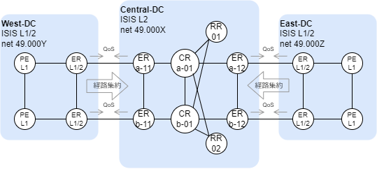
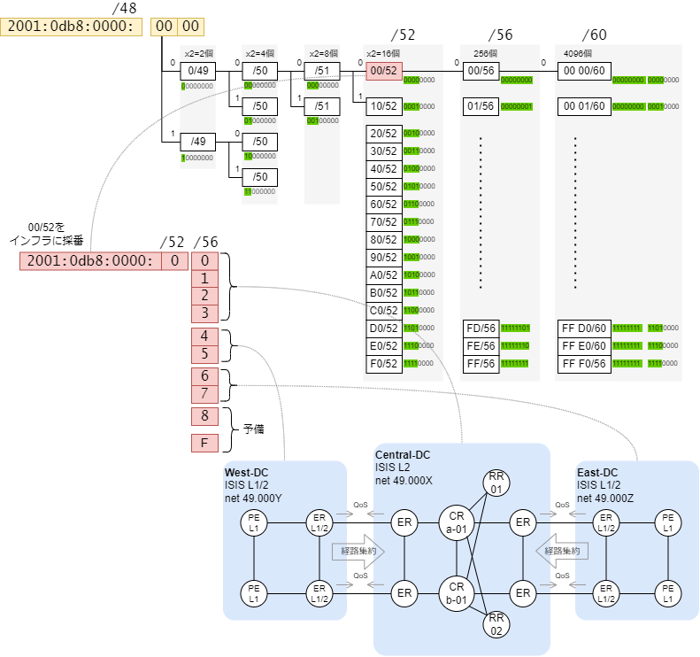
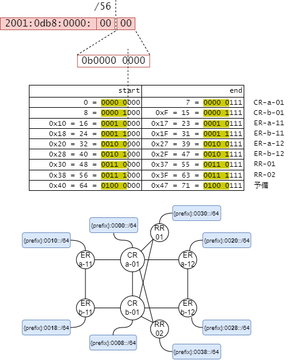
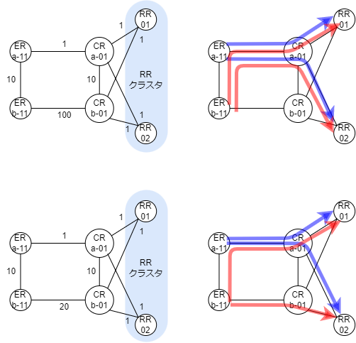

# ネットワーク設計

設計しないといけないことをメモ。

<br><br>

## ISISネットワーク

SRv6では動的ルーティングプロトコルにISISを使うのが事実上の標準です。
ISISはOSPFと同様、リンクステート型のルーティングプロトコルですが、ネットワーク設計の観点でOSPFと異なる点があります。

OSPFではインタフェースに対してどのエリアに属するかを指定しますので、エリアの境界線がルータの中にあります。
ISISはルータがどのエリアに属するか、を指定します。したがってエリアの境界線はリンク上にあります。
レベル2はバックボーンエリアに相当しますが、エリア番号は0である必要はありません。

L2ネットワーク一つで全域をカバーするか、エリアに分割して経路集約をかけていくかは、
ネットワークの規模やWANの有無、管理する範囲、など様々な要因を考慮して決めていきます。

具体的なイメージを思い描くために、データセンター同士をWAN回線で接続するケースを想定してみます。
Central-DCがバックボーンエリアに相当しますのでルータは全てL2になります。
East-DCとWest-DCのエッジルータはバックボーンエリアと接しますのでL1/2ルータとなり、
経路を集約してCentral-DC側に広告します。

East-DCとWest-DCのその他のルータはデフォルトルートをL1/2ルータに向ければよいので、L1ルータとなります。



<br><br>

## IPv6ネットワーク

装置に割り当てるロケータは論理的なインタフェースであり、そこに/64のIPv6アドレスを割り当てる、と考えると分かりやすいです。
SRv6ネットワークはアドレス設計の観点でいうと単なるIPv6のネットワークにすぎません。

ISP経由で取得できるIPv6アドレスは最大で/48のサイズになりますので、ここでは2001:0db8:0000/48を例に考えます。
/48を分割して利用しますが、このアドレス全てをインフラに使えるわけではありませんので、細かく分割していきます。
分割の単位は/52、/56、/60にするとアドレス表記の切れ目と一致してわかりやすくなります。



2001:0db8:0000/48のアドレスを/52で分割すると、2001:0db8:0000:**0**0/52から2001:0db8:0000:**F**0/52まで合計16個に分割されます。
仮に、このうちの先頭1個、2001:0db8:0000:**0**0/52をインフラ用に割り当てるとします。
これをさらに/56で分割して、16個の/56を取り出します。Center-DCには/56を4個分、East-DCには2個分、West-DCには2個分、といった具合に割り当てていきます。

<br><br>

## ロケータ設計

ロケータのブロック部は、SRv6を構成するルータで共通でなければいけません。所有しているアドレスが/48であればその条件は最初から満たしています。
/32のアドレスを使うケースでは、先頭40ビットが装置によって異なるようなアドレス割り当てをしないように気をつけます。

将来的にFlexAlgoを導入することを考慮すると、ロケータ（論理インタフェース）はルータ1台あたり複数必要になることを想定しておくべきです。
Affinityのカラーに8色使うなら、それだけでルータ1台に3ビット分のブロック(/61)が必要です。

たとえば、Central-DCには4つの/56を割り当てたとします。

- 2001:0db8:0000:00/56
- 2001:0db8:0000:01/56
- 2001:0db8:0000:02/56
- 2001:0db8:0000:03/56

このうち、先頭の2001:0db8:0000:00/56からロケータを取り出すと、各ルータに割り当てるロケータはこのようになります。



ここではロケータにaという名前を付けています。
FlexAlgoを使うとaffinityごとにロケータを持つことになりますので、a面、b面であったり、blue、redのような色の名前をつけてもよいでしょう。

<br><br>

## ループバックアドレス

ループバックは装置を代表するアドレスです。
採番したロケータの中からIPv6アドレスを割り当てるのが最善です。

```
{locator}::1/128
```

のようなルールで設計するとよいでしょう。

<br><br>

## ISISのインタフェースのネットワークタイプ

ルータ間の接続はPoint-to-Pointにします。

トラフィックエンジニアリングはp2pであることが前提条件になります。

<br><br>

## ルートリフレクタとISISメトリック設計

PEルータでVPNを作るときには、PEルータ間でiBGPを使った情報交換をします。
iBGPはフルメッシュで構成しますが、実際にフルメッシュでピアリングするのは困難ですので、ルートリフレクタを構成します。
ルートリフレクタはクラスタを組んで冗長化します。



各PEルータからRRにたどり着くための経路がどうなっているかは、把握しておいた方がよいでしょう。
PE-RR間でBFDを使って迅速に障害検知する場合、シングルポイントの障害で両系のiBGPピアがダウンしかねません。

BFDを使わない、という設計も選択肢の一つです。

<br><br>

## MTU/MSS

MTUはネットワーク内で統一します。SRヘッダが付くことを考慮してMTUを十分大きくしておきます。

（FITELnetは物理足に設定するわけではないので、注意が必要）

VPN通信が通るトンネルのインタフェースはTCP MSSの書き換えをする、しないを選択します。

<br><br>

## ToSの伝搬

L3VPNを中継する際、アンダーレイのIPヘッダにToSを反映させるか、させないか、を設計します。

反映させない場合、エンドユーザが付けたToSがend-endで透過しなくなります。


<br><br>

## スタティックトラフィックエンジニアリングの途中経路指定

TE（トラフィックエンジニアリング）は一方通行のトンネルですので、そのトンネルで相手まで通信できるか、プロトコルで確認していません。
途中経路として「ここを通れ」というポリシーを作る際、そこにたどり着く経路は動的ルーティングで冗長化されていないと、シングルポイント障害で通信が止まってしまいます。

<br><br>

## オーケストレータ

ないと運用で困る。


## PCE

あるとよい。RRのようなイメージで経路計算を集約できる。

<br><br><br><br>

# 設計項目

- 基盤ネットワーク設計
    - 物理ネットワーク
        - DC内ネットワーク
            - 面設計(1系-2系 or A面-B面)
            - トポロジ
                - ラダー型 or フルメッシュツリー
                - ルータ種別
                    - Cルータ
                    - PEルータ
                    - WANルータ
            - コアトポロジ
                - Cルータ間接続
            - PEトポロジ
                - Cルータ向け接続
                - CEルータ向け接続
                    - L3VPNシングルセグメント
                        - VRRP or Anycast Gateway
                    - L3VPNマルチセグメント
                    - EVPN
                        - ESI LAG
                    - L3VPN + EVPN
            - 物理インタフェース
                - 速度
                - MTU 9000 byte

        - DC間接続
            - 回線冗長方式
                - 現用・待機
            - プロトコルドメイン
                - ISISフラット or BGP

    - アンダーレイプロトコル
        - IPv6
            - アドレス設計
            - Loopbackインタフェース
            - インタフェースアドレス
                - ホスト部の老番・若番

        - BFD
            - Hello
            - BFD乗数

        - ISIS
            - プロセス名
            - エリア番号
            - ルータタイプ
                L1/L2/L1-2
            - インタフェースタイプ
                - point-to-pointのみ
            - メトリック設計
                - 10-10-10-100
            - Hello/Dead
            - エリア設計
            - アドレス集約
            - 装置起動時のプロセス待機（max-metric router-lsa on-startup [time]）
            - BFD対応有無

        - SRv6
            - ロケータ設計
            - TOS制御
            - PSP（EVPN時に制約あり？）
            - 静的SID割り当て
                - IOS-XRはEnd.Xのみなので事実上は使わない
            - SR-TE
            - FlexAlgo

        - iBGP
            - AS番号
            - RR
                - クラスタ
            - keepalive/hold
            - アトリビュート
                - MED
                - AS PATH (prepend)
                - Local Pref
            - nexthop tracking(bgp nexthop trigger delay)
                - critical
                - non-critical

    - オーバーレイプロトコル

        - L3VPN
            - VRF
                - 名前
                - RD/RT

            - address-family vpnv4
                - ロケータ

            - address-family vpnv6
                - ロケータ

            - address-family ipv4 vrf/ipv6 vrf
                - AS番号
                - keepalive/hold timer
                - BFD有無
                - アトリビュート
                    - local pref(1系2系)
                    - med(なし)
                    - as-path prepend
                - 経路再配送
                - 経路数制限

            - シングルセグメント構成
                - anycast gateway address
                    - IP/MAC

        - EVPN
            - Bridge Group
            - Bridge Domain
                - 文字列 L2VPN単位
            - EVI番号
                - 1-65534 L2VPN単位
                - RD/RT
            - ESI
                - 16進数 物理ポート単位
            - storm control
                - broadcast/multicast/unknown-unicast
            - ESI-LAG
                - Bundle-Ether番号(Port-channel)番号
                - LACP
                    - system mac
                    - period(short/long)
            - isolation group
                - 適用有無
            - NextHop選択（lowest ip/highest ip/modulo）
            - BUM
                - split holizon
            - VLAN-ID書き換え
            - L2制御フレーム(BPDU/LLDP/CDP...)
                - フィルタリング or 透過
            - 装置起動時のプロセス待機（startup-cost-in [time]）


    - 信頼性設計
        - リンク障害時の通過経路の明確化
        - ネットワークの面冗長設計
            - Active-Standby or Active-Active
        - SRv6 microloop avoidance
        - SRv6 TI-LFA
            - node protection
            - link protection
        - L3VPN収容
            - eBGP
                - 4ピア構成
            - esi-lag
                - anycast gateway or vrrp or hsrp
        - EVPN収容
            - ESI-LAG
                - Active-Active or Active-Standby(port-active設定)
        - サイレント障害検知
            - SR DPM(Data Plane Monitoring)のSRv6版はある？

    - ネットワーク性能設計
        - 帯域制御
            - 適用箇所
            - 方式
                - 契約種別
                    - ベストエフォート
                        - 共有ユーザ数
                    - 帯域確保
                - classify粒度
                    - 管理系通信(BGP/ISIS/BFD/ICMP/...)
                    - vlan/ip/tcp
                - shaping/policing
        - RTT計測

    - 拡張設計
        - 収容数増加時のスケールアウト単位
        - 装置一台あたりの許容スペックの明確化
            - 論理インタフェース数
            - Bridge Domain数
            - bundle-ether数
            - EVI数
            - BVI数
            - VRF数
            - IP経路数
            - MAC数
        - WAN回線不足時
            - スケールアップ
            - スケールアウト

    - ネットワークセキュリティ
        - BGP経路数保護
        - L2ループ対策
            - ストーム制御
        - 装置管理接続
            - アドレス制限
            - 認証
        - CPU保護
            - CoPP
        - 証跡管理
        - 装置OSの脆弱性対応

- 運用保守
    - in-band or out-band
    - SNMP
        - バージョン、認証、trap、community
    - gRPC
    - NTP
        - サーバ
    - 監視
        - ICMP監視
        - SNMP Trap
        - 障害監視
            - 装置
            - リンク
            - 環境（ファン・電源）
        - トラフィック量監視
            - 回線使用率
            - エラーパケット数
        - フロー監視
            - NetFlow
        - キャパシティ監視
            - CPU
            - メモリ
    - ログ
        - SYSLOG
        -
    - ライフサイクル管理
        - ソフトウェアバージョンアップ
    - メンテナンス停止
    - 保守交換手順
