# SRv6

https://www.segment-routing.net/

SRv6 = **S**egment **R**outing over IP**v6** dataplane

A source-routing architecture that seeks the right balance between distributed intelligence and centralized optimization.

（分散インテリジェンスと集中最適化の間の適切なバランスを追求するソース ルーティング アーキテクチャ。Google翻訳）

<br>

## ひとことでいうと

新しいアドレス体系を使ってパケットの通り道を制御する仕組みです。

受信した装置が途中経路と出口を指定できるので、ソースルーティングの一種になります。



R1に着信したパケットがR4から出ていくことを考えます。

IPネットワークの動的ルーティングでは、最短コストに従ってルーティングされますので、コスト設計をどれだけ頑張っても

- R1-R2-R4
- R1-R3-R4
- R1-R2-R3-R4
- R1-R3-R2-R4

の通り道しか実現できません。

SRv6の場合は、着信したR1がどこを通したいかを制御できますので

- R1-R2-R3-R2-R4

のような、同じノードを2回通るような経路も実現可能です。
R3が特別な役割、たとえばフィルタリングやパケットの中身を精査する機能を持っているときに、一度そこを通してから外に出したい場合に使えそうです。

このような経路制御をシンプルに、少ないプロトコルで実現できるのがSRv6です。

<br>

## SRv6は○○ではない

SRv6は**ルーティングプロトコルではありません**

新しいアドレス体系を扱うためにISISやOSPF、BGPを拡張しますが、SRv6という動的ルーティングプロトコルがあるわけではありません。

SRv6はデータを運ぶ**ネットワーク層、トランスポート層ではありません**

SRv6ではパケットを運ぶためにIPv6が必要です。SR-MPLSではMPLSを使ってパケットを運びます。

SRv6はアドレス体系ですので、それ単独でパケットを運ぶことは動作できません。

<br>

## セグメントってなんだ？

セグメントルーティングという言葉を聞いたときに思い浮かぶ疑問の一つがこれではないでしょうか。

セグメントは**番号を採番する対象の機能**のことを指します。

IPネットワークでセグメントといえば、ルータで区切られた部分（ブロードキャストが届く範囲）に割り当てるサブネットを思い浮かべることが多いと思います。

セグメントルーティングでは「その場所にいるノードにパケットを中継する」という機能に対して番号を採番します。

ルータの中に仮想ルータ（VRF）を作成したのであれば、そのVRFに対して番号を採番します。
その番号に向けてパケットを送信すればVRFにパケットが届くようになる、ということです。

この番号のことをSID(=Segment ID、シッド、セグメントID)と呼びます。

SRv6においてSIDはIPv6のアドレス形式と同じ形を利用します。SR-MPLSの場合は単なる整数値を使います。

<br>

## SRv6の利用シーン


<dl>
    <dt>VPNのサービス基盤</dt>
        <dd>入り口と出口が明確になるネットワークを作るのに向いています。VPNはその典型です。</dd>
    <dt>スライシング</dt>
        <dd>同じネットワークインフラを分割して、契約に応じて提供する部分を変更する機能です。5Gのコアでよく言われる機能です。</dd>
    <dt>サービスチェイニング</dt>
        <dd>必要に応じてトラフィックを捻じ曲げてファイアウォールや負荷分散装置等を経由して、ネットワークに付加価値をつけることができる機能です。</dd>
</dl>

このような利用シーンから、通信キャリアのバックボーンやデータセンターの中で共通に利用するネットワーク基盤で先行して導入されています。

<br>

## SRv6を利用する上でのネットワーク構成の考え方

- ファブリックネットワーク

ネットワーク全体をパケットの中継を行うファブリックとして考えるのがファブリックネットワークです。



ネットワーク全体を一つの装置として考え、着信したパケットが、ファブリックのどこかを通って出ていく、と考えます。
したがってネットワークの内側と外側、入り口と出口は明確に分けて考える必要があります。

ファブリックネットワークの作り方には時代によって流行り廃りがあります。

現在の主流はこれらです。

- Cisco ACI  ・・・データプレーンはVXLAN、独自コントロールプレーン（APIC）
- MPLS/BGP VPN　・・・データプレーンMPLS、コントロールプレーンにLDP, BGP

注目株がこちら。

- SRv6　・・・データプレーンにIPv6を使ったセグメントルーティング
- SR-MPLS　・・・データプレーンにMPLSを使ったセグメントルーティング

SRv6とSR-MPLSは現在主流になっているACIやMPLS/BGP VPNよりも、よりオープンで、よりシンプルに実現します。

残念ながら、あまり普及しなかったものもあります。

- Cisco FabricPath (レイヤ2ブリッジの拡張)
- Cisco SD-Access (SD-LAN)　・・・データプレーンはVXLAN、コントロールプレーンはLISP

シャーシ型の装置を作っているベンダーは、ファブリックネットワークも得意です。
シャーシ型の装置はスーパーバイザーと呼ばれる装置を管理するモジュールと、装置内部でパケットを中継するファブリックモジュール、外部に接続インタフェースを提供するラインカードで構成されます。



それらモジュールをそれぞれ単独の装置にして、分散配置すればファブリックネットワークが構成できます。
このようにして作られたベンダー独自のファブリックネットワークには「コントローラ」と呼ばれる装置がつきものです。

一方で、SRv6にコントローラはありません。
各装置が自律的に動作する分散型のアーキテクチャを採用した、コントローラが存在しないファブリック型ネットワークと言ってよいでしょう。

> **note**
> SRv6において、機器を管理するコントローラは存在しませんが、経路計算を1台の装置に集約にすることはできます。

<br>

## 必要な知識

SRv6を理解するうえで必要になる知識はこれらです。

- IPv6
- ISIS（IPv6ルーティング）
- BGP（L3VPN、EVPN）

企業向けのネットワークインテグレーションではあまり馴染みがないものが多いのが難点です。



ベースになるネットワークでは網内の全域でIPv6が必要です。

そのためのルーティングプロトコルにはISISが用いられます。
IPv6をルーティングするだけならOSPFv3でもよいのですが、SRv6で導入される新しいアドレス体系と相性が良いのはISISで、
ベンダー各社の実装状況を鑑みてもルーティングプロトコルはISISの一択になります。

VPNを構成するエッジ・エッジ間での情報交換はiBGPが用いられます。
iBGPはフルメッシュでピアリングしなければいけませんので、通常はルートリフレクタを導入して管理を容易にします。

<br>

## SIDの採番

ルータは２つの機能を必ず持っています。

1. 自分宛の通信を処理する機能
2. 隣接する装置にパケットを中継する機能

IPネットワークを設計するときのベストプラクティスでは、
すべてのルータにループバックインタフェースを作成して、装置を代表するIPアドレスをそのループバックに割り当てます。
IPv4であれば/32、IPv6であれば/128のアドレスをループバックに割り当てて、動的ルーティングでその情報を配信します。
ルータそのものへの通信、たとえばiBGPでピアリングするときのアドレスや、NTPサーバとして振る舞うときのアドレスにはこのアドレスを利用します。
SRv6において、自装置宛の通信を処理する機能にEndという名称が付与されており、SIDの採番対象となっています。

したがって、

装置を代表するアドレス = ループバックインタフェースのIPアドレス = SRv6のEnd SID

と考えてよいでしょう。

ルータは自足のインタフェースの先にいるノードにパケットを中継します。
すべてのルータがこの動作をすることで、ホップバイホップでパケットが中継されていくわけですが、SRv6ではこの機能にEnd.Xという名称を付与しています。
もちろんSIDを採番する対象です。

ルータのどの機能にどのSIDを割り当てるか、その方法は大きく分類すると２通りで、一つは人間が決める方法、もう一つは動的に決める方法です。

Endは装置を代表するSIDですから、人間が静的に決めたほうが管理の観点でメリットが大きいです。

End.Xは隣接ノードを見つけたときに自動で決めたほうがいいでしょう。
隣接ノードは障害の発生や構成変更で常に存在するとは限りませんので、見つけ次第、自動で採番する方が理にかなっています。

<br>

## SRv6のセグメントID形式

SRv6のセグメントIDはIPv6アドレスと同じ形式を取ります。

IPv6では前半64ビットがネットワーク部、後半64ビットがホスト部になっていますが、SRv6では前半をLocator（ロケータ）、後半をFunction（ファンクション）と呼びます。



SRv6のロケータはさらにブロック部とノード部に分かれます。通常ブロック部は40ビット、ノード部は24ビットです。

SRv6を構成するネットワーク内でブロック部は共通にします。

たとえば 2001:0db8:: を例に考えてみます。

先頭の40ビットはブロック部になりますので、全ルータの全てのロケータで共通にします。
ここではブロック部を 2001:0db8:00 としてみます（40ビットの番号をIPv6の形式で表記すると見栄えが悪いのですが仕方ありません）。

ノード部はルータごとに変わります。ノード部の下1オクテットを1から連番で割り当てるなら、各装置のロケータはこうなります。

- R1のロケータは 2001:0db8:00 + 00:0001
- R2のロケータは 2001:0db8:00 + 00:0002
- R2のロケータは 2001:0db8:00 + 00:0003
- R2のロケータは 2001:0db8:00 + 00:0004



R1のロケータをIOS-XRの設定イメージで書いてみると、このようになります。

```bash
segment-routing
 srv6
  locators
   locator a
    prefix 2001:0db8:0000:1::/64
   !
  !
 !
!
```

FITELnetの設定イメージではこうなります。

```bash
segment-routing srv6
locator a 2001:0db8:0000:1::/64
```


## ファンクション部

Function（ファンクション）はルータがセグメントIDを採番する対象の機能です。

FunctionはRFC8986で標準化されていますので、ここからはその呼び方を使います。

> https://datatracker.ietf.org/doc/rfc8986/
>
> RFC8986 Segment Routing over IPv6 (SRv6) Network Programming

よく目にするFunctionはこれら。

<dl>
    <dt>End</dt>
        <dd>そのルータ自身宛ての通信を処理する機能</dd>
    <dt>End.X</dt>
        <dd>ルータの自足のインタフェース上にいるノードに中継する機能</dd>
    <dt>End.DT4</dt>
        <dd>そのルータの中にあるL3VPNのIPv4ルーティングテーブル(VRF)を検索して中継する機能</dd>
    <dt>End.DT6</dt>
        <dd>そのルータの中にあるL3VPNのIPv6ルーティングテーブル(VRF)を検索して中継する機能</dd>
</dl>


### End.X

End.Xは転送に利用する。

次に転送する先のインタフェースとIPv6アドレスが分かる。

```bash
fx201-p#show segment-routing srv6 sid detail

SID                         Function     Context                                             Owner  State
--------------------------  -----------  --------------------------------------------------  -----  ---------
3ffe:201:0:1:42::           End.X        [Port-channel 1020000, Link-Local]                  IS-IS  InUse
  Locator : prefix1
  Nexthop : fe80::280:bdff:fe4c:b2b2
  Link-ID : 7
  OUT-RFID: 65537
  Created : Wed Dec 14 18:11:20 2022 (02w5d16h ago)
3ffe:201:0:1:43::           End.X (PSP)  [Port-channel 1020000, Link-Local]                  IS-IS  InUse
  Locator : prefix1
  Nexthop : fe80::280:bdff:fe4c:b2b2
  Link-ID : 7
  OUT-RFID: 65537
  Created : Wed Dec 14 18:11:20 2022 (02w5d16h ago)
```

固定でSIDを作るには次のコマンドを使う。

```bash
local-sid <SID> action end.x <送信インターフェイス名> <Next-hop> [psp]
```


## End.DT4

L3VPNなのでiBGPを使ってエッジルータ同士が情報交換する。

このとき交換するのはロケータの情報と **ラベル** の情報。昔ながらのMPLS-VPNの仕組みをそのまま流用している。

L3VPNの情報はshow ip bgp vpnv4 all で確認できる。

```
fx201-pe1#show ip bgp vpnv4 all 220.0.1.0

Route Distinguisher: 1:1 (1)
BGP routing table entry for 220.0.1.0/24
  Not advertised to any peer
  Local
    3ffe:220:1::1 (metric 30) from 3ffe:220:1::1 (220.0.0.1)
      Origin incomplete, metric 0, localpref 100, valid, internal, best, installed
      Extended Community: RT:1:1
      Original RD:1:1
      BGP Prefix-SID: SRv6 L3VPN 3ffe:220:1:1:: (L:40.24, F:16.0, T:16.64) End.DT4
      Local Label: no label
      Remote Label: 1120
      Path Identifier (Remote/Local): /0
      Last update: Wed Dec 14 18:05:34 2022
```

`BGP Prefix-SID: SRv6 L3VPN 3ffe:220:1:1:: (L:40.24, F:16.0, T:16.64) End.DT4`

という部分に注目。Prefix-SIDはロケータのことで、ルータそのものを指す。

`3ffe:220:1:1::` は対向するPEルータ、つまりこの情報を教えてくれたルータを指している。

- L:40.24 の意味

> マニュアルから引用
> SRv6 SID Structure Sub-Sub-TLV の LocBlock len, LocNode len を示しています

ロケータのBlock部が40ビット、Node部が24ビットという意味。2つ合わせて40+24=64ビットがロケータの長さ。
どのメーカーのSRv6ルータでもこうなっているはず。

- F:16.0 の意味

> マニュアルから引用
> SRv6 SID Structure Sub-Sub-TLV の Function len, Argument len を示しています

Function部の長さが16ビット、引数となるArgumentの長さが0ビット、という意味。2つ合わせて16+0=16ビットがFunction部の長さ。
この部分はメーカーによって違うかもしれない。

- T:16.64 の意味

> マニュアルから引用
> SRv6 SID Structure Sub-Sub-TLV の Trans len, Trans Offset を示しています

RFC9252(BGP Overlay Services Based on Segment Routing over IPv6) を読まないと、この意味はわからない。

RFC9252から引用。

```
   Transposition Length (1 octet):
      This field is the size in bits for the part of the SID that has
      been transposed (or shifted) into an MPLS Label field.

   Transposition Offset (1 octet):
      This field is the offset position in bits for the part of the SID
      that has been transposed (or shifted) into an MPLS Label field.
```

BGPを使ってVPNの経路情報を交換するときには、VPNを識別する情報としてMPLSのラベルを付与する。

MPLSのラベルの長さは20ビット。

セグメントIDの長さは128ビット。

当然収まりきらないので工夫して格納する。ここがすごく分かりづらいところ。

128ビットのSIDのうち、どの部分からどの部分までを20ビットのラベル部に格納したのかを表すのがTrans lenとTrans Offset。

T:16.64は、SIDの先頭64ビットから16ビットを切り出したもの、という意味になる。これはちょうどFunction部を表している。

- Remote Label: 1120 の意味

対向ルータが送ってきたラベルの値のこと。

10進数の `1120` は16進数では `0x 0460`、2進数では `0b 0000 0100 0110 0000` になる。

20ビットの器に入っているので正確には `0x 00460` = `0b 0000 0000 0100 0110 0000` となる。

T:16.64と指定された通り、128ビットのSIDの先頭64ビットから16ビット分がここに格納されていることになるので、先頭から16ビット分を取り出す。
すなわち下4ビットを破棄すると、2進数で `0000 0000 0100 0110`、16進数で`0x0046` となる。

IPv6のアドレスは連続するゼロを省略するのでFunction部は`0x46`ということになる。

ロケータとラベル情報からSIDを組み立てると、ロケータの`3ffe:220:1:1::`にラベルの`0x46`を連結して`3ffe:220:1:1:46::`がEnd.DT4のSIDになる。

IOS-XRの場合。

```
RP/0/RP0/CPU0:PE04#show bgp vrf vrf1 192.168.5.0/24
Thu Dec 15 14:26:10.464 JST
BGP routing table entry for 192.168.5.0/24, Route Distinguisher: 100:1
Versions:
  Process           bRIB/RIB  SendTblVer
  Speaker                  31           31
Last Modified: Dec 15 14:23:30.905 for 00:02:39
Paths: (2 available, best #1)
  Advertised to CE peers (in unique update groups):
    192.168.6.6
  Path #1: Received by speaker 0
  Advertised to CE peers (in unique update groups):
    192.168.6.6
  65005
    2001:db8::3 (metric 30) from 2001:db8::1 (192.168.255.3)
      Received Label 0x420
      Origin IGP, metric 0, localpref 100, valid, internal, best, group-best, import-candidate, imported
      Received Path ID 0, Local Path ID 1, version 31
      Extended community: RT:100:1
      Originator: 192.168.255.3, Cluster list: 0.0.0.1
      PSID-Type:L3, SubTLV Count:1
       SubTLV:
        T:1(Sid information), Sid:2001:db8:0:3::, Behavior:19, SS-TLV Count:1
         SubSubTLV:
          T:1(Sid structure):
      Source AFI: VPNv4 Unicast, Source VRF: vrf1, Source Route Distinguisher: 100:1
```

Trans LenとTrans Offsetが不明だが、おそらくFITELnetと同じでT:16.64のはず。

`Received Label 0x420` からこのプレフィクスに紐づいたラベル値は0x420 = 0x00420であることがわかる。

頭から16ビット分を取り出す、すなわち下4ビットを破棄して0x0042がFunction部ということになる。

`T:1(Sid information), Sid:2001:db8:0:3::, Behavior:19, SS-TLV Count:1` からロケータは2001:db8:0:3であることがわかる。

ロケータとラベルの情報から、この経路に紐づくSIDは `2001:db8:0:3:42` となる。


RFC9252 BGP Overlay Services Based on Segment Routing over IPv6 (SRv6)

```
5.1.  IPv4 VPN over SRv6 Core

   The MP_REACH_NLRI over SRv6 core is encoded according to IPv4 VPN
   unicast over IPv6 core defined in [RFC8950].

   The label field of IPv4-VPN NLRI is encoded as specified in [RFC8277]
   with the 20-bit Label Value set to the whole or a portion of the
   Function part of the SRv6 SID when the Transposition Scheme of
   encoding (Section 4) is used; otherwise, it is set to Implicit NULL.
   When using the Transposition Scheme, the Transposition Length MUST be
   less than or equal to 20 and less than or equal to the FL.

   The SRv6 Service SID is encoded as part of the SRv6 L3 Service TLV.
   The SRv6 Endpoint Behavior SHOULD be one of these: End.DX4, End.DT4,
   or End.DT46.
```

Transposition Scheme of encoding (Section 4) というのはこの部分。

```
4.  Encoding SRv6 SID Information

   The SRv6 Service SID(s) for a BGP service prefix is carried in the
   SRv6 Services TLVs of the BGP Prefix-SID attribute.

   For certain types of BGP Services, like L3VPN where a per-VRF SID
   allocation is used (i.e., End.DT4 or End.DT6 behaviors), the same SID
   is shared across multiple NLRIs, thus providing efficient packing.
   However, for certain other types of BGP Services, like EVPN Virtual
   Private Wire Service (VPWS) where a per-PW SID allocation is required
   (i.e., End.DX2 behavior), each NLRI would have its own unique SID,
   thereby resulting in inefficient packing.

   To achieve efficient packing, this document allows either 1) the
   encoding of the SRv6 Service SID as a whole in the SRv6 Services TLVs
   or 2) the encoding of only the common part of the SRv6 SID (e.g.,
   Locator) in the SRv6 Services TLVs and the encoding of the variable
   (e.g., Function or Argument parts) in the existing label fields
   specific to that service encoding.  This later form of encoding is
   referred to as the Transposition Scheme, where the SRv6 SID Structure
   Sub-Sub-TLV describes the sizes of the parts of the SRv6 SID and also
   indicates the offset of the variable part along with its length in
   the SRv6 SID value.  The use of the Transposition Scheme is
   RECOMMENDED for the specific service encodings that allow it, as
   described further in Sections 5 and 6.
```

Transposition Schemeは転置スキームと訳すのかな。

End.DT4のようにPer-CEやPer-VRFでSIDを割り当てるサービスでは、プレフィクスに対して同じSIDを割り当てることになるので、同じ情報を何度も繰り返し送信すのは無駄になる。
転置スキームを使って一度送ったらそれを再利用する。

```
3.2.1.  SRv6 SID Structure Sub-Sub-TLV

   SRv6 Service Data Sub-Sub-TLV Type 1 is assigned for the SRv6 SID
   Structure Sub-Sub-TLV.  The SRv6 SID Structure Sub-Sub-TLV is used to
   advertise the lengths of the individual parts of the SRv6 SID, as
   defined in [RFC8986].  The terms Locator Block and Locator Node
   correspond to the B and N parts, respectively, of the SRv6 Locator
   that is defined in Section 3.1 of [RFC8986].  It is carried as Sub-
   Sub-TLV in the SRv6 SID Information Sub-TLV.

    0                   1                   2                   3
    0 1 2 3 4 5 6 7 8 9 0 1 2 3 4 5 6 7 8 9 0 1 2 3 4 5 6 7 8 9 0 1
   +-+-+-+-+-+-+-+-+-+-+-+-+-+-+-+-+-+-+-+-+-+-+-+-+-+-+-+-+-+-+-+-+
   | SRv6 Service  |    SRv6 Service               | Locator Block |
   | Data Sub-Sub  |    Data Sub-Sub-TLV           | Length        |
   | -TLV Type=1   |    Length                     |               |
   +-+-+-+-+-+-+-+-+-+-+-+-+-+-+-+-+-+-+-+-+-+-+-+-+-+-+-+-+-+-+-+-+
   | Locator Node  | Function      | Argument      | Transposition |
   | Length        | Length        | Length        | Length        |
   +-+-+-+-+-+-+-+-+-+-+-+-+-+-+-+-+-+-+-+-+-+-+-+-+-+-+-+-+-+-+-+-+
   | Transposition |
   | Offset        |
   +-+-+-+-+-+-+-+-+

                  Figure 5: SRv6 SID Structure Sub-Sub-TLV

   SRv6 Service Data Sub-Sub-TLV Type (1 octet):
      This field is set to 1 to represent the SRv6 SID Structure Sub-
      Sub-TLV.

   SRv6 Service Data Sub-Sub-TLV Length (2 octets):
      This field contains a total length of 6 octets.

   Locator Block Length (1 octet):
      This field contains the length of the SRv6 SID Locator Block in
      bits.

   Locator Node Length (1 octet):
      This field contains the length of the SRv6 SID Locator Node in
      bits.

   Function Length (1 octet):
      This field contains the length of the SRv6 SID Function in bits.

   Argument Length (1 octet):
      This field contains the length of the SRv6 SID Argument in bits.

   Transposition Length (1 octet):
      This field is the size in bits for the part of the SID that has
      been transposed (or shifted) into an MPLS Label field.

   Transposition Offset (1 octet):
      This field is the offset position in bits for the part of the SID
      that has been transposed (or shifted) into an MPLS Label field.
```

SIDのFunction部の情報を送るときに、20ビットのMPLSのラベル情報に置換する際のビットシフトの量をTransposition Lengthで指定する。
ここが4になっているはず。


## FunctionのSIDに到達するための経路は？

IPv6のルーティングテーブルを検索すれば出てくる。

個々のSIDに関する情報を配信しているわけではないので、ロンゲストマッチのルールに従って最後はロケータにたどり着くはず。

```
fx201-pe1#show ipv6 route 3ffe:220:1:1:46::

Routing entry for 3ffe:220:1:1::/64
  Known via "isis", distance 115, metric 30, best, redistributed
  Last update 00:00:01 ago

  fe80::280:bdff:fe4d:5e10 (reachable by fe80:2723::/64), port-channel1010000, RD 0:0, System VRF-ID 0, NHD LINK fe80:2723::280:bdff:fe4d:5e10 (25), refcnt 4
  fe80::280:bdff:fe4c:b2a3 (reachable by fe80:2726::/64), port-channel3010000, RD 0:0, System VRF-ID 0, NHD LINK fe80:2726::280:bdff:fe4c:b2a3 (22), refcnt 3
```

## ローカルSIDは再配布される？

静的に決めたSIDはどうなる？


## 疎通確認の方法


IOS-XRの場合は、ポリシー名を指定してping、tracerouteを打てる。

```
RP/0/RP0/CPU0:PE04#ping segment-routing srv6 policy name ?
  WORD  Srv6 TE configured or auto-generated policy name

RP/0/RP0/CPU0:PE04#traceroute segment-routing srv6 policy name a ?
  flowlabel  flowlabel of the packet
  maxttl     maximum time to live
  minttl     minimum time to live
  numeric    Numeric display only
  port       port number
  priority   priority of the packet
  probe      probe count
  reduced    ping segment routing policy with reduced option
  source     source address or interface
  timeout    timeout value in seconds
  verbose    verbose output
  vrf        vrf table for the route lookup
  <cr>
```

Path Tracingという機能が実装されると、どこを通っているかが分かるようになる。

SIDへのpingはできない。

```
f220-pe2#show segment-routing srv6 sid

SID                         Function     Context                                             Owner  State
--------------------------  -----------  --------------------------------------------------  -----  ---------
3ffe:220:1:1:40::           End                                                              IS-IS  InUse
3ffe:220:1:1:41::           End (PSP)                                                        IS-IS  InUse
3ffe:220:1:1:46::           End.DT4      '1'                                                 BGP    InUse
3ffe:220:1:1:47::           End.DT4      '2'                                                 BGP    InUse
3ffe:220:1:1:48::           End.DT6      '1'                                                 BGP    InUse
3ffe:220:1:1:49::           End.DT6      '2'                                                 BGP    InUse
3ffe:220:1:1:4a::           End.X        [Port-channel 1020000, Link-Local]                  IS-IS  InUse
3ffe:220:1:1:4b::           End.X (PSP)  [Port-channel 1020000, Link-Local]                  IS-IS  InUse
3ffe:220:1:1:4c::           End.X        [Port-channel 1010000, Link-Local]                  IS-IS  InUse
3ffe:220:1:1:4d::           End.X (PSP)  [Port-channel 1010000, Link-Local]                  IS-IS  InUse
f220-pe2#ping ipv6 3ffe:220:1:1:40::
Sending 5, 100-byte ICMP Echos to 3ffe:220:1:1:40::(3ffe:220:1:1:40::), timeout is 2 seconds:
*** No route to host.
.*** No route to host.

Success rate is   0 percent (0/2)

f220-pe2#ping 3ffe:220:1:1:41::
Sending 5, 100-byte ICMP Echos to 3ffe:220:1:1:41::(3ffe:220:1:1:41::), timeout is 2 seconds:
*** No route to host.

Success rate is   0 percent (0/1)
```


## OAM (Operation and Maintenance)

ファブリックネットワークは、全体を一つの装置として見るので、個々の装置の管理ではなく、複数の装置を同時に扱う必要がある。
パケットが入ってきた場所と、出ていく場所は異なる装置なのが通常なので、その両方の装置をケアしなければいけない。

ベンダー独自技術の場合はコントローラが付属する。Cisco ACIの場合はAPICがコントローラ。

オープン技術を採用する場合には、マルチベンダ製品を扱うオーケストレータを使う場合が多い。

Cisco NSO(Network Services Orchestrator)

JuniperはCSO(Contail Service Orchestration)

ただ、現場作業時にNSOを持ち込むのはオーバースペックなので、簡易なツールが必要。

pyATSを使って各種操作を自動化する。

できること

- ファブリック内のSIDを全て収集

- パラメータシートからのVPNプロビジョニング

- end-to-endの疎通確認


## 要望

機能追加

- ping srv6 <ポリシー> の実装
- path-tracing の実装
- API(RESTCONF/YANGモデル)の実装
- gRPCを使ったdial-in/outでのテレメトリ送信
