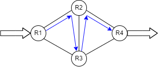
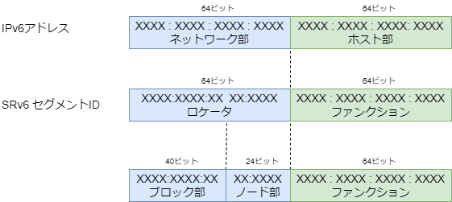
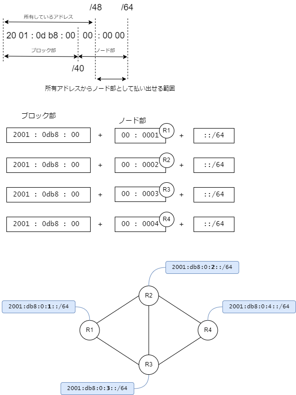

# SRv6

https://www.segment-routing.net/

SRv6 = **S**egment **R**outing over IP**v6** dataplane

A source-routing architecture that seeks the right balance between distributed intelligence and centralized optimization.

（分散インテリジェンスと集中最適化の間の適切なバランスを追求するソース ルーティング アーキテクチャ。Google翻訳）

<br>

## ひとことでいうと

新しいアドレス体系を使ってパケットの通り道を制御する仕組みです。

パケットを受信した装置は、その新しいアドレス体系（番号）を使って途中経路や出口を指定できるので、ソースルーティングの一種になります。

たとえばR1に着信したパケットがR4から出ていくことを考えます。


IPネットワークの動的ルーティングでは最短コストに従ってルーティングされますので、コスト設計をどれだけ頑張っても

- R1-R2-R4
- R1-R3-R4
- R1-R2-R3-R4
- R1-R3-R2-R4

の4通りしか実現できません。

一方でSRv6の場合は、着信したR1がどこを通したいかを（新しい番号を使って）制御できますので

- R1-R2-R3-R2-R4



のような、同じノードを2回通るような経路も実現可能です。

これを応用すると、たとえばフィルタリングやパケットの中身を精査する機能を持っている装置を通してから外に出したい場合に使えるでしょう。


このような最短コストによらない経路制御を、シンプルに、少ないプロトコルで実現するのがSRv6です。

<br>

## SRv6は○○ではない

SRv6は**ルーティングプロトコルではありません**

新しいアドレス体系を扱うためにISISやOSPF、BGPを拡張しますが、SRv6という動的ルーティングプロトコルがあるわけではありません。

SRv6はデータを運ぶ**ネットワーク層、トランスポート層ではありません**

SRv6はアドレス体系ですので、それ単独でパケットを運ぶことは動作できません。
SRv6ではIPv6を、SR-MPLSではMPLSを使ってパケットを運びます。

<br>

## セグメントってなんだ？

セグメントルーティングという言葉を聞いたときに思い浮かぶ疑問の一つがこれではないでしょうか。

セグメントは**番号を採番する対象の機能**のことを指します。

IPネットワークでセグメントといえば、ルータで区切られた部分（ブロードキャストが届く範囲）に割り当てるサブネットを思い浮かべることが多いと思います。
セグメントルーティングではそれを「その場所にいるノードにパケットを中継する機能」と考え、その機能に対して番号を採番します。

ルータの中に仮想ルータ（VRF）を作成したのであれば、そのVRFに対して番号を採番します。
その番号に向けてパケットを送信すればVRFにパケットが届くようになる、ということです。
この番号のことをSID(=Segment ID、シッド、セグメントID)と呼びます。
SRv6においてSIDはIPv6のアドレス形式と同じ形を利用します。SR-MPLSの場合は単なる整数値を使います。

採番対象になる代表的な機能については標準化されて名称がついています（この後紹介します）。

<br>

## SRv6のネットワーク構成の考え方

SRv6はファブリックネットワークです。


ネットワーク全体を一つの装置（ファブリック）と捉え、着信したパケットがファブリックのどこかを通って出ていく、と考えます。
したがってネットワークの内側と外側、入り口と出口は明確に分けて考える必要があります。

ファブリックネットワークの作り方には時代によって流行り廃りがあります。

現在の主流はこれらです。

- Cisco ACI  ・・・データプレーンはVXLAN、独自コントロールプレーン（APIC）
- MPLS/BGP VPN　・・・データプレーンMPLS、コントロールプレーンにLDP, BGP

注目株がこちら。

- SRv6　・・・データプレーンにIPv6を使ったセグメントルーティング
- SR-MPLS　・・・データプレーンにMPLSを使ったセグメントルーティング

SRv6とSR-MPLSは現在主流になっているACIやMPLS/BGP VPNよりも、よりオープンで、よりシンプルに実現できます。

残念ながら、あまり普及しなかったものもあります。

- Cisco FabricPath (レイヤ2ブリッジの拡張)
- Cisco SD-Access (SD-LAN)　・・・データプレーンはVXLAN、コントロールプレーンはLISP

シャーシ型の装置を作っているベンダーは、ファブリックネットワークも得意です。
シャーシ型の装置はスーパーバイザーと呼ばれる装置を管理するモジュールと、装置内部でパケットを中継するファブリックモジュール、外部に接続インタフェースを提供するラインカードで構成されます。


それらモジュールをそれぞれ単独の装置にして、分散配置すればファブリックネットワークが構成できます。
このようにして作られたベンダー独自のファブリックネットワークには「コントローラ」と呼ばれる装置がつきものです。

一方で、SRv6にコントローラはありません。
各装置が自律的に動作する分散型のアーキテクチャを採用した、専用コントローラが存在しないファブリック型ネットワークです。

SRv6のデータプレーンはIPv6です。
入り口ルータは受け取ったパケットを新しいIPv6パケットで包み込んで出口ルータ目掛けて送信します。
このときに途中経路を指定したり、ネットワークの状況に応じて最適な経路を選択するのです。

<br>

## 構成例

SRv6のイメージをつかむために、先に構成例を見てみましょう。
SRv6に対応したルータがあったとして、それを使ってどのようなネットワークを組めるか考えます。

<br>

### 例1. IPv4 over SRv6


バックボーンとなるネットワークをIPv6で構成します。末端側はIPv4が必要で、エンド・エンドでIPv4が通るようにします。
SRv6の入り口でIPv4パケットを受信したら、出口になるルータを探し、そこに向けてIPv6パケットで包み込んで運びます。出口ルータでは外側のIPv6を外してIPv4で届けます。
IPv6は何を運んでいるかを「Next Header」フィールドで示します。この場合のNext Headerは4、IPv4になります。

一見VPNのように見えますが、VPNは使いません。トンネルインタフェースも使いません。
絵はビル内を想定した書き方をしていますが、広域ネットワークでも適用できます。

<br>

### 例2. L3VPN over SRv6


前述の例はVPNを使わない代わりにバックボーンネットワークにIPv4経路が伝搬します。
バックボーン側とエッジ側で管理が異なるネットワークでしたら、VPNを構成してバックボーン側にエッジ側の経路が流れ込まないように構成した方がよいでしょう。
従来の技術ではMPLS-VPNがこの構成を得意としていますが、SRv6であればIPv6しか使いませんので、よりシンプルに実現できます。
パケットの運び方は前述の例と全く同じです。

また、SRv6内部の通信は「どこを通すか」制御できますので、このVPNは広帯域を提供、このVPNはベストエフォートを提供、というようにサービスレベルを変えることもできます。

<br>

### 例3. EVPN over SRv6


IP網を経由してエンド・エンドでイーサネットを通したい、という要件では、VXLANを使うことが多いのですが、この要件もSRv6で実現できます。
L3VPNはMPLS、EVPNはVXLAN、というように複数のプロトコルを持ち込まなくてもSRv6だけでどちらも実現できます。

SRv6でイーサネットフレームを運ぶ場合の外側IPv6ヘッダのNext Headerは143です（古い実装では59 IPv6-NoNxtになっているかもしれません。IOS-XRは`segment-routing srv6 encapsulation evpn next-header` 設定でこの値を変更できます）。

> 参照
>
> RFC8986 Segment Routing over IPv6 (SRv6) Network Programming

<br>

> 参照
>
> https://www.iana.org/assignments/protocol-numbers/

<br>

## 設定を見たほうが早い方向け

装置のコンフィグを見たほうがイメージが湧く、というコアな方には、IOS-XRの設定を先にみて頂いた方がいいかもしれません。

[IOS-XRの設定例](../iosxr_config/README.md)


<br>

## 必要な知識

SRv6を動かすのに必要な知識はこれらです。

- IPv6
- ISIS
- BGP
- VPN（L3VPN、EVPN）

企業向けのネットワークではあまり馴染みがないかもしれませんが、同じことを実現するために別の技術を使おうとすると、もっと大変なことになります。


まず、ベースになるネットワークでは網内の全域でIPv6が必要です。IPv6-IPv4-IPv6のように途切れてはいけません。

IPv6を動的にルーティングするプロトコルにはISISが用いられます。
OSPFv3でもよいのですが、SRv6で導入される新しいアドレス体系と相性が良いのはISISです。
ベンダー各社のSRv6実装状況を鑑みてもルーティングプロトコルはISISの一択になります。

VPNを構成するエッジ・エッジ間での情報交換はiBGPが用いられます。
iBGPはフルメッシュでピアリングしなければいけませんので、通常はルートリフレクタを導入して管理を容易にします。

<br>

## ルータが持つセグメント

ルータは２つの機能を必ず持っています。

1. 自分宛の通信を処理する機能
2. 隣接する装置にパケットを中継する機能

IPネットワークを設計するときのベストプラクティスでは、すべてのルータにループバックインタフェースを作成して、装置を代表するIPアドレスをそのループバックに割り当てます。
IPv4であれば/32、IPv6であれば/128のアドレスをループバックに割り当てて、動的ルーティングでその情報を配信します。
ルータの識別子、たとえばbgpやOSPFのルータIDとしてこのアドレスが使われるほか、
実際の通信、たとえばiBGPでピアリングするときのアドレスや、トンネルの送信元アドレスとしてループバックのアドレスが利用されます。


SRv6では自装置宛の通信を処理する機能にEndという名称が付与されており、SIDの採番対象となっています。
ノード（装置自身）への通信を処理する機能ですからノードSID(Node-SID)と呼びます。

- 装置を代表するアドレス = ループバックインタフェースのIPアドレス
- 装置を代表するSID = SRv6のEnd機能に対するSID = ノードSID

と考えてよいでしょう。

ルータは自足のインタフェースの先にいるノードにパケットを中継します。
すべてのルータがこの動作をすることで、ホップバイホップでパケットが中継されていくわけですが、SRv6ではこの機能にEnd.Xという名称が付いています。
もちろんSIDを採番する対象で、ノードが持っている足の数だけEnd.XのSIDを割り当てます。これを隣接関係SID（Ajacency SID、Adj-SID）と呼びます。

> **Note**
>
> ざっくり、装置のループバックがnode-SID、特定のインタフェースがadj-SID、と考えていいと思います。

ルータのどの機能にどのSIDを割り当てるか、その方法は大きく分類すると２通りで、一つは人間が決める方法、もう一つは動的に決める方法です。

Endは装置を代表するSIDですから、なるべく固定的に採番されていた方が管理の観点でメリットが大きいです。
IOS-XRではファンクション部が1のSIDが自動で割り当てられます。

一方、End.Xは隣接ノードを見つけたときに自動で決めたほうがいいでしょう。
隣接ノードは障害の発生や構成変更で常に存在するとは限りませんので、見つけ次第、自動で採番する方が理にかなっています。通常これはISISの仕事です。

ルータには上記２つの機能に加えて、VPNを収容することもあります。
セグメントルーティングが画期的なのは、VPNに対しても同じアドレス体系で番号を付与できることです。
どこを通って、どこにたどり着け、という制御をかける際に、全てを同じ番号体系で指し示せるのです。

どこを通れ、は装置を代表するノードSID、どのインタフェースを通れ、はEnd.XのSID、どこにたどり着け、はVPNに対応するSIDを指定します。

<br>

## セグメントIDの形式

SRv6のセグメントIDはIPv6アドレスと同じ形式を取ります。
IPv6では前半64ビットがネットワーク部、後半64ビットがホスト部になっていますが、SRv6では前半をLocator（ロケータ）、後半をFunction（ファンクション）と呼びます。
ロケータはそれがどの装置に存在するものなのかを表し、ファンクションはその装置の中のどの機能なのかを表します。



SRv6のロケータはさらにブロック部とノード部に分かれます。通常ブロック部は40ビット、ノード部は24ビットです。
（40ビットというと16の倍数ではないので、IPv6のアドレス表記とは相性が悪いのですが、そう決まっているので仕方ありません）。
SRv6を構成するネットワーク内でブロック部は共通にします。

たとえば 2001:0db8:0000:/48 を例に考えてみます。

<br>

> **Note**
>
> 2001:0db8で始まるアドレスは文書記載用に予約されたアドレスです。

<br>

> **Note**
>
> プロバイダーからIPv6アドレスの払い出しを受ける際の最大サイズは一般的に/48です。

<!--

> **Note**
>
> アドレスにかかる費用
> https://www.nic.ad.jp/ja/ip/member/fee-table-2012.html#fee-table

-->

<br>

先頭の40ビットはブロック部になりますので、SRv6を構成する全ルータのロケータで共通でなければいけません。
ユニークローカルアドレスfc00::/7を使う場合は十分注意してください。
ISPからグローバルアドレスを/48で払い出されたなら、このルールはすでに満たしています。

この例では 2001:0db8:00 がブロック部になります（16進表記のXXが5個で40ビットです）。

ノード部はルータごとに変わります。ノード部を1から連番で割り当てるなら、各装置のロケータはこうなります。

- R1のロケータは 2001:0db8:00 + 00:0001
- R2のロケータは 2001:0db8:00 + 00:0002
- R2のロケータは 2001:0db8:00 + 00:0003
- R2のロケータは 2001:0db8:00 + 00:0004



<br>

## IPv6アドレスとロケータの採番

IPv6の場合、ルータとルータの間にある部分（いわゆるセグメント）は、IPv6を有効にすればリンクローカルアドレスが動的に決まりますので、必ずしもIPv6アドレスを採番する必要はありません。
ですが、実際には遠隔からのping監視の必要性、インタフェースをアドレスで特定する必要性、などを考慮するとIPv6アドレスの採番が必要です。
ルータとルータの間の部分にIPv6アドレスを採番しつつ、ルータ自身に対してもロケータという形で/64のアドレスを割り当てます。
ロケータはルータの論理的なインタフェースと考えると分かりやすいと思います。


ルータのインタフェースおよびロケータにどういうアドレスを採番するか、はネットワーク設計者の腕の見せ所になります。
IPv6はアドレス空間が広大ですので、節約するよりも、効率的に集約することが重んじられます。
運用管理上意味のある単位でひとまとめにしたときに、そこで用いられている物理足のアドレスとロケータがまとめて一つのアドレスに集約できるように配慮して払い出します。

<br>

## ファンクション部

Function（ファンクション）は装置が自分自身の機能に対してセグメントIDを採番する対象です。

Functionは [RFC8986](https://datatracker.ietf.org/doc/rfc8986/) で標準化されていますので、ここからはその呼び方を使います。

| ファンクション     |  説明  |
| ----------------- | ----- |
| End               | エンドポイント |
| End.X             | L3クロスコネクトのエンドポイント<br>Adjacency SIDと呼びます |
| End.T             | 特定のIPv6テーブルをルックアップするエンドポイント |
| End.DX6           | カプセル化を解除してIPv6クロスコネクトを行うエンドポイント<br>IPv4 L3VPN per-CE |
| End.DX4           | カプセル化を解除してIPv4クロスコネクトを行うエンドポイント<br>IPv4 L3VPN per-CE |
| End.DT6           | カプセル化を解除して特定のIPv6テーブルをルックアップするエンドポイント<br>IPv6 L3VPN per-VRF |
| End.DT4           | カプセル化を解除して特定のIPv4テーブルをルックアップするエンドポイント<br>IPv4 L3VPN per-VRF |
| End.DT46          | カプセル化を解除して特定のIPテーブルをルックアップするエンドポイント<br>L3VPN per-VRF |
| End.DX2           | カプセル化を解除してL2クロスコネクトを行うエンドポイント<br>L2VPN |
| End.DX2V          | カプセル化を解除してVLAN L2テーブルをルックアップするエンドポイント<br>EVPN Flexible Cross-connect |
| End.DT2U          | カプセル化を解除してユニキャストMAC L2テーブルをルックアップするエンドポイント<br>EVPN Bridging Unicast |
| End.DT2M          | カプセル化を解除してL2テーブルでフラッディングするエンドポイント<br>EVPN Bridging BUM |
| End.B6.Encaps     | カプセル化を伴うSRv6 Policyに紐付けられたエンドポイント<br>Binding SID |
| End.B6.Encaps.Red | End.B6.Encaps with reduced SRH |
| End.BM            | SR-MPLS Policyに紐付けられたエンドポイント |

たくさんありますが、よく目にするファンクションはこれらです。

<dl>
    <dt>End</dt>
        <dd>そのルータ自身への通信を処理する機能</dd>
    <dt>End.X</dt>
        <dd>ルータの自足のインタフェース上にいるノードに中継する機能</dd>
    <dt>End.DT4</dt>
        <dd>そのルータの中にあるL3VPNのIPv4ルーティングテーブル(VRF)を検索して中継する機能</dd>
    <dt>End.DT6</dt>
        <dd>そのルータの中にあるL3VPNのIPv6ルーティングテーブル(VRF)を検索して中継する機能</dd>
</dl>

<br>

## ファンクション部へのSIDの採番方法

人間が決めた値を静的に設定する方法と、プロトコルで動的に採番する方法があります。
通常は動的に採番します。

<br>

### Endファンクション

Endファンクションはそのルータ自身宛ての通信を処理する機能ですから、そのルータを代表するSIDです。このSIDをノードSID(node-SID)と呼びます。

装置を代表するIPv6アドレスと、装置を代表するSIDは、関連付けておくとわかりやすくなります。
たとえばロケータが 2001:0db8:0:1::/64 であれば、ループバックにはその中から 2001:0db8:0:1::1/128 というIPv6アドレスを割り当てます。
ISISはSRv6のロケータ情報を/64の経路として配信しますので、ループバックに割り当てた/128のアドレスをconnected経路として再配送する必要はありません。

<br>

> **Note**
>
> SRv6を構成するルータのLoopbackのIPv6アドレスは {locator}::1/128 とする、といった具合にルール化しておくとよいと思います。

<br>

### End.X

End.Xは隣接ノードとの関係を示す機能です。このSIDを隣接関係SID(adj-SID)と呼びます。

隣接ノードを見つけるのはISISの仕事です。
ISISは隣接ノードを見つけ次第、ロケータの中からEnd.XのSIDを採番します。
この情報を詳細に調べると、そのインタフェースの先にいる隣接機器のIPv6アドレスを知ることができます。

動的に決めたEnd.XのSID(adj-SID)は装置の再起動やインタフェースのダウン・アップで変わってしまうかもしれません。
このインタフェースを通れ、と指定する場面では、事前にEnd.XのSIDが決まっていたほうがよいので、静的に決めて置いたほうがよいでしょう。

> **Note**
>
> EndとEnd.Xはどちらもそのノード自身のSIDです。Endは装置監視の宛先に、End.Xはインタフェース監視の宛先に使う、とざっくり考えていいと思います。

<br>

## End.DT4とEnd.DT6、End.DX4とEnd.DX6

End.DT4は自装置の中にあるVRF宛てのIPv4通信を処理する機能です。
End.DT6はVRF宛てのIPv6通信を処理する機能です。

ネットワークの設計によっては同じVRFの先に複数のCEルータがつながるケースがあります。
VRF単位にファンクションを割り当てるのがEnd.DT、CE装置単位にファンクションを割り当てるのがEnd.DXです。

<br>

> **Note**
>
> 装置の実装によってデフォルトの動作がper-vrfかper-ceか異なりますので、マニュアルを参照しましょう。IOS-XRはper-ce、FITELnetはper-vrfがデフォルトの動作です。

<br>

> **Note**
>
> このVPNの通信はこの経路を通るようにしたい、といった特別な経路制御をかけたい場合はEnd.DTのSIDを静的に設定するのもありかもしれませんが、数が多くなることが予期されるので得策ではありません。
> VPNの通信に対して特別な扱いをしたい場合は、ISISのFlexAlgoを使うか、トラフィックエンジニアリングポリシーを適用するのが現実的です。

自装置のVRFに対して割り当てたSIDの情報は、iBGPを使って自分以外のエッジルータに配信します。
そのVRF宛ての通信は（iBGPのNext Hopアドレスではなく）配信したSID宛てになります。

<br>

> **Note**
>
> 実際にiBGPで交換している情報は、ロケータと **ラベル** の情報です。
> 昔からあるMPLS-VPNの仕組みをそのまま流用しているためです。
> 当然ですが、ラベルからSID、SIDからラベルに変換できます。

<br>

## SIDのルーティングテーブル

ネットワークを運用管理する立場からみると「あの機能にパケットを送るには、どのSIDを付ければよのか」ということを知りたくなります。
しかしながら、SRv6はアドレス体系であって、情報を交換するプロトコルではありませんので、SIDのルーティングテーブルというものは存在しません。
End.Xの詳細情報はISISに、End.DTやEnd.DXはBGPの中に詳細情報が格納されています。
各プロトコルに関してのshowコマンドを駆使することになります。

<br>

> **Note**
>
> IOS-XRであれば、これらコマンドを駆使して経路とSIDの対応を調べます。
>
> show segment-routing srv6 sid
>
> show bgp vpnv4 unicast local-sids
>
> show bgp vpnv4 unicast received-sids
>
> show route vrf NAME PREFIX detail
>
> show cef vrf NAME PREFIX

<br>

現実的には全てのエッジルータからSIDの情報を集めて一元管理することになると思います。
SIDは動的に割り当てられますので、変化があったときにはログが飛ぶように設定するのも大切なことです。

> **Note**
>
> IOS-XRであれば、
> `segment-routing srv6 logging locator status`
> の設定でログが出ます。

<br>

## SIDに到達するための経路の確認

ISISやBGPの情報から宛先として使うべきSIDがわかったとして、そこに到達する経路はどうなるでしょう。

SRv6のSIDはIPv6と同じ形式ですから、IPv6のルーティングテーブルを検索すればSIDに到達するための経路が出てきます。
通常はロンゲストマッチのルールに従ってISISが配信した/64のロケータの情報にたどり着きます。

> **Note**
>
> 何らかの手段で/64のロケータの経路さえ学習できれば、途中にSRv6を理解しないルータがいても大丈夫です。

<br>

## L3VPN通信のパケット

はじめに、比較のため広く用いられているMPLS VPNの場合を考えます。
L3VPNはPEルータ同士がiBGPを使ってアドレスファミリVPNv4の情報を交換することで成立します。
VPNv4の経路情報は、あのPEの中にある、あのVRFの先にいる経路、という情報です。


MPLS網の中に流れるパケットの宛先は、PEルータを指します。具体的にはPEルータのiBGPのピアのアドレスに相当するMPLSラベルです。
iBGPでは装置を代表するアドレス、すなわちループバックのアドレスでピアリングするのが普通です。
そのアドレスにたどり着くためのラベルが一段目のラベルです。二段目のラベルには、どのVRFの通信か、を識別する情報が入ります。

このパケットをMPLS網のコアルータが観察しても、なんの通信か、を察することはできません。
二段目のラベルの意味を知っているのはiBGPでVPNv4の情報を交換したPEルータだけだからです。

たとえば、契約にもとづいてVPNの通信に帯域制御をかける、という要件があったとします。
MPLS VPNでこの要件を実現するのはなかなか難しく、PEルータがパケットを受信した時点で帯域を制御しなければいけません。

MPLS VPNのポイントは以下の通りです。

- ラベルを2段使う
- 一段目は出口になるPEルータのループバックアドレスに向けたラベル
- 二段目はVRFを識別するラベル
- コアルータが一段目のラベルを見ても、出口になるPEルータ宛ての通信にしか見えない（VPNの通信かどうかもわからない）
- コアルータが二段目のラベルを見ても、その意味は分からない（意味を知っているのはiBGPで情報を交換したPEルータだけ）

<br>

今度はSRv6の場合を考えてみます。

PE間でiBGPを使って情報を交換する仕組みはMPLS VPNの場合と同じです。
End.DT4では、VRFごとにSIDを採番します（CE側に経路情報が複数あっても、同じVRFに収容される限り同じSIDが採番されます）。
iBGPでアドレスファミリVPNv4を交換する際、SIDの情報がラベルに変換されてiBGPで伝搬し、もう一度ラベルからSIDに逆変換されます。


実際のパケットは、End.DT4のSIDが宛先になります。iBGPのNext Hopではありません。SIDです。

これがSRv6の特徴の一つです。
MPLS VPNのときには一段目のラベルとして出口になるPE（より正確には出口PEのループバックアドレス）が使われていました。
出口になるPEにVRFが複数あっても、iBGPのNext Hopが出口になりますので、一段目のラベルは同じものが使われます。

一方、SRv6 VPNではVRFに相当するSIDが宛先になります。
SIDはIPv6アドレスそのものです。
ロケータの中から割り当てられますから、どのルータが所持しているものなのかもわかります。
コアルータはSIDの意味まではわかりませんが、ロケータの/64の経路を見ればどこに中継すればいいかわかります。

SRv6 VPNのポイントは以下の通りです。

- IPinIPでトンネルする
- 外側ヘッダの宛先はVRFに割り当てられたSIDであり、出口ルータのループバックではない
- 途中経路を指定しなければSRヘッダは付与されず、単なるIPinIPパケットで運ばれる

VRFが決まれば、End.DT4のSIDが決まり、網内で中継されるパケットの宛先IPv6アドレスが決まります。
契約にもとづいてVPNの通信に帯域制御をかける、という要件があったとしても、単純に宛先IPv6アドレスで帯域制御するだけです。
この特徴はSRv6を使うことで得られるメリットの一つです。

<br>

## ヘッドエンド側の動作

基本はIPinIPです。

SRv6ネットワークをファブリックと考えて、パケットが着信した入り口ルータでは元のパケットをまるごと別のIPv6パケットで包み込み、出口になるSIDを目掛けて中継します。
出口ルータはSIDの機能に応じた処理を行います。L3VPNのSID宛てなら、VRFのテーブルをみて適切にVPNに転送します。

<br>

## コアルータの動作

宛先アドレスが自分宛てでなければ、単なるIPv6パケットとして中継します。

自分を目掛けて飛んできたIPv6パケットの宛先アドレスがEndやEnd.XのSIDであれば、SRv6としての処理を行います。

<br>

## パケットにSRヘッダが付く場合の通信

どこを経由してたどり着け、と指示する場合にはパケットにSRヘッダが付きます。
言い換えると、指定が無い限りSRヘッダは付きません。

<br>

> **Note**
>
> SRヘッダは無い方が好ましいです。どこを通れ、と指定してもSRヘッダを使わなくてすむのがマイクロSIDです。

[RFC8754 IPv6 Segment Routing Header (SRH)](https://datatracker.ietf.org/doc/rfc8754/)

```text
   The SRH is defined as follows:

     0                   1                   2                   3
     0 1 2 3 4 5 6 7 8 9 0 1 2 3 4 5 6 7 8 9 0 1 2 3 4 5 6 7 8 9 0 1
    +-+-+-+-+-+-+-+-+-+-+-+-+-+-+-+-+-+-+-+-+-+-+-+-+-+-+-+-+-+-+-+-+
    | Next Header   |  Hdr Ext Len  | Routing Type  | Segments Left |
    +-+-+-+-+-+-+-+-+-+-+-+-+-+-+-+-+-+-+-+-+-+-+-+-+-+-+-+-+-+-+-+-+
    |  Last Entry   |     Flags     |              Tag              |
    +-+-+-+-+-+-+-+-+-+-+-+-+-+-+-+-+-+-+-+-+-+-+-+-+-+-+-+-+-+-+-+-+
    |                                                               |
    |            Segment List[0] (128-bit IPv6 address)             |
    |                                                               |
    |                                                               |
    +-+-+-+-+-+-+-+-+-+-+-+-+-+-+-+-+-+-+-+-+-+-+-+-+-+-+-+-+-+-+-+-+
    |                                                               |
    |                                                               |
                                  ...
    |                                                               |
    |                                                               |
    +-+-+-+-+-+-+-+-+-+-+-+-+-+-+-+-+-+-+-+-+-+-+-+-+-+-+-+-+-+-+-+-+
    |                                                               |
    |            Segment List[n] (128-bit IPv6 address)             |
    |                                                               |
    |                                                               |
    +-+-+-+-+-+-+-+-+-+-+-+-+-+-+-+-+-+-+-+-+-+-+-+-+-+-+-+-+-+-+-+-+
    //                                                             //
    //         Optional Type Length Value objects (variable)       //
    //                                                             //
    +-+-+-+-+-+-+-+-+-+-+-+-+-+-+-+-+-+-+-+-+-+-+-+-+-+-+-+-+-+-+-+-+
```

Segment Listは配列です。SIDすなわちIPv6アドレスと同じ形式のものが並びます。

外側のIPv6ヘッダの宛先アドレスはホップバイホップで変わっていきます。

TODO: 絵と説明を入れる


<br>

## SIDにpingを打ちこむと？

EndとEnd.XのSIDであれば、応答が返ってきます。

それ以外のSIDは形式こそIPv6と同じですが、特別な機能に対して割り当てた番号ですので、そこにpingを打ち込んでも応答は期待できません。

<br>

## 狙った経路で通信する

ルータの中に存在する機能にSIDを採番したとして、そこに向けて通信するにはどうしたらいいかを考えます。

一番簡単な方法はスタティックルーティングです。
「あのSIDにたどり着くためには、ここを通過せよ」というポリシー情報をルータに設定します。
ただし、これは片道なので戻りの通信も考慮しなければいけません。

<br>

FlexAlgoを使ってISISの経路計算を論理的に分割する方法もあります。
OSPFのコスト、ISISのメトリックで経路を計算すると最短パスが求まるわけですが、回線の遅延時間で計算すると違う経路の方が優れているかもしれません。
経路計算に使う指標を複数導入して、どの指標で計算した経路を選択するか制御するのがFlexAlgoです。

FlexAlgoではインタフェースに特別な名前をつけて、この名前のインタフェースは通るな、といった制約を課して経路計算することもできます。


SRv6で用いられるIGPが事実上ISISの一択になっているのは、こういった特別な経路計算を得意としているからです。
ISISではアルゴリズム番号ごとに独立した経路計算が行われますので、各ルータはそのアルゴリズム番号とロケータを対応づけます。
あとは、宛先としてつかうSIDをどれにするか、によって違う経路を通ることになります。

動的ルーティングにISISを採用しているのであれば、FlexAlgoは容易に導入できます。
FlexAlgoを使うことで従来のコスト（メトリック値）による最短パス以外の経路計算が実現できるわけですが、
その経路をどうやって物理的に分離しておくか、を考えるほうが難しいです。
上記の図のように、立体的なネットワーク構成を採用するのがよいのか、
A面-B面のような面構成をさらに増やしていくのがいいのか、WANを経由する部分だけFlexAlgoを使うのか、といったことを考慮しなければいけません。

<br>

トラフィックエンジニアリングポリシーを導入する方法もあります。
ポリシーは(src, dst, color)の３要素に対して割り当てるもので、通る場所を指定したり、経路計算に使うメトリックを指定したり、粒度の細かい制御を行います。
ポリシーは少々ややこしいため、PCE(Path Computation Element)を導入して一括管理する方が良さそうです。

<br>

## L3VPNの通信

エッジルータがVPN用にVRFを作成すると、VRFごとにSIDが割り当てられます（End.DT4 per-VRFの場合）。

このSIDはiBGPで自分以外の全てのエッジルータに配信されます。

対向ルータがVPNの通信を送信するときには、IPv6で包んでこのSIDに向けて送信します。

<br>

> **Note** ココ重要
>
> iBGPのNext Hopではなく、SIDに向けてパケットを送信します。

ロケータの情報はISISで全ルータに配られていますので、その経路に沿ってIPv6パケットが流れていきます。

この時点ではまだSRv6のヘッダは登場しません。
途中経路上でパケットをキャプチャしても単なるIPv6パケット（IP-in-IP）しか観察できません。
特別な経路を通って到達させたいときに初めてSRv6のヘッダが使われます。

<br>

## PSP = Penultimate Segment Pop

SIDのテーブルを表示するとPSPマークが出てきます。最終目的地の手前でSRヘッダを取り除くことを言います。
不要になったSRヘッダはなるべく早めに取り除いたほうが、転送効率の観点で好ましいです。

隣接ルータがSRv6を構成していない場合、最終目的地の手前であってもSRヘッダを取り除く必要があります。
そのような場面以外は、あまり気にしなくてよいと思います。

> **Note**
>
> SR-MPLSでVPN通信を運ぶ場合、運んでいるIPパケットのToSの値はラベルのExpフィールドに反映されますので、PEの手前でラベルを外してしまうとその情報が失われてしまいます。
> そのためPEルータではexplicit-nullを設定してNULLラベルを意図的に使うこともありますが、SRv6では特にそのようなことは気にしなくてよいと思います。

<br>

## uSIDの利用

マイクロSID(Micro-SID)をuSIDと表記します。uはマイクロの記号μの代用です。

IPv6のアドレス形式と同じサイズの中に、コンパクトなSIDを複数格納することで、SRv6ヘッダを使うことなく通り道を指定できます。

uSIDは
`<uSID-Block><Active-uSID><Next-uSID>...<Last-uSID><End-of-Carrier>...<End-of-Carrier>`
の形式をとります。
uSID-Blockは共通部のIPv6プレフィクスで、続いてuSIDのIDの配列が続きます。
End-of-CarrierはuSIDの終わりを表現する定義済みのuSIDで`0000`です。
uSIDが並んだ後の余りの部分は0でパディングされる、と考えていいと思います。

uSIDの形式は `F bb uu` の形式で表現され、F3216と表記した場合はuSID-Blockの長さが32ビット、uSID IDの長さが16ビット、合計48ビット、という意味になります。

> **Note**
>
> IOS-XR 7.3で実装されているuSIDはF3216形式のみです。

uSIDに関連付けられたエンドポイントの動作は、それ用に定義されています。

- uN : End動作のNEXT-CSID (圧縮された SID) 表記
- uA : End.X 動作のNEXT-CSID表記
- uDT : End.DT 動作のNEXT-CSID表記
- uDX : End.DX 動作のNEXT-CSID表記

具体的な例で考えてみます。F3216を想定すると、ISPから入手する/48のアドレスは使えませんので、RFC4193のユニークローカルアドレスを利用します。
RFC4193に従うと0xFDに続けてランダムな数字を生成するべきですが、ここでは見やすいように先頭32ビットをFD00:0000:とします。

> **Note**
>
> uSIDではRFC4193 ユニークローカルアドレスの利用が推奨されます。


各ノードには16ビットのuNが割り当てられます。仮にPE03のvrfにはuDT4で`0303`が割り当てられ、PE05のvrfには`0505`が割り当てられたとします。

PE03がPE05のvrfにたどり着く経路として PE03-CR01-CR02-CR01-PE05 を指定すると、宛先になるIPv6アドレスは `fd00:0000:0100:0200:0100:0500:0505:0000` となります。

- ①のFD00:0000はuSID Blockです。
- ②の0100はCR01のuNです。
- ③の0200はCR02のuNです。
- ④の0100はCR01のuNです。
- ⑤の0500はPE05のuNです。
- ⑥の0505はPE05のvrfのuDTです。

このアドレスの経路情報を探索すると、ロンゲストマッチのルールで先頭48ビット `fd00:0000:0100` の経路情報に一致します。
これはCR01がISISでロケータの情報として配信したものです。したがってPE03から送信されたパケットはまずCR01に向かいます。
CR01は自身のuNの次を見て、転送すべきノードを0200、すなわちCR02と特定します。
宛先アドレスを4ビット左にシフトして自身のuNを取り除き、新たな宛先アドレス `fd00:0000:0200:0100:0500:0505:0000:0000` に転送します。
こうして最終目的地のPE05までたどり着くと、PE05は自身のuNの次にくる値0505がuDTであることを特定し、vrfに中継します。

このようにuSIDを使うとSRv6ヘッダを使うことなく、宛先IPv6アドレスだけで経由地を指定できます。

> **Note**
>
> F3216形式のuSIDであれば一つの宛先に5個まで経由地を指定できます。

なお、フルレングスSIDとマイクロSIDは排他ではありませんので、ロケータごとに使い分けることも可能です。


<br><br><br><br>

# RFC

RFC8986は必読です。

## アーキテクチャ関連

RFC 8402 Segment Routing Architecture

RFC 7855 Source Packet Routing in Networking (SPRING) Problem Statement and Requirements

RFC 8660 Segment Routing with MPLS data plane

RFC 8754 IPv6 Segment Routing Header (SRH)

RFC 8986 Segment Routing over IPv6 (SRv6) Network Programming

## ISIS関連

RFC 7810 IS-IS Traffic Engineering (TE) Metric Extensions

RFC 8491 Signaling MSD (Maximum SID Depth) using IS-IS

RFC 8667 IS-IS Extensions for Segment Routing

RFC 8668 Advertising L2 Bundle Member Link Attributes in IS-IS

## BGP関連

RFC 8571 BGP-LS Advertisement of IGP Traffic Engineering Performance Metric Extensions

RFC 8669 Segment Routing Prefix SID extensions for BGP

## OSPF関連

RFC 7471 OSPF Traffic Engineering (TE) Metric Extensions

RFC 8665 OSPF Extensions for Segment Routing

RFC 8666 OSPFv3 Extensions for Segment Routing

RFC 8476 Signaling MSD (Maximum SID Depth) using OSPF

## OAM関連

RFC 8287 Label Switched Path (LSP) Ping/Trace for Segment Routing Networks Using MPLS Dataplane

RFC 8403 A Scalable and Topology-Aware MPLS Dataplane Monitoring System
