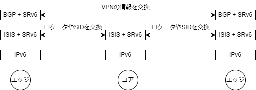

# SRv6

https://www.segment-routing.net/

SRv6 = **S**egment **R**outing over IP**v6** dataplane

A source-routing architecture that seeks the right balance between distributed intelligence and centralized optimization.

（分散インテリジェンスと集中最適化の間の適切なバランスを追求するソース ルーティング アーキテクチャ。Google翻訳）

<br>

## ひとことでいうと

新しいアドレス体系を使ってパケットの通り道を制御する仕組みです。

パケットを受信した装置は、その新しいアドレス体系（番号）を使って途中経路や出口を指定できるので、ソースルーティングの一種になります。

たとえばR1に着信したパケットがR4から出ていくことを考えます。


IPネットワークの動的ルーティングでは最短コストに従ってルーティングされますので、コスト設計をどれだけ頑張っても

- R1-R2-R4
- R1-R3-R4
- R1-R2-R3-R4
- R1-R3-R2-R4

の4通りしか実現できません。

一方でSRv6の場合は、着信したR1がどこを通したいかを（新しい番号を使って）制御できますので

- R1-R2-R3-R2-R4


のような、同じノードを2回通るような経路も実現可能です。

このような通信はR3が特別な役割、たとえばフィルタリングやパケットの中身を精査する機能を持っているときに、一度そこを通してから外に出したい場合に使えそうです。

このような経路制御をシンプルに少ないプロトコルで実現できるのがSRv6です。

<br>

## SRv6は○○ではない

SRv6は**ルーティングプロトコルではありません**

新しいアドレス体系を扱うためにISISやOSPF、BGPを拡張しますが、SRv6という動的ルーティングプロトコルがあるわけではありません。

SRv6はデータを運ぶ**ネットワーク層、トランスポート層ではありません**

SRv6はアドレス体系ですので、それ単独でパケットを運ぶことは動作できません。
SRv6ではIPv6を、SR-MPLSではMPLSを使ってパケットを運びます。

<br>

## セグメントってなんだ？

セグメントルーティングという言葉を聞いたときに思い浮かぶ疑問の一つがこれではないでしょうか。

セグメントは**番号を採番する対象の機能**のことを指します。

IPネットワークでセグメントといえば、ルータで区切られた部分（ブロードキャストが届く範囲）に割り当てるサブネットを思い浮かべることが多いと思います。
セグメントルーティングではそれを「その場所にいるノードにパケットを中継する機能」と考え、その機能に対して番号を採番します。

ルータの中に仮想ルータ（VRF）を作成したのであれば、そのVRFに対して番号を採番します。
その番号に向けてパケットを送信すればVRFにパケットが届くようになる、ということです。
この番号のことをSID(=Segment ID、シッド、セグメントID)と呼びます。
SRv6においてSIDはIPv6のアドレス形式と同じ形を利用します。SR-MPLSの場合は単なる整数値を使います。

採番対象になる代表的な機能については標準化されて名称がついています（この後紹介します）。

<br>

## SRv6の利用シーン

<dl>
    <dt>VPNのサービス基盤</dt>
        <dd>入り口と出口が明確になるネットワークを作るのに向いています。VPNはその典型です。</dd>
    <dt>スライシング</dt>
        <dd>同じネットワークインフラを分割して、契約に応じて提供する部分を変更する機能です。5Gのコアでよく言われる機能です。</dd>
    <dt>サービスチェイニング</dt>
        <dd>必要に応じてトラフィックを捻じ曲げてファイアウォールや負荷分散装置等を経由して、ネットワークに付加価値をつけることができる機能です。</dd>
</dl>

このような利用シーンから、通信キャリアのバックボーンやデータセンターの中で共通に利用するネットワーク基盤で先行して導入されています。
L3VPNやEVPNの技術を使って多種な通信を運びつつ、ネットワークの内部はシンプルな状態を維持したいときにSRv6が最も適しています。

逆に、あまり向いていないのは拠点間を接続するWANの部分やパブリッククラウドとの接続部分です。
SRv6のアドレス体系（セグメントID）の情報をネットワーク内に伝搬させるのにISISを利用しますので、ISISを適用できる範囲内がSRv6の利用シーンになります。

<br>

## SRv6のネットワーク構成の考え方

ネットワーク全体をパケットの中継を行うファブリックとして考えるのがファブリックネットワークです。


ネットワーク全体を一つの装置として考え、着信したパケットが、ファブリックのどこかを通って出ていく、と考えます。
したがってネットワークの内側と外側、入り口と出口は明確に分けて考える必要があります。

ファブリックネットワークの作り方には時代によって流行り廃りがあります。

現在の主流はこれらです。

- Cisco ACI  ・・・データプレーンはVXLAN、独自コントロールプレーン（APIC）
- MPLS/BGP VPN　・・・データプレーンMPLS、コントロールプレーンにLDP, BGP

注目株がこちら。

- SRv6　・・・データプレーンにIPv6を使ったセグメントルーティング
- SR-MPLS　・・・データプレーンにMPLSを使ったセグメントルーティング

SRv6とSR-MPLSは現在主流になっているACIやMPLS/BGP VPNよりも、よりオープンで、よりシンプルに実現します。

残念ながら、あまり普及しなかったものもあります。

- Cisco FabricPath (レイヤ2ブリッジの拡張)
- Cisco SD-Access (SD-LAN)　・・・データプレーンはVXLAN、コントロールプレーンはLISP

シャーシ型の装置を作っているベンダーは、ファブリックネットワークも得意です。
シャーシ型の装置はスーパーバイザーと呼ばれる装置を管理するモジュールと、装置内部でパケットを中継するファブリックモジュール、外部に接続インタフェースを提供するラインカードで構成されます。


それらモジュールをそれぞれ単独の装置にして、分散配置すればファブリックネットワークが構成できます。
このようにして作られたベンダー独自のファブリックネットワークには「コントローラ」と呼ばれる装置がつきものです。

一方で、SRv6にコントローラはありません。
各装置が自律的に動作する分散型のアーキテクチャを採用した、コントローラが存在しないファブリック型ネットワークと言ってよいでしょう。

> **Note**
> SRv6において、機器を管理するコントローラは存在しませんが、経路計算を1台の装置に集約にすることはできます。

<br>

## 必要な知識

SRv6を理解するうえで必要になる知識はこれらです。

- IPv6
- ISIS（IPv6ルーティング）
- BGP
- VPN（L3VPN、EVPN）

企業向けのネットワークインテグレーションではあまり馴染みがないものが多いのが難点です。



ベースになるネットワークでは網内の全域でIPv6が必要です。

そのためのルーティングプロトコルにはISISが用いられます。
IPv6をルーティングするだけならOSPFv3でもよいのですが、SRv6で導入される新しいアドレス体系と相性が良いのはISISで、FlexAlgoという魅力的な機能もISISが必要です。
ベンダー各社のSRv6実装状況を鑑みてもルーティングプロトコルはISISの一択になります。

VPNを構成するエッジ・エッジ間での情報交換はiBGPが用いられます。
iBGPはフルメッシュでピアリングしなければいけませんので、通常はルートリフレクタを導入して管理を容易にします。

<br>

## ルータが持つセグメント

ルータは２つの機能を必ず持っています。

1. 自分宛の通信を処理する機能
2. 隣接する装置にパケットを中継する機能

IPネットワークを設計するときのベストプラクティスでは、すべてのルータにループバックインタフェースを作成して、
装置を代表するIPアドレスをそのループバックに割り当てます。
IPv4であれば/32、IPv6であれば/128のアドレスをループバックに割り当てて、動的ルーティングでその情報を配信します。
ルータそのものへの通信、たとえばiBGPでピアリングするときのアドレスや、NTPサーバとして振る舞うときのアドレスにはこのアドレスを利用します。

SRv6において、自装置宛の通信を処理する機能にEndという名称が付与されており、SIDの採番対象となっています。
ノード（装置自身）への通信を処理する機能ですからノードSIDと呼びます。

- 装置を代表するアドレス = ループバックインタフェースのIPアドレス
- 装置を代表するSID = SRv6のEnd機能に対するSID = ノードSID

と考えてよいでしょう。

ルータは自足のインタフェースの先にいるノードにパケットを中継します。
すべてのルータがこの動作をすることで、ホップバイホップでパケットが中継されていくわけですが、SRv6ではこの機能にEnd.Xという名称が付いています。
もちろんSIDを採番する対象で、ノードが持っている足の数だけEnd.XのSIDを割り当てます。これを隣接SID（Ajacency SID）と呼びます。

ルータのどの機能にどのSIDを割り当てるか、その方法は大きく分類すると２通りで、一つは人間が決める方法、もう一つは動的に決める方法です。

Endは装置を代表するSIDですから、なるべく固定的に採番した方が管理の観点でメリットが大きいです。
一方、End.Xは隣接ノードを見つけたときに自動で決めたほうがいいでしょう。
隣接ノードは障害の発生や構成変更で常に存在するとは限りませんので、見つけ次第、自動で採番する方が理にかなっています（通常はISISの仕事です）。

ルータには上記２つの機能に加えて、VPNを収容することもあります。
セグメントルーティングが画期的なのは、VPNに対しても同じアドレス体系で番号を付与できることです。
どこを通って、どこにたどり着け、という制御をかける際に、全てが同じ番号体系で指し示せるのです。

どこを通れ、は装置を代表するノードSID、どのインタフェースを通れ、はEnd.XのSID、どこにたどり着け、はVPNに対応するSIDを指定します。

<br>

## セグメントIDの形式

SRv6のセグメントIDはIPv6アドレスと同じ形式を取ります。
IPv6では前半64ビットがネットワーク部、後半64ビットがホスト部になっていますが、SRv6では前半をLocator（ロケータ）、後半をFunction（ファンクション）と呼びます。
ロケータはそれがどの装置に存在するものなのかを表し、ファンクションはその装置の中のどの機能なのかを表します。


SRv6のロケータはさらにブロック部とノード部に分かれます。通常ブロック部は40ビット、ノード部は24ビットです。
（40ビットというと16の倍数ではないので、IPv6のアドレス表記とは相性が悪いのですが、そう決まっているので仕方ありません）。
SRv6を構成するネットワーク内でブロック部は共通にします。

たとえば 2001:0db8:0000:/48 を例に考えてみます。

> **Note**
> 2001:0db8で始まるアドレスは文書記載用に予約されたアドレスです。

> **Note**
> プラバイダーからIPv6アドレスの払い出しを受ける際の最大サイズは一般的に/48です。

先頭の40ビットはブロック部になりますので、SRv6を構成する全ルータのロケータで共通でなければいけません。
/48のサイズでアドレスの払い出しを受けていれば、このルールはすでに満たしています。
この例では 2001:0db8:00 がブロック部になります（16進表記のXXが5個で40ビットです）。

ノード部はルータごとに変わります。ノード部を1から連番で割り当てるなら、各装置のロケータはこうなります。

- R1のロケータは 2001:0db8:00 + 00:0001
- R2のロケータは 2001:0db8:00 + 00:0002
- R2のロケータは 2001:0db8:00 + 00:0003
- R2のロケータは 2001:0db8:00 + 00:0004


R1のロケータをIOS-XRの設定イメージで書いてみると、このようになります。

```bash
segment-routing
 srv6
  locators
   locator a
    prefix 2001:0db8:0000:1::/64
   !
  !
 !
!
```

> **Note**
> ここでのaはロケータに付与した名前です。
> FlexAlgoを導入するとロケータは複数必要になりますので、採番ルールと同時に名前付けのルールも意識しておいた方が良さそうです。

<br>

## IPv6アドレスとロケータの採番

IPv6の場合、ルータとルータの間にある部分（いわゆるセグメント）は、IPv6を有効にすればリンクローカルアドレスが動的に決まりますので、必ずしもIPv6アドレスを採番する必要はありません。
ですが、実際には遠隔からのping監視の必要性、インタフェースをアドレスで特定する必要性、などを考慮するとIPv6アドレスの採番が必要です。
ルータとルータの間の部分にIPv6アドレスを採番しつつ、ルータ自身に対してもロケータという形で/64のアドレスを割り当てます。
ロケータはルータの論理的なインタフェースと考えると分かりやすいと思います。

ルータのインタフェースに付与するアドレスとロケータをどういうルールで採番するか、はネットワーク設計者の腕の見せ所になります。
IPv6はアドレス空間が広大ですので、節約するよりも、効率的に集約することが重んじられます。
運用管理上意味のある単位でひとまとめにしたときに、そこで用いられている物理足のアドレスとロケータがまとめて一つのアドレスに集約できるように配慮して払い出します。

> **Note**
> FlexAlgoを導入すると、ルータ1台あたり複数のロケータが必要になります。


<br>

## ファンクション部

Function（ファンクション）は装置が自分自身の機能に対してセグメントIDを採番する対象です。

FunctionはRFC8986で標準化されていますので、ここからはその呼び方を使います。

> https://datatracker.ietf.org/doc/rfc8986/
>
> RFC8986 Segment Routing over IPv6 (SRv6) Network Programming

| ファンクション     |  説明  |
| ----------------- | ----- |
| End               | エンドポイント |
| End.X             | L3クロスコネクトのエンドポイント<br>Adjacency SIDと呼びます |
| End.T             | 特定のIPv6テーブルをルックアップするエンドポイント |
| End.DX6           | カプセル化を解除してIPv6クロスコネクトを行うエンドポイント<br>IPv4 L3VPN per-CE |
| End.DX4           | カプセル化を解除してIPv4クロスコネクトを行うエンドポイント<br>IPv4 L3VPN per-CE |
| End.DT6           | カプセル化を解除して特定のIPv6テーブルをルックアップするエンドポイント<br>IPv6 L3VPN per-VRF |
| End.DT4           | カプセル化を解除して特定のIPv4テーブルをルックアップするエンドポイント<br>IPv4 L3VPN per-VRF |
| End.DT46          | カプセル化を解除して特定のIPテーブルをルックアップするエンドポイント<br>L3VPN per-VRF |
| End.DX2           | カプセル化を解除してL2クロスコネクトを行うエンドポイント<br>L2VPN |
| End.DX2V          | カプセル化を解除してVLAN L2テーブルをルックアップするエンドポイント<br>EVPN Flexible Cross-connect |
| End.DT2U          | カプセル化を解除してユニキャストMAC L2テーブルをルックアップするエンドポイント<br>EVPN Bridging Unicast |
| End.DT2M          | カプセル化を解除してL2テーブルでフラッディングするエンドポイント<br>EVPN Bridging BUM |
| End.B6.Encaps     | カプセル化を伴うSRv6 Policyに紐付けられたエンドポイント<br>Binding SID |
| End.B6.Encaps.Red | End.B6.Encaps with reduced SRH |
| End.BM            | SR-MPLS Policyに紐付けられたエンドポイント |

たくさんありますが、よく目にするFunctionはこれらです。

<dl>
    <dt>End</dt>
        <dd>そのルータ自身宛ての通信を処理する機能</dd>
    <dt>End.X</dt>
        <dd>ルータの自足のインタフェース上にいるノードに中継する機能</dd>
    <dt>End.DT4</dt>
        <dd>そのルータの中にあるL3VPNのIPv4ルーティングテーブル(VRF)を検索して中継する機能</dd>
    <dt>End.DT6</dt>
        <dd>そのルータの中にあるL3VPNのIPv6ルーティングテーブル(VRF)を検索して中継する機能</dd>
</dl>

<br>

## ファンクション部へのSIDの採番

人間が決めた値を静的に設定する方法と、プロトコルが動的に採番する方法があります。

静的に決める範囲は、上位1オクテットのうち 0x00 - 0x3f まで、合計64個としている実装が多いようです。
この場合、動的に決まるSIDは0x40以降になります。

<br>

### Endファンクション

Endファンクションはそのルータ自身宛ての通信を処理する機能ですから、そのルータを代表するSIDです。
装置を代表するIPv6アドレスと、装置を代表するSIDは同じものにしておくとわかりやすくなります。
そのためには、ループバックに割り当てるIPv6アドレスをロケータの中から採番します。

たとえばR1のロケータが 2001:0db8:0:1::/64 だったとして、ループバックには2001:0db8:0:1::1/128を割り当てます。

> **Note**
> SRv6を構成するルータのLoopbackのIPv6アドレスは {locator}::1/128 とする、といった具合にルール化しておくとよいと思います。

ISISはSRv6のロケータ情報を/64の経路として配信しますので、Loopbackのconnected経路を配信する必要はありません。

<br>

### End.Xファンクション

End.Xは隣接ノードにパケットを転送する機能です。

FITELnetの機器でEnd.XのSIDを静的に設定するなら次のコマンドを使います。

```bash
local-sid <SID> action end.x <送信インターフェイス名> <Next-hop> [psp]
```

コマンドの引数にある`<Next-hop>`は隣接ノードのIPv6アドレスです。
事前に調べておかないと設定できませんし、その隣接ノードが常時存在するとも限りません。

End.XはISISを使って動的に決めたほうがよいでしょう。

ISISをSRv6に対応させるには、次の設定を使います。

FITELnetの場合

```bash
Router(config)# router isis core
Router(config-isis core)# srv6 locator a
```

この設定をするだけでロケータ a の中からEnd.XのSIDを自動採番してくれます。

```bash
fx201-p#show segment-routing srv6 sid detail

SID                         Function     Context                                             Owner  State
--------------------------  -----------  --------------------------------------------------  -----  ---------
3ffe:201:0:1:42::           End.X        [Port-channel 1020000, Link-Local]                  IS-IS  InUse
  Locator : prefix1
  Nexthop : fe80::280:bdff:fe4c:b2b2
  Link-ID : 7
  OUT-RFID: 65537
  Created : Wed Dec 14 18:11:20 2022 (02w5d16h ago)
3ffe:201:0:1:43::           End.X (PSP)  [Port-channel 1020000, Link-Local]                  IS-IS  InUse
  Locator : prefix1
  Nexthop : fe80::280:bdff:fe4c:b2b2
  Link-ID : 7
  OUT-RFID: 65537
  Created : Wed Dec 14 18:11:20 2022 (02w5d16h ago)
```

> **Note**
> FITELnetはLLDPやCDPがないのですが、SRv6のEnd.Xの情報から隣接機器のIPv6アドレスを知ることができます。

<br>

## End.DT4 End.DT6ファンクション

End.DT4は自装置の中にあるL3VPN(VRF)宛てのIPv4通信を処理する機能です。
End.DT6はVRF宛てのIPv6通信を処理する機能です。

同じVRFの先に複数のCEルータがつながるケースがあります。
VRF単位にファンクションを割り当てるか、CE装置単位にファンクションを割り当てるか、選択できます。

> **Note**
> FITELnetのデフォルト動作はVRF単位です。

このVPNの通信はこの経路を通るようにしたい、といった特別な経路制御をかけたい場合はSIDを静的に設定するのもありだと思います。

FITELnetではこのように設定します。

```bash
local-sid <SID> action {end.dt4|end.dt6} [vrf <VRF>]
```

引数でVRFを指定しますので、順番的にはVRFを先に作成して、その後SIDを割り当てることになります。

動的にSIDを決めるのであれば、VRFの設定に対して、どのロケータから採番するかを定義します。

FITELnetでの設定はこのようにします。

```bash
Router(config)# ip vrf VRF1
Router(config-vrf VRF1)# segment-routing srv6 locator a
```

自装置のVRFに対して割り当てたSIDの情報は、iBGPを使って自分以外のエッジルータに配信します。

> **Note**
> 実際にiBGPで交換している情報は、ロケータと **ラベル** の情報です。
> 昔からあるMPLS-VPNの仕組みをそのまま流用しているためです。
> 当然ですが、ラベルからSID、SIDからラベルに変換できます。


<br>

## SIDのルーティングテーブル

自装置の中で割り当てたSIDの情報は次のshowコマンドで確認できます。

FITELnetの場合。

```bash
show segment-routing srv6 sid
```

```bash
Router# show segment-routing srv6 sid
SID Function Context Owner State
-------------------------- ----------- -------------------------------------------------- ----- ---------
2001:db8:0:45:40:: End IS-IS InUse
2001:db8:0:45:41:: End (PSP) IS-IS InUse
2001:db8:0:45:42:: End.X [Port-channel 21, Link-Local] IS-IS InUse
2001:db8:0:45:43:: End.X (PSP) [Port-channel 21, Link-Local] IS-IS InUse
2001:db8:0:45:44:: End.DT4 'VRF1' BGP InUse
```

これはあくまで自装置の中に存在するSIDです。
自装置の中で採番したSIDの情報は、自分以外のルータに教えることで意味を持ちます。
自分の情報を配信すると、自分にパケットが届くようになる、というのはIPネットワークのルーティングと同じです。

End.Xの情報はISISで配信します。
End.DT4のようなVPNに割り当てたSIDはiBGPでエッジルータ同士情報を交換します。

となると「あの機能にパケットを送るには、どのSIDを付ければよのか」ということを知りたくなりますね。
ルーティングテーブルのように、宛先として使うべきSIDを一覧でみたいわけですが、残念ながらそれを表示するコマンドはなさそうです。
SRv6はアドレス体系であって、情報を交換するプロトコルではありませんので、ISISの中やBGPの中に情報が散在してしまうのは、仕方ないのかもしれません。

現実的には、全てのエッジルータからSIDの情報を集めてくることになると思います。

<br>

## FunctionのSIDに到達するための経路の確保

ISISやBGPの情報から宛先として使うべきSIDがわかったとして、そこに到達する経路はどうなるでしょう。

SRv6のSIDはIPv6と同じ形式ですから、IPv6のルーティングテーブルを検索すればSIDに到達するための経路が出てきます。

```
fx201-pe1#show ipv6 route 3ffe:220:1:1:46::

Routing entry for 3ffe:220:1:1::/64
  Known via "isis", distance 115, metric 30, best, redistributed
  Last update 00:00:01 ago

  fe80::280:bdff:fe4d:5e10 (reachable by fe80:2723::/64), port-channel1010000, RD 0:0, System VRF-ID 0, NHD LINK fe80:2723::280:bdff:fe4d:5e10 (25), refcnt 4
  fe80::280:bdff:fe4c:b2a3 (reachable by fe80:2726::/64), port-channel3010000, RD 0:0, System VRF-ID 0, NHD LINK fe80:2726::280:bdff:fe4c:b2a3 (22), refcnt 3
```

ロンゲストマッチのルールに従って、ISISが配信した/64のロケータの情報にたどり着きます。

<br>

## SIDにpingを打ちこむ

Endに割り当てたSIDであれば、応答があってしかるべきです。

それ以外のSIDは形式こそIPv6と同じですが、機能に対して割り当てた番号ですので、そこにpingを打ち込んでも応答はありません。

<br>

## 狙った経路で通信する

ルータが自身の中にある機能にSIDを採番したとして、そこに向けて通信するにはどうしたらいいかを考えます。

一番簡単な方法はスタティックルーティングです。
「あのSIDにたどり着くためには、ここを通過せよ」という情報をルータに設定します。


<br>

## VPN通信の場合

エッジルータがVPN用にVRFを作成すると、VRFごとにSIDが割り当てられます（End.DT4 per-VRFの場合）。

このSIDはBGPで自分以外の全てのエッジルータに配信されます。

エッジルータはそのSIDに向けてIP-in-IPで送信します。

> **Note**
> SRv6を使っていない場合は、iBGPで経路を配信したエッジルータのアドレスがnext-hopになります。
> SRv6の場合、next-hopがSIDに置き換わるだけです。

ロケータの情報はISISで配られていますので、その経路に従ってIP-in-IPパケットがネットワークに流れていきます。

この時点ではまだSRv6は登場しません。
途中経路上でパケットをキャプチャしても単なるIP-in-IPのパケットしか観察できません。
特別な経路を通って到達させたいときに初めてSRv6が使われます。

「あのSIDにたどり着くためには、ここを通過せよ」という情報をルータに設定するのは、
スタティックルーティングのときとまったく同じですが、
VPNの場合にはより柔軟なポリシーを作れるようになっています。

1. BGPで学習したNext-HopとなるSIDであり、かつ
2. BGPのColor属性が一致した場合、
3. この経路を使用せよ、

というポリシーをエッジルータに作成しておきます。
BGPの経路にカラー属性を付与することで、通る場所を制御できるようになります。

> **Note**
> BGPで経路を配信する側が、通り道を制御する、ということです。

何かしら特別な契約がある場合はカラー属性を付与して特別な経路を通過、そうでなければベストエフォートの経路を通過、というようなユースケースに使えそうです。

<br>

## PSP Penultimate Segment Pop

SIDのテーブルを表示するとPSPマークが出てきます。

最終目的地の手前でSRヘッダを取り除くことを言います。

最終目的地がSRのドメインの外にある場合に、最終目的地よりも手前でSRヘッダを取り除く必要があります。
そのような場面以外は、あまり気にしなくてよいと思います。

> **Note**
> なるべく早めに取り除いたほうが、ヘッダが短くなるので好ましい側面もあります。


<br>

## 疎通確認の方法

IOS-XRの場合は、ポリシー名を指定してping、tracerouteを打てます。

```
RP/0/RP0/CPU0:PE04#ping segment-routing srv6 policy name ?
  WORD  Srv6 TE configured or auto-generated policy name

RP/0/RP0/CPU0:PE04#traceroute segment-routing srv6 policy name a ?
  flowlabel  flowlabel of the packet
  maxttl     maximum time to live
  minttl     minimum time to live
  numeric    Numeric display only
  port       port number
  priority   priority of the packet
  probe      probe count
  reduced    ping segment routing policy with reduced option
  source     source address or interface
  timeout    timeout value in seconds
  verbose    verbose output
  vrf        vrf table for the route lookup
  <cr>
```

Path Tracingという機能が実装されると、どこを通っているかが分かるようになる。

SIDへのpingはできない。

```
f220-pe2#show segment-routing srv6 sid

SID                         Function     Context                                             Owner  State
--------------------------  -----------  --------------------------------------------------  -----  ---------
3ffe:220:1:1:40::           End                                                              IS-IS  InUse
3ffe:220:1:1:41::           End (PSP)                                                        IS-IS  InUse
3ffe:220:1:1:46::           End.DT4      '1'                                                 BGP    InUse
3ffe:220:1:1:47::           End.DT4      '2'                                                 BGP    InUse
3ffe:220:1:1:48::           End.DT6      '1'                                                 BGP    InUse
3ffe:220:1:1:49::           End.DT6      '2'                                                 BGP    InUse
3ffe:220:1:1:4a::           End.X        [Port-channel 1020000, Link-Local]                  IS-IS  InUse
3ffe:220:1:1:4b::           End.X (PSP)  [Port-channel 1020000, Link-Local]                  IS-IS  InUse
3ffe:220:1:1:4c::           End.X        [Port-channel 1010000, Link-Local]                  IS-IS  InUse
3ffe:220:1:1:4d::           End.X (PSP)  [Port-channel 1010000, Link-Local]                  IS-IS  InUse
f220-pe2#ping ipv6 3ffe:220:1:1:40::
Sending 5, 100-byte ICMP Echos to 3ffe:220:1:1:40::(3ffe:220:1:1:40::), timeout is 2 seconds:
*** No route to host.
.*** No route to host.

Success rate is   0 percent (0/2)

f220-pe2#ping 3ffe:220:1:1:41::
Sending 5, 100-byte ICMP Echos to 3ffe:220:1:1:41::(3ffe:220:1:1:41::), timeout is 2 seconds:
*** No route to host.

Success rate is   0 percent (0/1)
```


## OAM (Operation and Maintenance)

ファブリックネットワークは、全体を一つの装置として見るので、個々の装置の管理ではなく、複数の装置を同時に扱う必要がある。
パケットが入ってきた場所と、出ていく場所は異なる装置なのが通常なので、その両方の装置をケアしなければいけない。

ベンダー独自技術の場合はコントローラが付属する。Cisco ACIの場合はAPICがコントローラ。

オープン技術を採用する場合には、マルチベンダ製品を扱うオーケストレータを使う場合が多い。

Cisco NSO(Network Services Orchestrator)

JuniperはCSO(Contail Service Orchestration)

ただ、現場作業時にNSOを持ち込むのはオーバースペックなので、簡易なツールが必要。

pyATSを使って各種操作を自動化する。

できること

- ファブリック内のSIDを全て収集

- パラメータシートからのVPNプロビジョニング

- end-to-endの疎通確認


## 要望

機能追加

- API(RESTCONF/YANGモデル)の実装 これからGenieのパーサーを揃えていくのは辛い

- ping srv6 <ポリシー> の実装 これはないと困る

- QoS 富士通のデータセンターでSR-MPLSを設計したときに最も苦労したのがこれ SRヘッダを見てQoSできるといいのかも

- path-tracing の実装

- gRPCを使ったdial-in/dial-outでのテレメトリ

<br><br><br><br>

# RFC

RFC8986は必読です。

## アーキテクチャ関連

RFC 8402 Segment Routing Architecture
RFC 7855 Source Packet Routing in Networking (SPRING) Problem Statement and Requirements
RFC 8660 Segment Routing with MPLS data plane
RFC 8754 IPv6 Segment Routing Header (SRH)
RFC 8986 Segment Routing over IPv6 (SRv6) Network Programming

## ISIS関連

RFC 7810 IS-IS Traffic Engineering (TE) Metric Extensions
RFC 8491 Signaling MSD (Maximum SID Depth) using IS-IS
RFC 8667 IS-IS Extensions for Segment Routing
RFC 8668 Advertising L2 Bundle Member Link Attributes in IS-IS

## BGP関連

RFC 8571 BGP-LS Advertisement of IGP Traffic Engineering Performance Metric Extensions
RFC 8669 Segment Routing Prefix SID extensions for BGP

## OSPF関連

RFC 7471 OSPF Traffic Engineering (TE) Metric Extensions
RFC 8665 OSPF Extensions for Segment Routing
RFC 8666 OSPFv3 Extensions for Segment Routing
RFC 8476 Signaling MSD (Maximum SID Depth) using OSPF

## OAM関連

RFC 8287 Label Switched Path (LSP) Ping/Trace for Segment Routing Networks Using MPLS Dataplane
RFC 8403 A Scalable and Topology-Aware MPLS Dataplane Monitoring System
