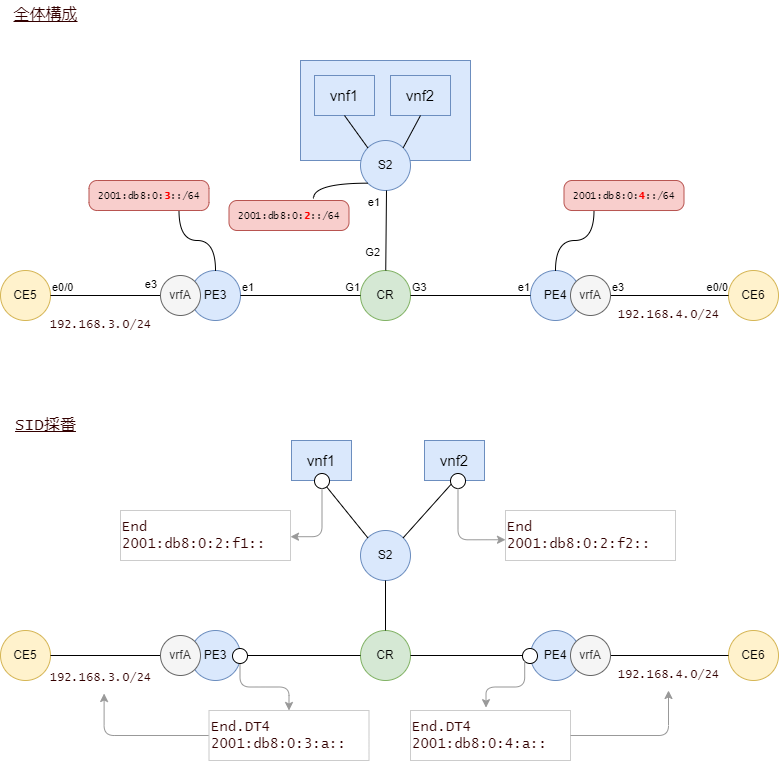
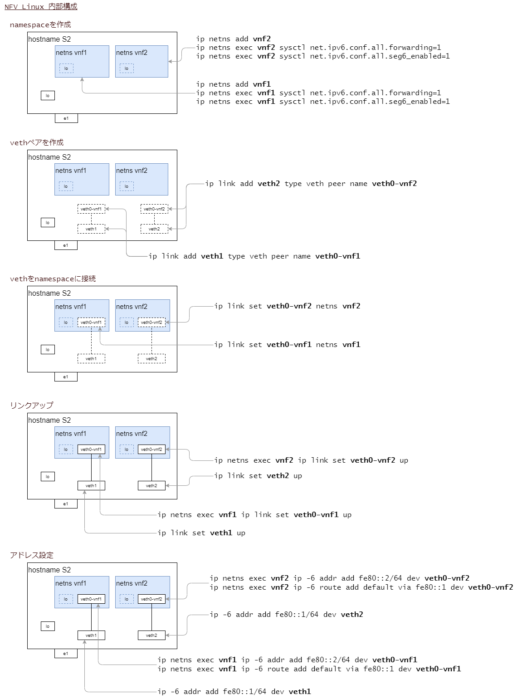
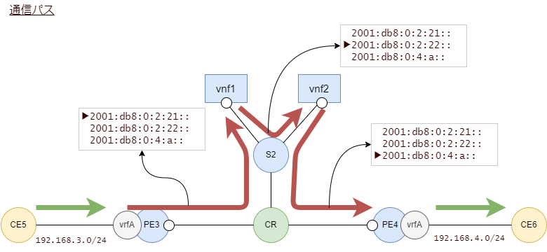

# Linux Service Function Chaining


## 構成



- CRはIPv6のルーティングだけを実行するルータでCSR1000vです。

- PE3, PE4はUbuntu server 22.04で、スタティックでSRv6 SIDを設定します。

- S2はUbuntu Server 22.04で、namespaceを使って複数の機能（VNF）を持たせます。


## CRの設定

PE3-CR-PE4はISISで動的ルーティングします。

S2はサービスを提供するノードですので、CR-S2間はスタティックです。

S2のロケータ 2001:db8:0:2::/64 をスタティックルートで設定します。
S2が持つループバックアドレスに向けたホストルート/128をスタティックルートで設定します。

これらスタティックルートをISISでredistributeして、PE3とPE4に配ります。

```
!
ipv6 unicast-routing
!

!
interface Loopback0
 no ip address
 ipv6 address 2001:DB8:0:FFFF::1/128
 ipv6 enable
 ipv6 router isis core
!
!
interface GigabitEthernet1
 description to_PE3_e1
 no ip address
 negotiation auto
 ipv6 enable
 ipv6 router isis core
 no mop enabled
 no mop sysid
 isis network point-to-point
 isis metric 1 level-1
 isis metric 1 level-2
!
interface GigabitEthernet2
 description to_S2_e1
 no ip address
 negotiation auto
 ipv6 address FE80::1 link-local
 ipv6 enable
 ipv6 router isis core
 no mop enabled
 no mop sysid
 isis network point-to-point
 isis metric 1 level-1
 isis metric 1 level-2
!
interface GigabitEthernet3
 description to_PE4_e1
 no ip address
 negotiation auto
 ipv6 enable
 ipv6 router isis core
 no mop enabled
 no mop sysid
 isis network point-to-point
 isis metric 1 level-1
 isis metric 1 level-2
!

!
router isis core
 net 49.0000.0000.0000.ffff.00
 metric-style wide
 redistribute static ip
 !
 address-family ipv6
  multi-topology
 exit-address-family
!

!
ipv6 route 2001:DB8:0:2::/64 GigabitEthernet2 FE80::2
ipv6 route 2001:DB8:0:FFFF::2/128 GigabitEthernet2 FE80::2
ipv6 route 2001:DB8:0:FFFF::21/128 GigabitEthernet2 FE80::2
ipv6 route 2001:DB8:0:FFFF::22/128 GigabitEthernet2 FE80::2
!
```

## PE3の設定

[Ubuntuの設定](README.ubuntu_setup.md) を参考に、VRFの作成まで実施します。

FRRで以下のように設定します。

ロケータ `2001:db8:0:3::/64` をスタティックでNull0に向け、それをISISにredistiributeします。

```
PE3# sh run
Building configuration...

Current configuration:
!
frr version 8.5
frr defaults traditional
hostname PE3
log syslog informational
service integrated-vtysh-config
!
ipv6 route 2001:db8:0:3::/64 Null0
!
interface lo
 ipv6 address 2001:db8:0:ffff::3/128
 ipv6 router isis core
exit
!
interface e3
 description to_CE5_e0/0
 ip address 192.168.3.1/24
exit
!
interface e1
 ipv6 router isis core
 isis metric 1
 isis network point-to-point
exit
!
router isis core
 net 49.0000.0000.0000.0003.00
 redistribute ipv6 static level-2
 topology ipv6-unicast
exit
!
end
```

## PE4の設定

[Ubuntuの設定](README.ubuntu_setup.md) を参考に、VRFの作成まで実施します。

FRRで以下のように設定します。

ロケータ `2001:db8:0:4::/64` をスタティックでNull0に向け、それをISISにredistiributeします。

```
PE4# sh run
Building configuration...

Current configuration:
!
frr version 8.5
frr defaults traditional
hostname PE4
log syslog informational
service integrated-vtysh-config
!
ipv6 route 2001:db8:0:4::/64 Null0
!
interface lo
 ipv6 address 2001:db8:0:ffff::4/128
 ipv6 router isis core
exit
!
interface e3
 description to_CE6_e0/0
 ip address 192.168.4.1/24
exit
!
interface e1
 ipv6 router isis core
 isis metric 1
 isis network point-to-point
exit
!
router isis core
 net 49.0000.0000.0000.0004.00
 redistribute ipv6 static level-2
 topology ipv6-unicast
exit
!
end
```

## PE3のVRFのスタティックルート設定

PE3からみてPE4の先にいるVRF経路（192.168.4.0/24）をスタティックルートで追加します。

このときの宛先はひとまずPE4のEnd.DT4のSIDにします。

```
ip -4 route add 192.168.4.0/24 encap seg6 mode encap segs 2001:db8:0:4:a:: dev e1 table 110
```

- SID 2001:db8:0:4:a:: はPE4におけるEnd.DT4であることを期待しています

## PE4のVRFのスタティックルート設定

PE4からみてPE3の先にいるVRF経路（192.168.3.0/24）をスタティックルートで追加します。
このときの宛先はPE3のEnd.DT4のSIDにします。

```
ip -4 route add 192.168.3.0/24 encap seg6 mode encap segs 2001:db8:0:3:a:: dev e1 table 110
```

- SID 2001:db8:0:3:a:: はPE3におけるEnd.DT4であることを期待しています


## PE3のEnd.DT4の設定

```
ip -6 route add 2001:db8:0:3:a::/128 encap seg6local action End.DT4 vrftable 110 dev e3 table localsid
```

## PE4のEnd.DT4の設定

```
ip -6 route add 2001:db8:0:4:a::/128 encap seg6local action End.DT4 vrftable 110 dev e3 table localsid
```

## PE3の経路確認

PE3のVRFのルーティングテーブル

```
ip route show vrf vrfA
```

実行例

```
root@PE3:~# ip route show vrf vrfA
192.168.3.0/24 dev e3 proto kernel scope link src 192.168.3.1
192.168.4.0/24  encap seg6 mode encap segs 1 [ 2001:db8:0:4:a:: ] dev e1 scope link
```

SID用ルーティングテーブル

```
ip -6 route show table localsid
```

実行例

```
root@PE3:~# ip -6 route show table localsid
2001:db8:0:3:a::  encap seg6local action End.DT4 vrftable 110 dev e3 metric 1024 pref medium
blackhole default dev lo metric 1024 pref medium
```

## PE4の経路確認

PE4のVRFのルーティングテーブル

```
ip route show vrf vrfA
```

実行例

```
root@PE4:~# ip route show vrf vrfA
192.168.3.0/24  encap seg6 mode encap segs 1 [ 2001:db8:0:3:a:: ] dev e1 scope link
192.168.4.0/24 dev e3 proto kernel scope link src 192.168.4.1
```

SID用ルーティングテーブル

```
ip -6 route show table localsid
```

実行例

```
root@PE4:~# ip -6 route show table localsid
2001:db8:0:4:a::  encap seg6local action End.DT4 vrftable 110 dev e3 metric 1024 pref medium
blackhole default dev lo metric 1024 pref medium
```

## CE5-CE6間の疎通確認

```
CE5#ping 192.168.4.6
Type escape sequence to abort.
Sending 5, 100-byte ICMP Echos to 192.168.4.6, timeout is 2 seconds:
!!!!!
Success rate is 100 percent (5/5), round-trip min/avg/max = 2/2/3 ms
```

## サービスモードのセットアップ

S2のホスト設定です。

```bash
# down the NAT interface
ip link dev e0 down

# assign link local address to e1
ip -6 addr add fe80::2/64 dev e1

# assign address to loopback
ip -6 addr add 2001:db8:0:ffff::2/128 dev lo

# add default route to CR
ip -6 route add default via fe80::1 dev e1
```

IPv6リンクローカルアドレスを固定していますが、これはCRにおいてスタティックルートを設定するためです。

続いてネットワーク名前空間を使ってVNF(Virtual Network Function)の領域を作ります。



スタティックルートの追加はデバイスをupさせた後に実施しないとエラーになります。

繰り返し実行しても大丈夫なように削除してから追加するようにしています。

```bash
# delete namespaces
ip netns del vnf1 > /dev/null 2>&1
ip netns del vnf2 > /dev/null 2>&1

# create two namespaces, vnf1 and vnf2
ip netns add vnf1
ip netns exec vnf1 sysctl net.ipv6.conf.all.forwarding=1
ip netns exec vnf1 sysctl net.ipv6.conf.all.seg6_enabled=1

ip netns add vnf2
ip netns exec vnf2 sysctl net.ipv6.conf.all.seg6_enabled=1
ip netns exec vnf2 sysctl net.ipv6.conf.all.forwarding=1

# create veth pair
ip link del veth1 > /dev/null 2>&1
ip link add veth1 type veth peer name veth0-vnf1
ip link del veth2 > /dev/null 2>&1
ip link add veth2 type veth peer name veth0-vnf2

# attach veth to namespace
ip link set veth0-vnf1 netns vnf1
ip link set veth0-vnf2 netns vnf2

# link up
ip link set veth1 up
ip link set veth2 up
ip netns exec vnf1 ip link set veth0-vnf1 up
ip netns exec vnf2 ip link set veth0-vnf2 up

# assign ipv6 link local address to veth
ip -6 addr add fe80::1/64 dev veth1
ip -6 addr add fe80::1/64 dev veth2
ip netns exec vnf1 ip -6 addr add fe80::2/64 dev veth0-vnf1
ip netns exec vnf2 ip -6 addr add fe80::2/64 dev veth0-vnf2

# これ必要？
# ip netns exec vnf1 sysctl net.ipv6.conf.veth0-vnf1.seg6_enabled=1
# ip netns exec vnf2 sysctl net.ipv6.conf.veth0-vnf2.seg6_enabled=1

# create loopback in namespace and assign ipv6 address
ip netns exec vnf1 ip -6 addr add 2001:db8:0:ffff::21 dev lo
ip netns exec vnf2 ip -6 addr add 2001:db8:0:ffff::22 dev lo
ip netns exec vnf1 ip link set dev lo up
ip netns exec vnf2 ip link set dev lo up

# add static route to namespaces loopback
ip -6 route del 2001:db8:0:ffff::21/128 > /dev/null 2>&1
ip -6 route del 2001:db8:0:ffff::22/128 > /dev/null 2>&1
ip -6 route add 2001:db8:0:ffff::21/128 via fe80::2 dev veth1
ip -6 route add 2001:db8:0:ffff::22/128 via fe80::2 dev veth2

# add static route to namespace SID
ip -6 route del 2001:db8:0:2:21::/128 > /dev/null 2>&1
ip -6 route del 2001:db8:0:2:22::/128 > /dev/null 2>&1
ip -6 route add 2001:db8:0:2:21::/128 via fe80::2 dev veth1
ip -6 route add 2001:db8:0:2:22::/128 via fe80::2 dev veth2

# add default route in namespace
ip netns exec vnf1 ip -6 route add default via fe80::1 dev veth0-vnf1
ip netns exec vnf2 ip -6 route add default via fe80::1 dev veth0-vnf2

# add End SID in namespace
ip netns exec vnf1 ip -6 route add 2001:db8:0:2:21::/128 encap seg6local action End dev veth0-vnf1
ip netns exec vnf2 ip -6 route add 2001:db8:0:2:22::/128 encap seg6local action End dev veth0-vnf2

```


PE3からS2のnamespace上にあるアドレスに疎通確認します。

- PE3からvnf1のloアドレス

```
root@PE3:~# ping -6 -c 1 2001:db8:0:ffff::21
PING 2001:db8:0:ffff::21(2001:db8:0:ffff::21) 56 data bytes
64 bytes from 2001:db8:0:ffff::21: icmp_seq=1 ttl=62 time=1.33 ms

--- 2001:db8:0:ffff::21 ping statistics ---
1 packets transmitted, 1 received, 0% packet loss, time 0ms
rtt min/avg/max/mdev = 1.328/1.328/1.328/0.000 ms
```

- PE3からvnf2のloアドレス

```
root@PE3:~# ping -6 -c 1 2001:db8:0:ffff::22
PING 2001:db8:0:ffff::22(2001:db8:0:ffff::22) 56 data bytes
64 bytes from 2001:db8:0:ffff::22: icmp_seq=1 ttl=62 time=1.33 ms

--- 2001:db8:0:ffff::22 ping statistics ---
1 packets transmitted, 1 received, 0% packet loss, time 0ms
rtt min/avg/max/mdev = 1.329/1.329/1.329/0.000 ms
```

## PE3のVRFのルーティングテーブルを変更

PE3に設定済みのVRFのスタティックルートを消します。

```
ip -4 route del 192.168.4.0/24 table 110
```

消えていることを確認します。

```
root@PE3:~# ip -4 route list table 110
192.168.3.0/24 dev e3 proto kernel scope link src 192.168.3.1
local 192.168.3.1 dev e3 proto kernel scope host src 192.168.3.1
broadcast 192.168.3.255 dev e3 proto kernel scope link src 192.168.3.1
```

PE3のVRFに新たにスタティックルートを追加します。

```
ip -4 route add 192.168.4.0/24 encap seg6 mode encap segs 2001:db8:0:2:21::,2001:db8:0:4:a:: dev e1 table 110
```

- 2001:db8:0:2:21:: はS2のvnf1のEnd SIDです

PE3のVRF経路を確認します。

```
root@PE3:~# ip -4 route list table 110
192.168.3.0/24 dev e3 proto kernel scope link src 192.168.3.1
local 192.168.3.1 dev e3 proto kernel scope host src 192.168.3.1
broadcast 192.168.3.255 dev e3 proto kernel scope link src 192.168.3.1
192.168.4.0/24  encap seg6 mode encap segs 2 [ 2001:db8:0:2:21:: 2001:db8:0:4:a:: ] dev e1 scope link
```

CE5からCE6に疎通確認します。

```
CE5#ping 192.168.4.6
Type escape sequence to abort.
Sending 5, 100-byte ICMP Echos to 192.168.4.6, timeout is 2 seconds:
!!!!!
Success rate is 100 percent (5/5), round-trip min/avg/max = 3/3/4 ms
```

今度は途中の通過点をS2のvnf2に変更してみます。

```
ip -4 route append 192.168.4.0/24 encap seg6 mode encap segs 2001:db8:0:2:22::,2001:db8:0:4:a:: dev e1 table 110
ip -4 route del 192.168.4.0/24 encap seg6 mode encap segs 2001:db8:0:2:21::,2001:db8:0:4:a:: dev e1 table 110
```

- 2001:db8:0:2:22はS2のvnf2のEnd SIDです


PE3のVRF経路を確認します。

```
root@PE3:~# ip route list table 110
192.168.3.0/24 dev e3 proto kernel scope link src 192.168.3.1
local 192.168.3.1 dev e3 proto kernel scope host src 192.168.3.1
broadcast 192.168.3.255 dev e3 proto kernel scope link src 192.168.3.1
192.168.4.0/24  encap seg6 mode encap segs 2 [ 2001:db8:0:2:22:: 2001:db8:0:4:a:: ] dev e1 scope link
```

CE5からCE6に疎通確認します。

```
CE5#ping 192.168.4.6
Type escape sequence to abort.
Sending 5, 100-byte ICMP Echos to 192.168.4.6, timeout is 2 seconds:
!!!!!
Success rate is 100 percent (5/5), round-trip min/avg/max = 3/3/4 ms
```

今度は途中の通過点をS2のvnf1とvnf2の両方を指定してみます。

```
ip -4 route append 192.168.4.0/24 encap seg6 mode encap segs 2001:db8:0:2:21::,2001:db8:0:2:22::,2001:db8:0:4:a:: dev e1 table 110
ip -4 route del 192.168.4.0/24 encap seg6 mode encap segs 2001:db8:0:2:22::,2001:db8:0:4:a:: dev e1 table 110
```

PE3のVRF経路を確認します。

```
root@PE3:~# ip -4 route list table 110
192.168.3.0/24 dev e3 proto kernel scope link src 192.168.3.1
local 192.168.3.1 dev e3 proto kernel scope host src 192.168.3.1
broadcast 192.168.3.255 dev e3 proto kernel scope link src 192.168.3.1
192.168.4.0/24  encap seg6 mode encap segs 3 [ 2001:db8:0:2:21:: 2001:db8:0:2:22:: 2001:db8:0:4:a:: ] dev e1 scope link
```

CE5からCE6に疎通確認します。

```
CE5#ping 192.168.4.6
Type escape sequence to abort.
Sending 5, 100-byte ICMP Echos to 192.168.4.6, timeout is 2 seconds:
!!!!!
Success rate is 100 percent (5/5), round-trip min/avg/max = 2/2/4 ms
```

CRのS2向けインタフェースでキャプチャしたものがこちら。

- CRからS2向けのパケット


- S2からCRに戻ってくるパケット


【参考】[pcapngファイル](img/sfc_vnf1_vnf2.pcapng)




## サービスファンクション

vnf1を通過する場合はトラフィックに遅延をかけることにします。

S2にて。

```
ip netns exec vnf1 tc qdisc show dev veth0-vnf1
ip netns exec vnf1 tc qdisc add dev veth0-vnf1 root netem delay 100ms
```

CE5からCE6に疎通確認します。

```
CE5#ping 192.168.4.6
Type escape sequence to abort.
Sending 5, 100-byte ICMP Echos to 192.168.4.6, timeout is 2 seconds:
!!!!!
Success rate is 100 percent (5/5), round-trip min/avg/max = 103/103/104 ms
```

ラウンドトリップが100ミリ秒を超えるようになりました。

S2のvnf1で発生させた通信遅延を消すにはこうします。

```
ip netns exec vnf1 tc qdisc del dev veth0-vnf1 root
```

サービスファンクションにはSnort（IPS/IDS）やnftables（ファイアウォール）を入れてみるとおもしろいと思います。

> 参考
>
> https://www.segment-routing.net/open-software

エンド・エンドの通信を途中経路上にあるサービスファンクションで処理したり、しなかったり、SRv6の入口側の装置で制御できます。
