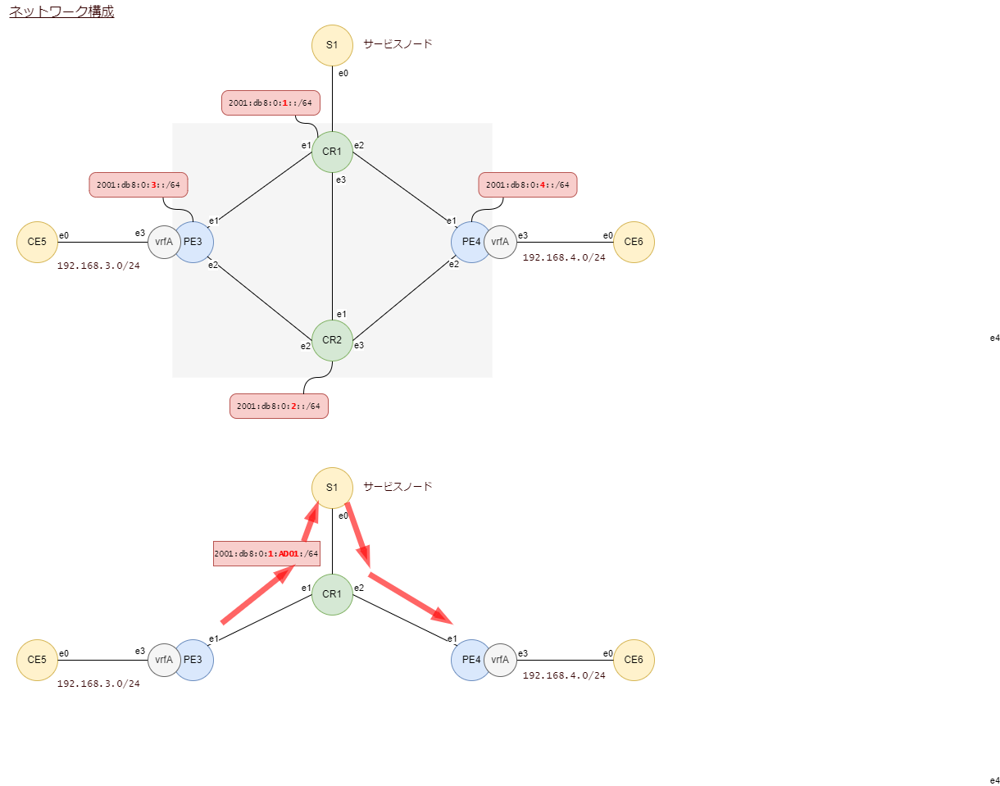

# Linux srextを使ったSRv6 Proxy

残念ながら、動きませんでした。

<br><br><br><br><br>

# SRv6 Linux srext設定

SRv6の先進的な機能はsrextに実装されています。カーネルモジュールを追加することで利用できるようになります。

> 参考
>
> https://github.com/netgroup/SRv6-net-prog

> 参考
>
> https://www.slideshare.net/amsalam20/service-function-chaining-with-srv6


## 構成



CR1にサービスモードS1を接続します。
S1はSRv6を実装していませんので、SIDを持っていません。

CR1にSRv6のプロキシ機能End.ADを構成して、S1を経由してから通信できるようにします。


## srextのインストール

プロキシ機能End.ADを必要とするノードはCR1です。CR1にsrextをインストールします。

以下のインストール作業はCR1で実行します。

コンパイル環境を準備します。

```
apt install make
apt install gcc
```

srextをgitで取得します。

```
git clone https://github.com/netgroup/SRv6-net-prog
```

srextディレクトリに移動します。

```
cd SRv6-net-prog/srext/
```

これからコンパイルして作成するカーネルモジュールに署名をするために必要なキーを作成します。

x509.genkeyファイルを新規に作成します。

```
vi x509.genkey
```

内容はこのようにします。

```
[ req ]
default_bits = 4096
distinguished_name = req_distinguished_name
prompt = no
string_mask = utf8only
x509_extensions = myexts

[ req_distinguished_name ]
CN = Modules

[ myexts ]
basicConstraints=critical,CA:FALSE
keyUsage=digitalSignature
subjectKeyIdentifier=hash
authorityKeyIdentifier=keyid
```

opensslコマンドでキーを作成します。

```
openssl req -new -nodes -utf8 -sha512 -days 36500 -batch -x509 -config x509.genkey -outform DER -out signing_key.x509 -keyout signing_key.pem
```

出来上がったキーをコピーします。

```
cp signing_key.* /lib/modules/$(uname -r)/build/certs/
```

srextをコンパイルします。

```
make
```

srextをインストールします。

```
make install
```

srextをカーネルにロードします。

```
depmod -a
modprobe srext
```

画面には何も表示されないのが期待値です。

もう一度、--first-timeを付けて実行してエラーがでればロードに成功しています。

実行例

```
root@cr1:~/SRv6-net-prog/srext# modprobe --first-time srext
modprobe: ERROR: could not insert 'srext': Module already in kernel
```

## （プロキシ動作なしで）通信できるようにする

簡単のため、まずはこの経路で通信できるようにスタティックルートを定義します。

`CE5 -(IPv4)---[ PE3 =(SRv6)= CR1 =(SRv6)= PE4 ]---(IPv4)- CE6`


## （行き）入り口でのEncap

CE5から送信されるパケットがPE3のVRF（テーブル番号110, 名前vrfA）に着信しますので、行き通信の入り口ノードはPE3です。

PE3のVRFのルーティングテーブルにスタティックルートでencap動作を仕込みます。

```
ip -4 route add 192.168.4.0/24 encap seg6 mode encap segs 2001:db8:0:4:ff01:: dev e1 table 110
```

- encap seg6 はSRv6を使う指定です
- mode はinlineかencapの２択ですが、ここではencapの一択です
- segs で指定している2001:db8:0:4:ff01はPE4にあるSIDで、End.DT4を実行してくれることを期待しています
- table 110 を指定することでvrfAのルーティングテーブルにこのスタティックルートが書き込まれます

PE3のVRF（名前vrfA）のルーティングテーブルを表示します。

`ip route list vrf vrfA`

```bash
root@pe3:~# ip route list vrf vrfA
192.168.3.0/24 dev e3 proto kernel scope link src 192.168.3.1
192.168.4.0/24  encap seg6 mode encap segs 2 [ 2001:db8:0:4:ff01:: ] dev e1 scope link
```

## （行き）出口でのDecap

SRv6網から抜けてCE6にたどり着く出口のSRv6ノードはPE4です。

PE4はプレフィクス2001:db8:0:4::/64に含まれる宛先のパケットをlocalsidテーブルを参照して処理します。

```bash
root@pe4:~# ip -6 rule show
0:      from all lookup local
999:    from all to 2001:db8:0:4::/64 lookup localsid
1000:   from all lookup [l3mdev-table]
32766:  from all lookup main
```

localsidテーブルにEnd.DT4のSIDを作ります。SIDのファンクション部はff01とします。

```
ip -6 route add 2001:db8:0:4:ff01::/128 encap seg6local action End.DT4 vrftable 110 dev e3 table localsid
```

- 2001:db8:0:4:ff01::/128 は定義したいSIDです
- encap seg6local : カプセル化を解く動作です
- action End.DT4 vrftable 110 : IPv4のVRFテーブル110を参照する動作です
- dev e3 : 送信先のインタフェースです
- table localsid : このSIDを格納する先のルーティングテーブルです

PE4におけるlocalsidのルーティングテーブルを確認します。

`ip -6 route show table localsid`

```bash
root@pe4:~# ip -6 route show table localsid
2001:db8:0:4:ff01::  encap seg6local action End.DT4 vrftable 110 dev e3 metric 1024 pref medium
blackhole default dev lo metric 1024 pref medium
```

## （戻り）入り口でのEncap

PE4が戻り通信の入り口ノードです。VRFのルーティングテーブルでPE3のSID 2001:db8:0:3:ff01宛に転送する設定を追加します。

```
ip -4 route add 192.168.3.0/24 encap seg6 mode encap segs 2001:db8:0:3:ff01:: dev e1 table 110
```

## （戻り）出口でのDecap

PE3が戻り通信の出口ノードです。SID 2001:db8:0:3:ff01でEnd.DT4を定義します。

```
ip -6 route add 2001:db8:0:3:ff01::/128 encap seg6local action End.DT4 vrftable 110 dev e3 table localsid
```

## 疎通確認

CE5からCE6に向けてpingできることを確認します。

```
CE5#ping 192.168.4.6
Type escape sequence to abort.
Sending 5, 100-byte ICMP Echos to 192.168.4.6, timeout is 2 seconds:
!!!!!
Success rate is 100 percent (5/5), round-trip min/avg/max = 1/2/3 ms
```

## PE3のEncap動作を変更

PE3は出口ノードPE4におけるEnd.DT4に向けて転送していました。これを一度削除してから、途中経路を追加します。

PE3で経路削除

```
ip -4 route delete 192.168.4.0/24 table 110
```

PE3で経路追加

```
ip -4 route add 192.168.4.0/24 encap seg6 mode encap segs 2001:db8:0:1:ad01::,2001:db8:0:4:ff01:: dev e1 table 110
```

- segs で指定している2001:db8:0:1:ad01はCR1にあるSIDで、プロキシ動作End.ADを実行してくれることを期待しています


## 中間ノードCR1でのプロキシ動作End.AD

これが一番難しいところです。

CR1は通信経路上にある中間ノードです。

CR1にSID 2001:db8:0:1:ad01::/128を作成して、そのSID宛てに飛んできたSRv6パケットをプロキシ動作させます。

iproute2のコマンドではなく、カーネルモジュールsrextをインストールしたときに同時にインストールされたsrconfコマンドを使います。

srconfコマンドの書式はこうです。

```
srconf localsid add SID end.ad4 ip IP-ADDR TARGETIF SOURCEIF
```

- SID 追加したいSID
- end.adはダイナミックプロキシ
- end.amはマスカレード
- IP-ADDRはプロキシ先となるVNFサービスのIPアドレス
- TARGETIFはプロキシ先となるVNFサービスに向けたインタフェース
- SOURCEIFはプロキシ先から戻ってくる通信を受け取るインタフェース

CR1で実行してみます。

```
srconf localsid add 2001:db8:0:1:ad01:: end.ad4 ip 192.168.1.2 e4 e4
```

残念ながらエラーが帰ってきてしまいます。

```
root@cr1:~/SRv6-net-prog/srext/scripts/testbed1# srconf localsid add 2001:db8:0:1:ad01:: end.ad4 ip 192.168.1.2 e4 e4
do_receive_response - received nack - leaving.
```

endであれば設定できます。

```
root@cr1:~/SRv6-net-prog/srext/scripts/testbed1# srconf localsid add 2001:db8:0:1:: end
SREXT answers: OK.
root@cr1:~/SRv6-net-prog/srext/scripts/testbed1# srconf localsid show
SRv6 - MY LOCALSID TABLE:
==================================================
         SID     :        2001:db8:0:1::
         Behavior:        end
         Good traffic:    [0 packets : 0  bytes]
         Bad traffic:     [0 packets : 0  bytes]
------------------------------------------------------
```


## カーネルのコンパイル

> 参考
>
> https://segment-routing.org/index.php/Implementation/Installation

この参考リンクを見ると、カーネルにCONFIG_IPV6_SEG6_BPFが有効になっていないといけないのかもしれない。

しかたないのでコンパイルし直す。


> 参考
>
> https://qiita.com/Brutus/items/3ca1237efdf1711a6428


```
apt-get update && apt install -y build-essential bc bison flex libelf-dev libssl-dev libncurses5-dev
```

ここを訪問してダウンロードするカーネルバージョンを決める
https://www.kernel.org/

uname -rで今動いているカーネルバージョンがわかる

```
root@cr1:~# uname -r
5.15.0-69-generic
```

5.15系で最新は5.15.105なので、これをダウンロードする

git clone https://git.kernel.org/pub/scm/linux/kernel/git/stable/linux-stable.git v5.15.105

cd v5.15.105

コンフィグファイルを既存のものからコピー

cp /boot/config-5.15.0-69-generic .config
ln -s config-5.15.0-105-generic .config

編集

CONFIG_SYSTEM_TRUSTED_KEYS=""
CONFIG_SYSTEM_REVOCATION_KEYS=""

CONFIG_IPV6_SEG6_BPF=y
CONFIG_IPV6_SEG6_LWTUNNEL=y
CONFIG_IPV6_SEG6_HMAC=y

make localmodconfig

対話式の項目はすべてデフォルト。

```
make
make modules
make modules_install
make install
```

この結果、起動しなくなりました。
