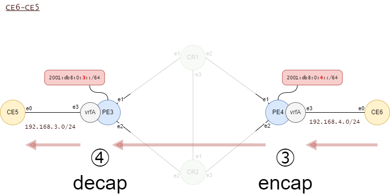
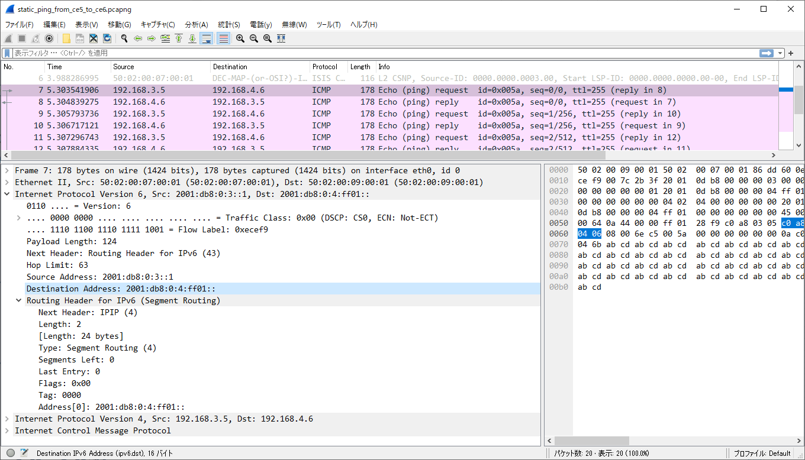

# Ubuntu Server 22.04 L3VPN over SRv6

LinuxだけでL3VPNを構成します。

BGPを使わずにスタティックにSIDテーブルを作ります。

## 構成

構成はBGPを使う場合と同じです。


## FRRの設定

ISISでループバックアドレス同士の通信が成立するようにしておきます。

ロケータとして採番した/64プレフィクスをISISで配るためにスタティックルートを設定し、それをredistributeします。

たとえばPE3の場合はこのような設定になります。

```
!
ipv6 route 2001:db8:0:3::/64 Null0

!
router isis core
 net 49.0000.0000.0000.0003.00
 redistribute ipv6 static level-2
 topology ipv6-unicast
exit
```


- CR1の設定

```
cr1# sh run
Building configuration...

Current configuration:
!
frr version 8.5
frr defaults traditional
hostname cr1
log syslog informational
service integrated-vtysh-config
!
ipv6 route 2001:db8:0:1::/64 Null0
!
interface e1
 description to_PE3_e1
 ipv6 router isis core
 isis metric 1
 isis network point-to-point
exit
!
interface e2
 description to_PE4_e1
 ipv6 router isis core
 isis metric 1
 isis network point-to-point
exit
!
interface e3
 description to_CR2_e1
 ipv6 router isis core
 isis metric 1
 isis network point-to-point
exit
!
interface lo
 ipv6 address 2001:db8:0:1::1/128
 ipv6 router isis core
exit
!
router isis core
 net 49.0000.0000.0000.0001.00
 redistribute ipv6 static level-2
 topology ipv6-unicast
exit
!
end
```

- CR2の設定

```
cr2# sh run
Building configuration...

Current configuration:
!
frr version 8.5
frr defaults traditional
hostname cr2
log syslog informational
service integrated-vtysh-config
!
ipv6 route 2001:db8:0:2::/64 Null0
!
interface e1
 description to_CR1_e3
 ipv6 router isis core
 isis metric 2
 isis network point-to-point
exit
!
interface e2
 description to_PE3_e2
 ipv6 router isis core
 isis metric 2
 isis network point-to-point
exit
!
interface e3
 description to_PE4_e2
 ipv6 router isis core
 isis metric 2
 isis network point-to-point
exit
!
interface lo
 ipv6 address 2001:db8:0:2::1/128
 ipv6 router isis core
exit
!
router isis core
 net 49.0000.0000.0000.0002.00
 redistribute ipv6 static level-2
 topology ipv6-unicast
exit
!
end
```

- PE3の設定

```
pe3# sh run
Building configuration...

Current configuration:
!
frr version 8.5
frr defaults traditional
hostname pe3
log syslog informational
service integrated-vtysh-config
!
ipv6 route 2001:db8:0:3::/64 Null0
!
interface e1
 description to_CR1_e1
 ipv6 router isis core
 isis metric 1
 isis network point-to-point
exit
!
interface e2
 description to_CR2_e2
 ipv6 router isis core
 isis metric 2
 isis network point-to-point
exit
!
interface lo
 ipv6 address 2001:db8:0:3::1/128
 ipv6 router isis core
exit
!
interface e3
 description vrfA
 ip address 192.168.3.1/24
exit
!
router isis core
 net 49.0000.0000.0000.0003.00
 redistribute ipv6 static level-2
 topology ipv6-unicast
exit
!
end
```

- PE4の設定

```
pe4# sh run
Building configuration...

Current configuration:
!
frr version 8.5
frr defaults traditional
hostname pe4
log syslog informational
service integrated-vtysh-config
!
ipv6 route 2001:db8:0:4::/64 Null0
!
interface e1
 description to_CR1_e2
 ipv6 router isis core
 isis metric 1
 isis network point-to-point
exit
!
interface e2
 description to_CR2_e3
 ipv6 router isis core
 isis metric 2
 isis network point-to-point
exit
!
interface lo
 ipv6 address 2001:db8:0:4::1/128
 ipv6 router isis core
exit
!
interface e3
 description vrfA
 ip address 192.168.4.1/24
exit
!
router isis core
 net 49.0000.0000.0000.0004.00
 redistribute ipv6 static level-2
 topology ipv6-unicast
exit
!
end
```


## SID用のテーブルを作成

デフォルトのルーティングテーブルを汚さないように、SID用のテーブルを別に作成します。

テーブル番号100、名前localsidで作成します。

全ルータ共通

```bash
echo 100 localsid >> /etc/iproute2/rt_tables
```

テーブルを作成しただけでは参照されませんので、テーブルを参照するルールの追加と、localsidテーブルにルーティングのエントリを追加します。

CR1の場合

ロケータのプレフィクスは2001:db8:0:1::/64なので、その宛先の通信はlocalsidテーブルを参照して中継するようにします。

```bash
ip -6 rule add to 2001:db8:0:1::/64 lookup localsid
```

ルールを確認します。

```bash
root@cr1:~# ip -6 rule show
0:      from all lookup local
32765:  from all to 2001:db8:0:1::/64 lookup localsid
32766:  from all lookup main
```

宛先 2001:db8:0:1::/64 に関してはlocalsidテーブルを参照するルールが追加されています。

このプレフィクスのうち、知らないSIDは破棄するようにエントリを加えます。

```bash
ip -6 route add blackhole default table localsid
```

CR2の場合

```
echo 100 localsid >> /etc/iproute2/rt_tables
ip -6 rule add to 2001:db8:0:2::/64 lookup localsid
ip -6 route add blackhole default table localsid
```

PE3の場合

```
echo 100 localsid >> /etc/iproute2/rt_tables
ip -6 rule add to 2001:db8:0:3::/64 lookup localsid
ip -6 route add blackhole default table localsid
```

PE4の場合

```
echo 100 localsid >> /etc/iproute2/rt_tables
ip -6 rule add to 2001:db8:0:4::/64 lookup localsid
ip -6 route add blackhole default table localsid
```

## CE5→CE6通信（行き）　① PE3のencap

CE5(192.168.3.0/24)からCE6(192.168.4.0/24)に向かう通信をSRv6で中継するように設定します。


PE3にはtable番号110でvrfAという名前のVRFを作成済みです。

このvrfAにスタティックルートを追加します。

```
ip -4 route add 192.168.4.0/24 encap seg6 mode encap segs 2001:db8:0:4:ff01:: dev e1 table 110
```

- encap seg6 : SRv6でカプセル化する設定です
- mode encap : モードの指定はinlineかencapの2択ですが、元のパケットがIPv4なのでencapの一択です
- segs 2001:db8:0:4:ff01:: はSIDです。コンマ区切りで複数指定できますが、ここではPE4を指定しています
- dev e1 : 転送先インタフェースです。この場合はe1から出ていくことになります。出口を複数指定したい場合はroute appendで追加できます
- table 110 : vrfA（テーブル番号110）に追加します

PE3におけるvrfAのルーティングテーブルはこのようになります。

`ip route list vrf vrfA`

```
root@pe3:~# ip route list vrf vrfA
192.168.3.0/24 dev e3 proto kernel scope link src 192.168.3.1
192.168.4.0/24  encap seg6 mode encap segs 1 [ 2001:db8:0:4:ff01:: ] dev e1 scope link
```


## CE5→CE6通信（行き）　② PE4のdecap

PE4はSRv6で前述の★のパケットを受信したときに、カプセル化を解いてVRFテーブルを参照し、最終宛先に送ります。

定義すべきSIDは 2001:db8:0:4:ff01::です（ロケータ2001:db8:0:4 ＋ ファンクション部ff01）

```
ip -6 route add 2001:db8:0:4:ff01::/128 encap seg6local action End.DT4 vrftable 110 dev e3 table localsid
```
- 2001:db8:0:4:ff01::/128 は定義したいSIDです
- encap seg6local : カプセル化を解く動作です
- action End.DT4 vrftable 110 : IPv4のVRFテーブル110を参照する動作です
- dev e3 : 送信先のインタフェースです
- table localsid : このSIDを格納する先のルーティングテーブルです


PE4におけるlocalsidのルーティングテーブルを確認します。

`ip -6 route show table localsid`

```bash
root@pe4:~# ip -6 route show table localsid
2001:db8:0:4:ff01::  encap seg6local action End.DT4 vrftable 110 dev e3 metric 1024 pref medium
blackhole default dev lo metric 1024 pref medium
```

## CE6→CE5通信（戻り）　③ PE4のencap

CE6からCE5に戻ってくる通信を設定します。



PE4のvrfA（table番号110）に戻り通信のスタティックルートを追加します。

```
ip -4 route add 192.168.3.0/24 encap seg6 mode encap segs 2001:db8:0:3:ff01:: dev e1 table 110
```

- 192.168.3.0/24宛てのパケットに関して
- encap seg6 : SRv6にカプセル化
- SIDとして2001:db8:0:3:ff01を指定（2001:db8:0:3:ff01::はPE3におけるEnd.DT4であることを期待　★★）
- 送信先インタフェースはe1
- スタティックルートの格納先はvrfA（テーブル番号110）

PE4におけるvrfAのルーティングテーブル

`ip route list vrf vrfA`

```
root@pe4:~# ip route list vrf vrfA
192.168.3.0/24  encap seg6 mode encap segs 1 [ 2001:db8:0:3:ff01:: ] dev e1 scope link
192.168.4.0/24 dev e3 proto kernel scope link src 192.168.4.1
```

## CE6→CE5通信（戻り）　④ PE3のdecap

PE3はSRv6で前述の★★のパケットを受信したときに、カプセル化を解いてVRFテーブルを参照し、最終宛先に送ります。

定義すべきSIDは 2001:db8:0:3:ff01::です（ロケータ2001:db8:0:3 ＋ ファンクション部ff01）

```
ip -6 route add 2001:db8:0:3:ff01::/128 encap seg6local action End.DT4 vrftable 110 dev e3 table localsid
```

localsidのルーティングテーブルを確認します。

```bash
root@pe3:~# ip -6 route list table localsid
2001:db8:0:3:ff01::  encap seg6local action End.DT4 vrftable 110 dev e3 metric 1024 pref medium
blackhole default dev lo metric 1024 pref medium
root@pe3:~#
```


## 疎通確認

CE5からCE6にpingで疎通確認します。

```
CE5#ping 192.168.4.6
Type escape sequence to abort.
Sending 5, 100-byte ICMP Echos to 192.168.4.6, timeout is 2 seconds:
!!!!!
Success rate is 100 percent (5/5), round-trip min/avg/max = 1/1/3 ms
CE5#
```



【参考】[pcapngファイル](img/static_ping_from_ce5_to_ce6.pcapng)


<br><br>

# もっとグネグネさせたい

PE3でSRv6にカプセル化するときに、途中経由地のSIDを複数定義することで、グネグネした通信を実現します。


PE3のVRF（名前vrfA、テーブル番号110）に定義したスタティックルートを消します。

```
ip route delete 192.168.4.0/24 table 110
```

PE3で新たにスタティックルートを定義します。

```
ip -4 route add 192.168.4.0/24 encap seg6 mode encap segs 2001:db8:0:1:ee01::,2001:db8:0:2:ee01::,2001:db8:0:1:ee01::,2001:db8:0:4:ff01:: dev e1 table 110
```

- 2001:db8:0:1:ee01:: はCR1のSIDで、ファンクションee01はEnd動作であることを期待しています
- 2001:db8:0:2:ee01:: はCR2のSIDで、ファンクションee01はEnd動作であることを期待しています
- 2001:db8:0:1:ee01:: はCR1のSIDで、ファンクションee01はEnd動作であることを期待しています
- 2001:db8:0:4:ff01:: はPE4のSIDで、ファンクションff01はEnd.DT4動作であることを期待しています

PE3のVRF（名前vrfA、テーブル番号110）のルーティングテーブルを確認します。

`ip route show vrf vrfA`

```
root@pe3:~# ip route show vrf vrfA
192.168.3.0/24 dev e3 proto kernel scope link src 192.168.3.1
192.168.4.0/24  encap seg6 mode encap segs 4 [ 2001:db8:0:1:ee01:: 2001:db8:0:2:ee01:: 2001:db8:0:1:ee01:: 2001:db8:0:4:ff01:: ] dev e1 scope link
```

## END SIDの作成

CR1の場合

devで指定するインタフェースはどれか一つを定義すればよいでしょう。

実際にはルーティングテーブルに従って適切な物理インタフェースから送信されます。


```bash
ip -6 route add 2001:db8:0:1:ee01::/128 encap seg6local action End dev e1 table localsid
```

CR2の場合

```bash
ip -6 route add 2001:db8:0:2:ee01::/128 encap seg6local action End dev e1 table localsid
```

CR1にて、localsidテーブルのルーティングエントリを確認します。
アクションEndが定義されているのが確認できます。

```bash
root@cr1:~# ip -6 route list table localsid
2001:db8:0:1:ee01::  encap seg6local action End dev e1 metric 1024 pref medium
blackhole default dev lo metric 1024 pref medium
```


## パケット

PE3から送信される最初のSRv6パケットはこのようになっています。


【参考】[pcapngファイル](img/snake_first.pcapng)

宛先IPv6アドレスは2001:db8:0:1:ee01です。これはCR1のEnd SIDです。

Segments Leftが3になっていますので、Address[3]を指しています。

<br><br>

CR1からPE4に送信される最後のSRv6パケットはこのようになっています。


【参考】[pcapngファイル](img/snake_last.pcapng)

宛先IPv6アドレスは2001:db8:0:4:ff01::です。これはPE4のEnd.DT4 SIDです。

Segments Leftが0になっていますので、Address[0]を指しています。
