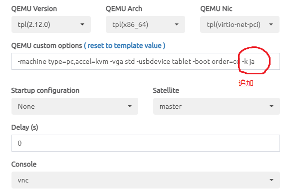

# EVE-NG上にUbuntu Serverを設定するための流し込みスクリプト

一部のコマンドはインタラクティブなので注意が必要。

### Ubuntuイメージ起動時のQEMU設定

QEMUのオプションに `-k ja` を追加してから起動するようにします。

日本語キーボードを使う、という指定です。



この設定は結線したりラボに変更を加えると消えてしまうことがあるので、その都度、追加します。


### Ubuntuのrootパスワード変更

出来合いのイメージのrootのパスワードはTest123になっていますので、これを変更します。

VNCクライアントで接続し、rootでログインします。

```bash
passwd root
```

### キーボードの設定を変更

そのままだとviで編集作業をするときにコロンが打てなくて難儀しますので、日本語キーボードに変更します。

```bash
dpkg-reconfigure keyboard-configuration
```

表示される選択肢に従って`Generic(105)` → `Japanese`を選びます。

再起動します。

```bash
reboot
```

### シリアルコンソールの有効化

Ubuntu ServerなのでGUIは不要にもかかわらず、そのままだとVNCクライアントが起動してしまいます。
テキストのコピー＆ペーストができずに不便ですので、シリアルコンソールを動かしてtelnet接続するように変更します。

`vi /etc/default/grub`

GRUB_CMD_LINE_LINUX=""となっている部分を以下のように変更します。

```
GRUB_CMDLINE_LINUX="console=ttyS0,115200 console=tty0"
```

編集したら反映させます。

```bash
grub-mkconfig -o /boot/grub/grub.cfg
```

Ubuntuを停止します。

```bash
shutdown –h now
```

ここまでがVNCクライアントを使っての作業です。

EVE-NGの設定でコンソール接続をtelnetに変更します。

Ubuntuを起動します。

ここからさきはルータと同じくtelnetのターミナルアプリで操作します。


## ホスト名、プロキシ設定

マシンごとに設定を変えて流し込みます。

PROXY_USERNAME=とPROXY_PASSWORD=とPROXY_ADDRESS=の部分は書き換えた上で、TeraTERM上で流し込みます。

```
HOSTNAME=Linux1

ROOT_PASSWORD=eve
PROXY_USERNAME=username
PROXY_PASSWORD=password
PROXY_ADDRESS=proxyaddress

echo "root:${ROOT_PASSWORD}" | chpasswd

hostnamectl set-hostname ${HOSTNAME}

timedatectl set-timezone Asia/Tokyo

cat - << EOS >> ~/.bashrc
export http_proxy="http://${PROXY_USERNAME}:${PROXY_PASSWORD}@${PROXY_ADDRESS}:8080"
export https_proxy="http://${PROXY_USERNAME}:${PROXY_PASSWORD}@${PROXY_ADDRESS}:8080"
EOS

source ~/.bashrc

cat - << EOS >> /etc/apt/apt.conf
Acquire::ftp::proxy "http://${PROXY_USERNAME}:${PROXY_PASSWORD}@${PROXY_ADDRESS}:8080";
Acquire::http::proxy  "http://${PROXY_USERNAME}:${PROXY_PASSWORD}@${PROXY_ADDRESS}:8080";
Acquire::https::proxy "http://${PROXY_USERNAME}:${PROXY_PASSWORD}@${PROXY_ADDRESS}:8080";
EOS

apt -y update
```

## 最低限必要なパッケージをインストール

ターミナルのサイズが反映されていない状態でシリアルコンソールを使い続けると画面が乱れて難儀します。

対策のため、~/.bashrcに以下の設定を加えます。

```
cat - << 'EOS' >> ~/.bashrc
rsz () if [[ -t 0 ]]; then local escape r c prompt=$(printf '\e7\e[r\e[999;999H\e[6n\e8'); IFS='[;' read -sd R -p "$prompt" escape r c; stty cols $c rows $r; fi
rsz
EOS
```

> 元ネタはここ
>
> https://wiki.archlinux.org/title/working_with_the_serial_console#Resizing_a_terminal


xtermに含まれるresizeコマンドを使う方法もありますが、重たいインストール作業を伴います。

resizeコマンドをインストールするためにxtermをインストールします。

```
apt -y install xterm
```

ログインと同時に自動実行されるように設定しておきます。

```
eval `resize`

echo 'eval `resize`' >> ~/.bashrc
```


## Ubuntuのアップグレード

長い時間かかりますが、インタラクティブな操作が必要なので、定期的にターミナルをチェックしなければいけません。

途中で表示されるメニューはデフォルトのままリターンキーを叩けばよいでしょう。

```
apt -y upgrade
```

古いパッケージを削除する

```
apt -y autoremove
```

## フロッピーデバイスの削除

フロッピーデバイスが組み込まれているとsystemctlで失敗するので削除します。

```
sudo rmmod floppy
echo "blacklist floppy" | sudo tee /etc/modprobe.d/blacklist-floppy.conf
sudo dpkg-reconfigure initramfs-tools
```

## ネットワーク設定

`ip link`でイーサネットが何個あるか確認します。

以下は4個のイーサネットを持っている前提です。

```
ip link set ens3 up
ip link set ens4 up
ip link set ens5 up
ip link set ens6 up

cat - << 'EOS' > /etc/netplan/00-installer-config.yaml
# This is the network config written by 'subiquity'
network:
  ethernets:
    e0:
      dhcp4: true
      match:
        macaddress: __:__:__:__:__:e0
      set-name: e0

    e1:
      dhcp4: false
      match:
        macaddress: __:__:__:__:__:e1
      set-name: e1

    e2:
      dhcp4: false
      match:
        macaddress: __:__:__:__:__:e2
      set-name: e2

    e3:
      dhcp4: false
      match:
        macaddress: __:__:__:__:__:e3
      set-name: e3

  version: 2
EOS

e0mac=`ip link list ens3 | grep ether | cut -d\  -f 6`
e1mac=`ip link list ens4 | grep ether | cut -d\  -f 6`
e2mac=`ip link list ens5 | grep ether | cut -d\  -f 6`
e3mac=`ip link list ens6 | grep ether | cut -d\  -f 6`

sed -i "s/macaddress: __:__:__:__:__:e0/macaddress: ${e0mac}/" /etc/netplan/00-installer-config.yaml
sed -i "s/macaddress: __:__:__:__:__:e1/macaddress: ${e1mac}/" /etc/netplan/00-installer-config.yaml
sed -i "s/macaddress: __:__:__:__:__:e2/macaddress: ${e2mac}/" /etc/netplan/00-installer-config.yaml
sed -i "s/macaddress: __:__:__:__:__:e3/macaddress: ${e3mac}/" /etc/netplan/00-installer-config.yaml

sed -i 's/GRUB_CMDLINE_LINUX=""/GRUB_CMDLINE_LINUX="console=ttyS0,115200 console=tty0"/' /etc/default/grub
grub-mkconfig -o /boot/grub/grub.cfg

cat - << 'EOS' >> /etc/sysctl.d/99-sysctl.conf

# IPv4 packet forwarding
net.ipv4.ip_forward=1

# IPv6 packet forwarding
net.ipv6.conf.all.forwarding=1

# Reverse Path Filter
net.ipv4.conf.default.rp_filter=0
net.ipv4.conf.all.rp_filter=0

# IPv6 address
net.ipv6.conf.all.keep_addr_on_down=1

# SRv6
net.ipv6.conf.all.seg6_enabled=1
net.ipv6.conf.all.seg6_require_hmac=0
net.ipv6.conf.default.seg6_enabled=1
net.ipv6.seg6_flowlabel=1

# VRF
net.ipv4.tcp_l3mdev_accept=1
net.ipv4.udp_l3mdev_accept=1
net.ipv4.raw_l3mdev_accept=1
EOS
```

## FRRのインストール

動的ルーティングを必要とするノードのみ、FRRをインストールします。

以下ではBGPとISISを有効にしています。

```
# add GPG key
curl -s https://deb.frrouting.org/frr/keys.asc | sudo apt-key add -

# possible values for FRRVER: frr-6 frr-7 frr-8 frr-stable
# frr-stable will be the latest official stable release
FRRVER="frr-stable"
echo deb https://deb.frrouting.org/frr $(lsb_release -s -c) $FRRVER | sudo tee -a /etc/apt/sources.list.d/frr.list

# update and install FRR
apt update && apt -y install frr frr-pythontools

sed -i "s/bgpd=no/bgpd=yes/" /etc/frr/daemons
sed -i "s/isisd=no/isisd=yes/" /etc/frr/daemons
# sed -i "s/ospfd=no/ospfd=yes/" /etc/frr/daemons
# sed -i "s/ospf6d=no/ospf6d=yes/" /etc/frr/daemons
```

> 参考
>
> apt-keyは廃止されているので、apt updateに失敗するようになるかもしれません。
> その場合はここを参照。
>
> https://itsfoss.com/key-is-stored-in-legacy-trusted-gpg/
>
> sudo apt-key export 08F13ED1 | gpg --dearmour -o /etc/apt/trusted.gpg.d/frr.gpg

> 参考
> FRRのリポジトリを追加したことでapt updateにエラーがでるかもしれません。
> その場合は次のようにキャッシュを削除することで対処できるかもしれません。
>
> dpkg --clear-avail
>
> rm /var/lib/apt/lists/* --force

# VRF作成

VRFの作成を必要とするノードのみ、以下を流し込みます。

IPアドレスの設定はFRRで実施します。

```
mkdir -p /nic
mkdir -p /nic/bin
chmod 755 /nic/bin

cat - << 'EOS' > /nic/bin/create_vrf.sh
#!/bin/sh

# VRF vrfA を作成する
# テーブル番号は一意であれば何でもよい
/usr/sbin/ip link add vrfA type vrf table 110

# e3にVLANのサブインタフェースを追加する
# /usr/sbin/ip link add link e3 name e3.110 type vlan id 110

# e3をvrfAに組み込む
/usr/sbin/ip link set dev e3 master vrfA up

# vrfAを有効にする
/usr/sbin/ip link set dev vrfA up

# VRFのstrict_modeは必ず1にします
/usr/sbin/sysctl -w net.vrf.strict_mode=1

# 作成したVRFのReverse Path Filterを停止
/usr/sbin/sysctl -w net.ipv4.conf.vrfA.rp_filter=0

exit 0
EOS

chown root:root /nic/bin/create_vrf.sh
chmod 755 /nic/bin/create_vrf.sh
/nic/bin/create_vrf.sh

cat - << 'EOS' > /etc/systemd/system/create_vrf.service
[Unit]
Description = create vrf
After=local-fs.target networking.service
ConditionPathExists=/nic/bin

[Service]
ExecStart=/nic/bin/create_vrf.sh
Restart=no
Type=simple

[Install]
WantedBy=multi-user.target
EOS

chown root:root /etc/systemd/system/create_vrf.service
chmod 644 /etc/systemd/system/create_vrf.service

systemctl daemon-reload
systemctl enable create_vrf.service
```

## SRv6 SID用のルーティングテーブル

テーブル番号100、名前localsidで作成します。

```bash
echo 100 localsid >> /etc/iproute2/rt_tables
```

参照するルールを追加します。

```
cat - << 'EOS' > /nic/bin/create_localsid.sh
#!/bin/sh

if [ `hostname` = PE3 ]; then
  LOCATOR=2001:db8:0:3::/64
elif [ `hostname` = PE4 ]; then
  LOCATOR=2001:db8:0:4::/64
fi

if [ -n ${LOCATOR} ]; then
  ip -6 rule add to ${LOCATOR} lookup localsid
  ip -6 route add blackhole default table localsid
fi

exit 0
EOS

chown root:root /nic/bin/create_localsid.sh
chmod 755 /nic/bin/create_localsid.sh
/nic/bin/create_localsid.sh
```

自動起動スクリプトを作成します。

```
cat - << 'EOS' > /etc/systemd/system/create_localsid.service
[Unit]
Description = create localsid
After=local-fs.target networking.service
ConditionPathExists=/nic/bin

[Service]
ExecStart=/nic/bin/create_localsid.sh
Restart=no
Type=simple

[Install]
WantedBy=multi-user.target
EOS

chown root:root /etc/systemd/system/create_localsid.service
chmod 644 /etc/systemd/system/create_localsid.service

systemctl daemon-reload
systemctl enable create_localsid.service
```
