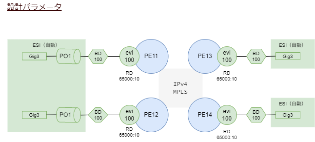

# SR-MPLS EVPN

4台のPEにEVIを作成して、全てのCEルータが同一セグメント上にくるようにします。

<br><br>

## 構成


<br>

## 完成形

先に完成形を示します。

CE111から他のCEにpingできることを確認します。

最初の1パケットが欠けるのはシスコ機器でよく見られる現象で、ARPが未解決な状態で通信を開始したためです（EVPNの問題ではありません）。

```
CE111#ping 10.0.0.112
Type escape sequence to abort.
Sending 5, 100-byte ICMP Echos to 10.0.0.112, timeout is 2 seconds:
.!!!!
Success rate is 80 percent (4/5), round-trip min/avg/max = 1/1/2 ms

CE111#ping 10.0.0.113
Type escape sequence to abort.
Sending 5, 100-byte ICMP Echos to 10.0.0.113, timeout is 2 seconds:
.!!!!
Success rate is 80 percent (4/5), round-trip min/avg/max = 1/1/3 ms

CE111#ping 10.0.0.114
Type escape sequence to abort.
Sending 5, 100-byte ICMP Echos to 10.0.0.114, timeout is 2 seconds:
.!!!!
Success rate is 80 percent (4/5), round-trip min/avg/max = 1/1/2 ms
```

CE111からみると他のCEは同じLAN上にいますので、ARPテーブルにエントリができています。

```
CE111#show arp
Protocol  Address          Age (min)  Hardware Addr   Type   Interface
Internet  10.0.0.111              -   aabb.cc00.0700  ARPA   Ethernet0/0
Internet  10.0.0.112              4   aabb.cc00.0800  ARPA   Ethernet0/0
Internet  10.0.0.113              4   aabb.cc00.0900  ARPA   Ethernet0/0
Internet  10.0.0.114              1   aabb.cc00.0a00  ARPA   Ethernet0/0
CE111#
```

PE11のGig1でキャプチャしたパケットです。MPLSのラベルが2段構成になっています。
一段目のラベルは出口のPEに向けてのパス、二段目はEVPNのEVIを示したものです。


【参考】[pcapngファイル](img/from_ce111_to_ce113_ping.pcapng)


<br><br>

## 設計パラメータ

- 各機器のループバックアドレス

| 装置 |  アドレス          |
| ---- | ----------------- |
| CR1  | 192.168.255.1/32  |
| CR2  | 192.168.255.2/32  |
| PE11 | 192.168.255.11/32 |
| PE12 | 192.168.255.12/32 |
| PE13 | 192.168.255.13/32 |
| PE14 | 192.168.255.14/32 |

- 装置間リンクのアドレス

| リンク     |  アドレス        |
| --------- | ---------------- |
| CR1-PE11  | 192.168.111.0/24 |
| CR1-PE12  | 192.168.112.0/24 |
| CR1-PE13  | 192.168.113.1/24 |
| CR1-PE14  | 192.168.114.1/24 |
| CR2-PE11  | 192.168.211.0/24 |
| CR2-PE12  | 192.168.212.0/24 |
| CR2-PE13  | 192.168.213.1/24 |
| CR2-PE14  | 192.168.214.1/24 |


<br><br>

## 基本設定

PE11の基本設定はこのようになります。

PE12, PE13, PE14もアドレスが違うだけで同様です。

```
!
interface Loopback0
 ip address 192.168.255.11 255.255.255.255
!
!
interface GigabitEthernet1
 mtu 9000
 ip address 192.168.111.11 255.255.255.0
 ip ospf network point-to-point
 ip ospf cost 10
!
!
interface GigabitEthernet2
 mtu 9000
 ip address 192.168.211.11 255.255.255.0
 ip ospf network point-to-point
 ip ospf cost 20
!
router ospf 1
 router-id 192.168.255.11
 nsf ietf
 network 192.168.111.11 0.0.0.0 area 0
 network 192.168.211.11 0.0.0.0 area 0
 network 192.168.255.11 0.0.0.0 area 0
 bfd all-interfaces
!
```

CR1の基本設定はこうなります。CR2も同様です。

```
!
interface Loopback0
 ip address 192.168.255.1 255.255.255.255
!
interface GigabitEthernet1
 mtu 9000
 ip address 192.168.111.1 255.255.255.0
 ip ospf network point-to-point
 ip ospf cost 1
 cdp enable
!
interface GigabitEthernet2
 mtu 9000
 ip address 192.168.112.1 255.255.255.0
 ip ospf network point-to-point
 ip ospf cost 2
 cdp enable
!
interface GigabitEthernet3
 mtu 9000
 ip address 192.168.113.1 255.255.255.0
 ip ospf network point-to-point
 ip ospf cost 3
 cdp enable
!
interface GigabitEthernet4
 mtu 9000
 ip address 192.168.114.1 255.255.255.0
 ip ospf network point-to-point
 ip ospf cost 4
 cdp enable
!
router ospf 1
 router-id 192.168.255.1
 nsf ietf
 passive-interface default
 no passive-interface GigabitEthernet1
 no passive-interface GigabitEthernet2
 no passive-interface GigabitEthernet3
 no passive-interface GigabitEthernet4
 no passive-interface Loopback0
 network 0.0.0.0 255.255.255.255 area 0
 bfd all-interfaces
!
```

<br><br>

## SR-MPLSの設定

ここまでの設定で全てのPE間でループバックアドレス同士のpingが可能になっています。

<br><br>

### 全てのCRとPEでセグメントルーティングを有効にします。

SIDとして利用する番号の範囲をグローバルブロック（SRGB = SR Global Block）と呼びます。

グローバルブロックは同じSRドメイン内で共通にすることが推奨されます。

グローバルブロックのデフォルト値は装置の実装によって違いますので、異機種が混在したときに困らないように決めておいたほうがいいでしょう。

> 参考
>
> シスコのデフォルト値は16000-23999です。

ここでは `20000 - 29999` を使うことにします。

定義したSRGBの情報はIGPで広告されます。

```
!
segment-routing mpls
 !
 global-block 20000 29999
 !
!
```

<br><br>

### 続いて装置を代表するSIDである、ノードSIDを各装置に定義します。

ここでは装置を代表するノードSIDを固定で設定します。

各装置、次のように採番します。

| 装置 | ノードSID | ループバックアドレス |
| ---- | -------- | ------------------ |
| CR1  | 20001    | 192.168.255.1      |
| CR2  | 20002    | 192.168.255.2      |
| PE11 | 20011    | 192.168.255.11     |
| PE12 | 20012    | 192.168.255.12     |
| PE13 | 20013    | 192.168.255.13     |
| PE14 | 20014    | 192.168.255.14     |

`connected-prefix-sid-map` 設定でIPプレフィクスとSIDを対応づけます。

PE11の場合、ループバックのIPアドレスは192.168.255.11なので、これに対応するSIDを20011にするためには次のように設定します。

```
!
segment-routing mpls
 connected-prefix-sid-map
  address-family ipv4
   192.168.255.11/32 index 11 range 1
  exit-address-family
 !
!
```

192.168.255.11/32のアドレス範囲に対して、20000 + インデックス11 = 20011が対応するSIDになります。

IGPで配られるSIDの情報も実態はインデックス番号です。SRGBの先頭の値にインデックスを足すことでSIDを計算します。

ノードSIDは絶対値で指定することも可能です。

PE12は絶対値指定で設定してみます。

```
!
segment-routing mpls
 connected-prefix-sid-map
  address-family ipv4
   192.168.255.12/32 absolute 20012 range 1
  exit-address-family
 !
!
```

どちらの設定方法でも得られる結果は同じです。

全てのPE、CRで同様に設定します。

<br><br>

### 続いてOSPFをSR-MPLSに対応させます。

OSPFでSR-MPLSを有効にすることで、Opaque LSAを使ってSID情報が配信されるようになります。

設定はこれだけです。

```
!
router ospf 1
 segment-routing mpls
!
```

インタフェースに割り当てられているIPプレフィクスに関してSIDが対応付けられ、そのSIDの情報が配信されます。

この動作は従来のMPLSにおいてLDPが実施していることと同じです。
したがってOSPFでSR-MPLSを有効にしたらLDPは不要になります。
ここではLDPが起動しないように明示的に設定することにします。

```
!
no mpls ip
!
```

既存でLDPが動いていて、SR-MPLSにマイグレーションしたいという場合には、その優先順位を設定できます。
次のように設定することでSR-MPLSで生成したラベルが優先されるようになります。

```
!
segment-routing mpls
 !
 set-attributes
  address-family ipv4
   sr-label-preferred
  exit-address-family
 !
```

ループバックインタフェースに付けたIPアドレスは自動的にノードSIDに変換されます。

前述の設定でノードSIDはすでに固定してありますが、ループバックインタフェースを複数作った場合、それもノードSIDになってしまいます。

（ノードSIDが複数あっても困ることはないと思いますが）ループバックインタフェースの設定で明示的にノードSIDにならないようにすることもできます。

たとえばこのように２つのループバックインタフェースを作ったときに、ノードSIDとして利用しない方は`n-flag-clear`を設定します。

```
!
interface Loopback0
 ip address 192.168.255.11 255.255.255.255
!
interface Loopback1
 ip address 192.168.0.111 255.255.255.255
 ip ospf prefix-attributes n-flag-clear
!
```

### Explicit NULLを設定します。

MPLSのデフォルト動作では最終目的地の一つ手前のノードでラベルが剥がされます。
最終目的地のルータで、①ラベルを剥がして、②出てきたパケットの中身をチェックしてルーティング、という２つの作業を実施すると、そのルータの処理が重たくなってボトルネックになりかねません。
一つ前のルータでラベルを剥がしてあげれば作業が分散され、全体的なパフォーマンスが向上するわけですが、それによるデメリットもあります。

ラベルの中には運んでいるパケットのToS情報が格納されていたりします。ラベルを剥ぎ取ってしまうとその情報が消失してしまいます。
剥ぎ取るのではなくNULLラベルを付けて最後までラベルを維持するのがexplicit-nullです。
VPNを使うときにはexplicit-nullを使うようにした方がよいでしょう。

explicit-nullを有効にするには次のように設定します。

```
!
segment-routing mpls
 !
 set-attributes
  address-family ipv4
   explicit-null
  exit-address-family
 !
!
```

<br><br>

## ここまでの設定で状態を確認します。

ここまでの設定で以下の設定を投入しました。

- OSPFを有効にしました
- SR-MPLSを有効にしました
- ノードSIDを固定的に設定しました
- OSPFをSR-MPLS対応に設定しました

<br>

### グローバルブロックを確認します

`show segment-routing mpls gb`

```
PE11#show segment-routing mpls gb
LABEL-MIN  LABEL_MAX  STATE           DEFAULT
20000      29999      ENABLED         No
```

設定した20000-29999になっています。

<br>

### ノードSIDを確認します

`show segment-routing mpls connected-prefix-sid-map ipv4`

```
PE11#show segment-routing mpls connected-prefix-sid-map ipv4

               PREFIX_SID_CONN_MAP ALGO_0

    Prefix/masklen   SID Type Range Flags SRGB
 192.168.255.11/32    11 Indx     1         Y

               PREFIX_SID_PROTOCOL_ADV_MAP ALGO_0

    Prefix/masklen   SID Type Range Flags SRGB Source
  192.168.255.1/32     1 Indx     1         Y  OSPF Area 0 192.168.255.1
  192.168.255.2/32     2 Indx     1         Y  OSPF Area 0 192.168.255.2
 192.168.255.11/32    11 Indx     1         Y  OSPF Area 0 192.168.255.11
 192.168.255.12/32    12 Indx     1         Y  OSPF Area 0 192.168.255.12
 192.168.255.13/32    13 Indx     1         Y  OSPF Area 0 192.168.255.13
 192.168.255.14/32    14 Indx     1         Y  OSPF Area 0 192.168.255.14
```

全てのPEルータ、CRルータのSID（のインデックス）が表示されています。
実際のSIDはグローバルブロックの先頭番号20000を加えたものになります。

装置ごとにSRGBの開始番号が異なっているとややこしくなりますので、ドメイン内でグローバルブロックは共通にしておいた方がいいと思います。

<br>

### 隣接関係SID(Adj-SID)を確認します

動的ルーティング(ここではOSPF)で隣接ノードを見つけると、その装置に向いたインタフェースにSIDが採番されます。

`show ip ospf segment-routing adjacency-sid`

```
PE11#show ip ospf segment-routing adjacency-sid

            OSPF Router with ID (192.168.255.11) (Process ID 1)
    Flags: S - Static, D - Dynamic,  P - Protected, U - Unprotected, G - Group, L - Adjacency Lost

Adj-Sid  Neighbor ID     Interface          Neighbor Addr   Flags   Backup Nexthop  Backup Interface
-------- --------------- ------------------ --------------- ------- --------------- ------------------
18       192.168.255.1   Gi1                192.168.111.1   D U
20       192.168.255.2   Gi2                192.168.211.2   D U
```

Adj-Sidの数字はインデックスではありません。MPLSで用いられるラベル値そのものです。

<br>

### MPLSテーブルを確認します

`show mpls forwarding-table`

```
PE11#show mpls forwarding-table
Local      Outgoing   Prefix           Bytes Label   Outgoing   Next Hop
Label      Label      or Tunnel Id     Switched      interface
18         Pop Label  192.168.111.1-A  0             Gi1        192.168.111.1
20         Pop Label  192.168.211.2-A  0             Gi2        192.168.211.2
22         No Label   10.0.11.0/24[V]  0             aggregate/L3VPN
20001      explicit-n 192.168.255.1/32 17749         Gi1        192.168.111.1
20002      explicit-n 192.168.255.2/32 19335         Gi2        192.168.211.2
20012      20012      192.168.255.12/32   \
                                       0             Gi1        192.168.111.1
20013      20013      192.168.255.13/32   \
                                       0             Gi1        192.168.111.1
20014      20014      192.168.255.14/32   \
                                       0             Gi1        192.168.111.1

A  - Adjacency SID
```

隣接関係SIDとノードSIDしか見えていません。

PE11からPE13の **物理インタフェース** 192.168.113.13 にpingしてみます。


MPLSになっていません。IPv4パケットです。

PE11からPE13の **ループバック** 192.168.255.13 にpingしてみます。


こんどはICMP Echo Requestにラベル20013がついていることが分かります。

このようにSR-MPLSではドメイン内の全通信がMPLSになるわけではなく、SRGBの範囲内で割り当てられたノードSIDだけがMPLSになっていることがわかります。

<br><br>

## EVPNを設定します

順番に設定していきます。



設計パラメータを考えるときに、ルータの中に作成するブリッジドメインに注目するとわかりやすいと思います。
アップリンク側はSR-MPLSのコア側を、ダウンリンクは自装置のインタフェースになるようなブリッジを作ることを意識すると、設計パラメータの繋がりが見えてきます。

<br>

### EVPNを有効にします

l2vpn evpnセクションでEVPNに共通の動作を指定します。
evpnのインスタンスは複数作成できるのですが、共通の設計パラメータはなるべく集めた方が短い設定になります。

全てのPEルータ共通で以下を設定します。

```
l2vpn evpn
 logging peer state
 replication-type ingress
 mpls label mode per-ce
 router-id Loopback0
!
```

replication-typeの指定は必須です。


PEルータは学習していないMACアドレスを受信したら自分以外の全てのPEにそれを届けなければいけません。
`replication-type`はそのやり方を定義するもので、
ingressは受信したノードでパケットのコピーを作成して全PEにユニキャストで転送する方式です。
マルチキャストで配信できればよいのですが、MPLS網ではそういうわけにいきませんので、事実上ingressの一択です。

<br>

### EVIとBDを定義します

EVIとBDは以下の関係にあります。


EVIはEVPNを識別する識別子で、L3VPNにおけるVRFに相当するものです。
どのPEにある、どのEVIでイーサネットを形成するか、を設計するものなので、ネットワーク全域を見渡して設計するパラメータです。

ここではPE11, PE12, PE13, PE14で共通のEVIを定義します。

```
l2vpn evpn instance 100 vlan-based
 rd 65000:100
 route-target export 65000:100
 route-target import 65000:100
!
```

instance 100の100は装置内でユニークであれば何番でも構いません。
重要なのはRDの方です。
全てのPEでRD=65000:100としたEVIを作成します。

この装置で学習したMACテーブルを65000:100として他のPEに広告します（export）。

他のPEが65000:100として広告してきたMACテーブルをこのEVIに取り込みます（import）。


```
!
bridge-domain 100
 member evpn-instance 100
!
```

bridge-domain 100の100は装置内でユニークであれば何番でも構いません。

ブリッジドメインからみると、ダウンリンク側として自装置のどのポートがブリッジに参加するか、そしてアップリンク側としてどのEVIがそのブリッジに参加するか、を指定することになります。

ここではまずアップリンク側のEVIをメンバーとして指定しています。

<br>

### ESIの設定

ESIはEVPNに参加するイーサネットを識別するものです。

シングル構成であれば明示的に設定する必要はありません。

マルチホーム接続の場合にはESIを適切に設定することで異なるPE装置間で同一のLANを形成することができます。


### CE向け物理ポートの設定

> 注意
>
> ESI-LAGを組むときには、対向装置はLACPをサポートしたものでなければいけません。ここではNexus9000vを利用しています。

PE11とPE12はポートチャネルを作成して、その中に流れるVLANをブリッジドメインに参加させます。

PE13とPE14は物理ポートの中に流れるVLANをブリッジドメインに参加させます。

PE11の設定

```
!
interface Port-channel1
 no ip address
 no negotiation auto
 evpn ethernet-segment 100
  identifier type 0 00.00.00.00.00.00.00.00.11
  redundancy all-active
  df-election wait-time 1
 lacp device-id 0000.0000.0011
 service instance 100 ethernet
  encapsulation untagged
 !
!
interface GigabitEthernet3
 no ip address
 negotiation auto
 channel-group 1
!

!
bridge-domain 100
 member Port-channel1 service-instance 100
 member evpn-instance 100
!
```

PE12の設定はPE11と同じです。

```
!
interface Port-channel1
 no ip address
 no negotiation auto
 evpn ethernet-segment 100
  identifier type 0 00.00.00.00.00.00.00.00.11
  redundancy all-active
  df-election wait-time 1
 lacp device-id 0000.0000.0011
 service instance 100 ethernet
  encapsulation untagged
 !
!
interface GigabitEthernet3
 no ip address
 negotiation auto
 channel-group 1 mode active
!

!
bridge-domain 100
 member Port-channel1 service-instance 100
 member evpn-instance 100
!
```

Port-channel直下のこの設定がESIを定義したものです。

```
 evpn ethernet-segment 100
  identifier type 0 00.00.00.00.00.00.00.00.11
```

evpn ethernet-segment 100の100は装置内でユニークであればなんでもよいと思います。
Port-channel直下には一つしか定義できませんので、他のPort-channelで使うESIと重複しない番号であれば何でもよいでしょう。
ESI(identifier)をtype 0で指定する場合は9バイトの文字列です。type 3で指定する場合はMACアドレスの形式です。

ここではPE11とPE12共にtype 0で指定し、下1オクテットを11としています。

PE13とPE14の設定はこうなります。

```
!
interface GigabitEthernet3
 no ip address
 negotiation auto
 service instance 100 ethernet
  encapsulation untagged
 !
!
bridge-domain 100
 member GigabitEthernet3 service-instance 100
 member evpn-instance 100
!
```

ここでは設定していませんが、service instanceの設定でVLANタグを付けたり、番号を変換することもできます。

<br>

### BGPの設定

PE同士でiBGP接続し、MAC学習テーブルの情報を交換します。

フルメッシュでの設定作業を軽減するために、CR1とCR2をルートリフレクタとします。

PE11, PE12, PE13, PE14共通設定

> 注意
>
> {{ PE_NUMBER }}のところには装置のループバックアドレスになるように11, 12, 13, 14を代入します

```
!
router bgp 65000
 bgp router-id 192.168.255.{{ PE_NUMBER }}
 bgp log-neighbor-changes
 bgp graceful-restart
 no bgp default ipv4-unicast
 neighbor 192.168.255.1 remote-as 65000
 neighbor 192.168.255.1 update-source Loopback0
 neighbor 192.168.255.2 remote-as 65000
 neighbor 192.168.255.2 update-source Loopback0
 !
 address-family l2vpn evpn
  neighbor 192.168.255.1 activate
  neighbor 192.168.255.1 send-community both
  neighbor 192.168.255.1 next-hop-self
  neighbor 192.168.255.1 soft-reconfiguration inbound
  neighbor 192.168.255.2 activate
  neighbor 192.168.255.2 send-community both
  neighbor 192.168.255.2 next-hop-self
  neighbor 192.168.255.2 soft-reconfiguration inbound
 exit-address-family
 !
!
```

<br><br>

## ここまでの設定で状態を確認します。

ここまでの設定で以下の設定を投入しました。

- EVPNを有効にしました
- EVIをRD=65000:100として定義しました
- PE11とPE12はPort-channelを作成しました
- PE11とPE12はESIを明示的に設定しました
- ブリッジドメインを定義しました（アップリンクがEVI、ダウンリンクがservice-instance）
- BGPにaddress-family l2vpn evpnを定義しました


<br>

### EVPNのピアを確認します

`show l2vpn evpn peers`

PE11での実行例です。

```
PE11#sh l2vpn evpn peers

EVI    BD    Peer-IP                   Num routes UP time
------ ----- ------------------------  ---------- --------
Global N/A   192.168.255.12            2          02:42:51
100    100   192.168.255.12            2          02:42:49
100    100   192.168.255.13            2          03:34:25
100    100   192.168.255.14            2          03:34:25
```

PE11とPE12はESI-LAGを構成しています。その関係で192.168.255.12が2台見えています。

<br>

### EVIを確認します

`show l2vpn evpn evi`

PE11での実行例です。

```
PE11#show l2vpn evpn evi
EVI   BD    Ether Tag  BUM Label Unicast Label Pseudoport
----- ----- ---------- --------- ------------- ------------------
100   100   0          17        21            Po1:100
```

EVIインスタンス100に関して、BUM(Broadcast Unknown-unicast Multicast)パケットはラベルは17で受信することを期待、ユニキャスト通信はラベル21で受信していることを期待しています。

<br>

### MACアドレステーブルを確認します

`show l2vpn evpn mac`

PE11での実行例です。

CE装置が4台います。全て学習しています。

```
PE11#show l2vpn evpn mac
MAC Address    EVI   BD    ESI                      Ether Tag  Next Hop(s)
-------------- ----- ----- ------------------------ ---------- ---------------
aabb.cc00.0700 100   100   0000.0000.0000.0000.0011 0          192.168.255.12
aabb.cc00.0800 100   100   0000.0000.0000.0000.0011 0          Po1:100
aabb.cc00.0900 100   100   0000.0000.0000.0000.0000 0          192.168.255.13
aabb.cc00.0a00 100   100   0000.0000.0000.0000.0000 0          192.168.255.14
```

PE12で実行するとこのようになります。

```
PE12#show l2vpn evpn mac
MAC Address    EVI   BD    ESI                      Ether Tag  Next Hop(s)
-------------- ----- ----- ------------------------ ---------- ---------------
aabb.cc00.0700 100   100   0000.0000.0000.0000.0011 0          Po1:100
aabb.cc00.0800 100   100   0000.0000.0000.0000.0011 0          Po1:100
aabb.cc00.0900 100   100   0000.0000.0000.0000.0000 0          192.168.255.13
aabb.cc00.0a00 100   100   0000.0000.0000.0000.0000 0          192.168.255.14
```

PE13で実行するとこのようになります。

```
PE13#show l2vpn evpn mac
MAC Address    EVI   BD    ESI                      Ether Tag  Next Hop(s)
-------------- ----- ----- ------------------------ ---------- ---------------
aabb.cc00.0700 100   100   0000.0000.0000.0000.0011 0          192.168.255.12
aabb.cc00.0800 100   100   0000.0000.0000.0000.0011 0          192.168.255.11
aabb.cc00.0900 100   100   0000.0000.0000.0000.0000 0          Gi3:100
aabb.cc00.0a00 100   100   0000.0000.0000.0000.0000 0          192.168.255.14
```

PE14で実行するとこのようになります。

```
PE14#show l2vpn evpn mac
MAC Address    EVI   BD    ESI                      Ether Tag  Next Hop(s)
-------------- ----- ----- ------------------------ ---------- ---------------
aabb.cc00.0700 100   100   0000.0000.0000.0000.0011 0          192.168.255.12
aabb.cc00.0800 100   100   0000.0000.0000.0000.0011 0          192.168.255.11
aabb.cc00.0900 100   100   0000.0000.0000.0000.0000 0          192.168.255.13
aabb.cc00.0a00 100   100   0000.0000.0000.0000.0000 0          Gi3:100
```

PE11とPE12で構成したESI-LAGの配下にいる2台の端末（aabb.cc00.0700とaabb.cc00.0800）は、PE11とPE12で分散されています。

<br>

### ESIの情報を確認します

`show l2vpn evpn ethernet-segment detail`

PE11での実行例です（ESIを明示的に定義しているのはPE11とPE12だけですので、PE13やPE14で実行しても何も表示されません）。

```
PE11#show l2vpn evpn ethernet-segment detail
EVPN Ethernet Segment ID: 0000.0000.0000.0000.0011
  Interface:              Po1
  Redundancy mode:        all-active
  DF election wait time:  1 seconds
  Split Horizon label:    115
  State:                  Ready
  Encapsulation:          mpls
  Ordinal:                0
  RD:                     192.168.255.11:1
    Export-RTs:           65000:100
  Forwarder List:         192.168.255.11 192.168.255.12
```

Forwarder ListにPE11とPE12のアドレスが格納されています。

<br>

### l2vpn evpnアドレスファミリのBGPテーブルを確認します

`show bgp l2vpn evpn`

PE11での実行例です。

```
PE11#show bgp l2vpn evpn
BGP table version is 238, local router ID is 192.168.255.11
Status codes: s suppressed, d damped, h history, * valid, > best, i - internal,
              r RIB-failure, S Stale, m multipath, b backup-path, f RT-Filter,
              x best-external, a additional-path, c RIB-compressed,
              t secondary path, L long-lived-stale,
Origin codes: i - IGP, e - EGP, ? - incomplete
RPKI validation codes: V valid, I invalid, N Not found

     Network          Next Hop            Metric LocPrf Weight Path
Route Distinguisher: 65000:100
 *>   [1][65000:100][00000000000000000011][0]/23
                      ::                                 32768 ?
Route Distinguisher: 192.168.255.11:1
 *>   [1][192.168.255.11:1][00000000000000000011][4294967295]/23
                      ::                                 32768 ?
Route Distinguisher: 192.168.255.12:1
 *>i  [1][192.168.255.12:1][00000000000000000011][4294967295]/23
                      192.168.255.12           0    100      0 ?
 * i                   192.168.255.12           0    100      0 ?
Route Distinguisher: 65000:100
 *>i  [2][65000:100][0][48][AABBCC000900][0][*]/20
                      192.168.255.13           0    100      0 ?
 * i                   192.168.255.13           0    100      0 ?
 *>i  [2][65000:100][0][48][AABBCC000A00][0][*]/20
                      192.168.255.14           0    100      0 ?
 * i                   192.168.255.14           0    100      0 ?
 *>   [3][65000:100][0][32][192.168.255.11]/17
                      ::                                 32768 ?
 * i  [3][65000:100][0][32][192.168.255.12]/17
                      192.168.255.12           0    100      0 ?
 *>i                   192.168.255.12           0    100      0 ?
 *>i  [3][65000:100][0][32][192.168.255.13]/17
                      192.168.255.13           0    100      0 ?
 * i                   192.168.255.13           0    100      0 ?
 *>i  [3][65000:100][0][32][192.168.255.14]/17
                      192.168.255.14           0    100      0 ?
 * i                   192.168.255.14           0    100      0 ?
Route Distinguisher: 192.168.255.11:17
 *>   [4][192.168.255.11:17][00000000000000000011][32][192.168.255.11]/23
                      ::                                 32768 ?
Route Distinguisher: 192.168.255.12:17
 *>i  [4][192.168.255.12:17][00000000000000000011][32][192.168.255.12]/23
                      192.168.255.12           0    100      0 ?
 * i                   192.168.255.12           0    100      0 ?
```

正直、分かりづらいです。

MACアドレスだけでなくIPv4アドレスも出てくるのはどういうことだろう？

<br>

### L2SWのLACPの状態を確認します

`show lacp neighbor`

Nexus9000vでの実行例

```
L2SW# show lacp neighbor
Flags:  S - Device is sending Slow LACPDUs F - Device is sending Fast LACPDUs
        A - Device is in Active mode       P - Device is in Passive mode
port-channel1 neighbors
Partner's information
            Partner                Partner                     Partner
Port        System ID              Port Number     Age         Flags
Eth1/1      32768,0-0-0-0-0-11     0x1             75154       SA

            LACP Partner           Partner                     Partner
            Port Priority          Oper Key                    Port State
            32768                  0x1                         0x3d

Partner's information
            Partner                Partner                     Partner
Port        System ID              Port Number     Age         Flags
Eth1/2      32768,0-0-0-0-0-11     0x1             75209       SA

            LACP Partner           Partner                     Partner
            Port Priority          Oper Key                    Port State
            32768                  0x1                         0x3d
```

<br>

### （障害検証）L2SWで片系のインタフェースを閉塞して状態を確認します

L2SWでe1/1を閉塞します。

```
L2SW(config-if)# shutdown
```

PE11配下のCE装置から残り3台のCEにpingしてみます。

```
CE111#ping 10.0.0.112
Type escape sequence to abort.
Sending 5, 100-byte ICMP Echos to 10.0.0.112, timeout is 2 seconds:
!!!!!
Success rate is 100 percent (5/5), round-trip min/avg/max = 5/8/14 ms
CE111#ping 10.0.0.113
Type escape sequence to abort.
Sending 5, 100-byte ICMP Echos to 10.0.0.113, timeout is 2 seconds:
!!!!!
Success rate is 100 percent (5/5), round-trip min/avg/max = 8/11/17 ms
CE111#ping 10.0.0.114
Type escape sequence to abort.
Sending 5, 100-byte ICMP Echos to 10.0.0.114, timeout is 2 seconds:
!!!!!
Success rate is 100 percent (5/5), round-trip min/avg/max = 7/11/18 ms
CE111#
```

通信は復旧しています。

このときPE11にはこのようなログが表示されます。

Gig3がダウンしたことでPort-channel1も閉塞しています。

```
PE11#
Apr 14 05:06:06.653: %EC-5-MINLINKS_NOTMET: Port-channel Port-channel1 is down bundled ports (0) doesn't meet min-links
Apr 14 05:06:06.660: GigabitEthernet3 taken out of port-channel1

Apr 14 05:06:08.661: %LINK-3-UPDOWN: Interface Port-channel1, changed state to down
Apr 14 05:06:09.661: %LINEPROTO-5-UPDOWN: Line protocol on Interface Port-channel1, changed state to down
```

同時にPE12, PE13, PE14は次のようなログが表示されます。

```
PE13#
Apr 14 05:06:06.678: %EVPN-5-PEER_STATUS: Peer 192.168.255.11 (global) is DOWN
Apr 14 05:06:08.695: %EVPN-5-PEER_STATUS: Peer 192.168.255.11 (EVI 100, BD 100) is DOWN
```

PE11がEVPNのピアから抜けたと表示されます。

`show l2vpn evpn peer` で確認してみると、確かにPE11がいなくなっています。

```
PE13#show l2vpn evpn peer

EVI    BD    Peer-IP                   Num routes UP time
------ ----- ------------------------  ---------- --------
Global N/A   192.168.255.12            1          21:10:24
100    100   192.168.255.12            4          21:10:22
100    100   192.168.255.14            2          22:12:27
```

このことから **ダウンリンクのポートが全てダウンするとEVPNから抜ける** ことが分かります。

<br>

### （障害検証）閉塞を解除します

L2SWでe1/1の閉塞を解除します。

```
L2SW(config-if)# no shutdown
```

PE11は次のようなログが表示されます。

物理ポートがリンクアップアップしたことでPort-channel1がアップしています。

```
Apr 14 05:16:37.580: %EC-5-MINLINKS_MET: Port-channel Port-channel1 is up as its bundled ports (1) meets min-links
Apr 14 05:16:37.585: GigabitEthernet3 added as member-1 to port-channel1

Apr 14 05:16:39.585: %LINK-3-UPDOWN: Interface Port-channel1, changed state to up
Apr 14 05:16:40.585: %LINEPROTO-5-UPDOWN: Line protocol on Interface Port-channel1, changed state to up
```

それと同時にPE12, PE13, PE14には次のようなログが表示されます。

```
PE13#
Apr 14 05:16:37.598: %EVPN-5-PEER_STATUS: Peer 192.168.255.11 (global) is UP
Apr 14 05:16:39.619: %EVPN-5-PEER_STATUS: Peer 192.168.255.11 (EVI 100, BD 100) is UP
```

PE11がEVPNに組み込まれたことがわかります。


<br><br>

## 設計ミスをするとどうなる？

<br>

### LACPのデバイスID不一致

PE11とPE12で組んでいるESI-LAGに注目します。

L2SWからみると、PE11とPE12で異なる装置につながっているわけですが、LACPとしては同じ装置に見えています。

PE11とPE12共に同じdevice-idを設定しているためです。

```
!
interface Port-channel1
 lacp device-id 0000.0000.0011
!
```

あえてPE12で異なるdevice-idを設定してみます。

```
PE12(config)#int po 1
PE12(config-if)#lacp device-id 0000.0000.0012
```

設定した瞬間に、PE12ではこのようなログが出ます。

```
Apr 14 05:25:45.568: %EC-5-MINLINKS_NOTMET: Port-channel Port-channel1 is down bundled ports (0) doesn't meet min-linkse
Apr 14 05:25:45.573: GigabitEthernet3 taken out of port-channel1

Apr 14 05:25:47.575: %LINK-3-UPDOWN: Interface Port-channel1, changed state to down
Apr 14 05:25:48.576: %LINEPROTO-5-UPDOWN: Line protocol on Interface Port-channel1, changed state to down
```

LACPのdevice-idを変えただけなのに、Port-channel1がダウンしてしまいました。

PE12のブリッジドメインからするとPort-channel1は唯一のダウンリンクなので、それが落ちるとEVPNから抜けてしまいます。

他のPE装置にはこのようなログが表示されます。

```
PE11#
Apr 14 05:25:45.593: %EVPN-5-PEER_STATUS: Peer 192.168.255.12 (global) is DOWN
Apr 14 05:25:47.605: %EVPN-5-PEER_STATUS: Peer 192.168.255.12 (EVI 100, BD 100) is DOWN
```

L2SWからみても、PE12向けの物理ポートはダウン（サスペンド）状態になります。

```
L2SW# show int e 1/2
Ethernet1/2 is down (suspended)
admin state is up, Dedicated Interface
  Belongs to Po1
```

PE12でLACPのdevice-idを元の設定に戻せば、即時で復旧します。

結論: **ESI-LAGを組むときは、必ずLACP device-idを一致させること**


<br>

### ESIの不一致

PE11とPE12でESI-LAGを組んでいますが、同じイーサネットに繋がってることを明示するために同じESIを設定します。

Port-channel直下に次のように設定しています。

```
!
interface Port-channel1
 evpn ethernet-segment 100
  identifier type 0 00.00.00.00.00.00.00.00.11
!
```

あえてPE12で異なるESIを設定してみます。

```
PE12(config)#int po 1
PE12(config-if)#evpn ethernet-segment 100
PE12(config-if-evpn-es)#identifier type 0 00.00.00.00.00.00.00.00.22
```

設定してもログは何も出ません。

ですが、PE11で `show l2vpn evpn ethernet-segment detail` を表示すると、Forwarder ListからPE12がいなくなっていることが分かります。

```
PE11#show l2vpn evpn ethernet-segment detail
EVPN Ethernet Segment ID: 0000.0000.0000.0000.0011
  Interface:              Po1
  Redundancy mode:        all-active
  DF election wait time:  1 seconds
  Split Horizon label:    115
  State:                  Ready
  Encapsulation:          mpls
  Ordinal:                0
  RD:                     192.168.255.11:1
    Export-RTs:           65000:100
  Forwarder List:         192.168.255.11
```

この状態でCEから通信すると、高頻度でパケットロスが発生します。

```
CE111#ping 10.0.0.113 repeat 100
Type escape sequence to abort.
Sending 100, 100-byte ICMP Echos to 10.0.0.113, timeout is 2 seconds:
!!!!!.!!!!!!.!!!!!!!!..!!!!!!!!!!!!!!!!!!!!!!!!!!!!!!!!!!!!!!!!!!!!!!!
!!!!!!!!!!!!!!!!!!!!!!!!!!!!!!
Success rate is 96 percent (96/100), round-trip min/avg/max = 6/9/30 ms
CE111#
```

これはよろしくないです。

間欠的にパケットロスが発生する事象は障害の発生への気づきが遅れるリスクをはらんでますし、トラブルシューティングが難しくなります。

L2SWの状態は
- 物理インタフェースはアップ
- Port-channelはアップ
- LACPネイバーは異常なし
となりますので、CE側装置にはまったく影響がでていません。

他のPE装置からみるとピアは正常に見えます。

```
PE14#show l2vpn evpn peers

EVI    BD    Peer-IP                   Num routes UP time
------ ----- ------------------------  ---------- --------
Global N/A   192.168.255.11            1          00:31:02
Global N/A   192.168.255.12            1          00:14:39
100    100   192.168.255.11            3          00:31:00
100    100   192.168.255.12            2          00:14:37
100    100   192.168.255.13            2          22:47:05
```

CEルータからpingを打ち続けていると、しばらくしてこのようなログがPE12に表示されます。

```
Apr 14 05:49:31.747: %EVPN-3-DUP_MAC: Duplicate MAC address aabb.cc00.0700 EVI 100 BD 100 detected on Po1:100 and 192.168.255.11
```

MACアドレスが重複したことを検知しています。CEルータは自分のダウンリンクであるPort-channel1にもいるし、PE11経由で回ってくる経路もあり、結果的に重複することになります。

これによりPE12は当該CEルータのMAC情報を削除しますので、これがでれば通信が安定します。

```
CE111#ping 10.0.0.114 repeat 100
Type escape sequence to abort.
Sending 100, 100-byte ICMP Echos to 10.0.0.114, timeout is 2 seconds:
!!!!!!!!!!!!!!!!!!!!!!!!!!!!!!!!!!!!!!!!!!!!!!!!!!!!!!!!!!!!!!!!!!!!!!
!!!!!!!!!!!!!!!!!!!!!!!!!!!!!!
Success rate is 100 percent (100/100), round-trip min/avg/max = 6/7/20 ms
```

ですが、PE11しか通信に使われませんので、負荷分散は期待できません。

結論: **ESI-LAG環境でESIが不一致になると、間欠的なパケロスとMACアドレス重複が発生する**

なお、もとの設定に戻せば即時でESIのForwarder Listに登場して復旧します。


<br><br><br>

# EVPN over SR-MPLSの設定

[CR1](config_evpn/5_CR1.txt)

[CR2](config_evpn/6_CR2.txt)

[PE11](config_evpn/1_PE11.txt)

[PE12](config_evpn/2_PE12.txt)

[PE13](config_evpn/3_PE13.txt)

[PE14](config_evpn/4_PE14.txt)

[L2SW](config_evpn/15_NXOS.txt)


<br><br><br>

# EVPNとL3VPNの相互接続


<br><br>

## L3VPNを追加

PE11とPE12にL3VPNを追加します。

PE11に以下の設定を追加します。

```
!
vrf definition L3
 rd 65000:103
 !
 address-family ipv4
  route-target export 65000:103
  route-target import 65000:103
 exit-address-family
!

!
interface GigabitEthernet4
 vrf forwarding L3
 ip address 10.0.211.1 255.255.255.0
 negotiation auto
!

!
router bgp 65000
 !
 address-family vpnv4
  neighbor 192.168.255.1 activate
  neighbor 192.168.255.1 send-community extended
  neighbor 192.168.255.1 next-hop-self
  neighbor 192.168.255.2 activate
  neighbor 192.168.255.2 send-community extended
  neighbor 192.168.255.2 next-hop-self
 exit-address-family
 !
 address-family ipv4 vrf L3
  redistribute connected
 exit-address-family
!
```

PE12の設定（CEルータ向けのインタフェースにつけるアドレスが違うだけです）。

```
!
vrf definition L3
 rd 65000:103
 !
 address-family ipv4
  route-target export 65000:103
  route-target import 65000:103
 exit-address-family
!

!
interface GigabitEthernet4
 vrf forwarding L3
 ip address 10.0.212.1 255.255.255.0
 negotiation auto
!

!
router bgp 65000
 !
 address-family vpnv4
  neighbor 192.168.255.1 activate
  neighbor 192.168.255.1 send-community extended
  neighbor 192.168.255.1 next-hop-self
  neighbor 192.168.255.2 activate
  neighbor 192.168.255.2 send-community extended
  neighbor 192.168.255.2 next-hop-self
 exit-address-family
 !
 address-family ipv4 vrf L3
  redistribute connected
 exit-address-family
!
```

動作を確認です。

CE211からCE212に向けてpingします。

```
CE211#ping 10.0.212.212
Type escape sequence to abort.
Sending 5, 100-byte ICMP Echos to 10.0.212.212, timeout is 2 seconds:
!!!!!
Success rate is 100 percent (5/5), round-trip min/avg/max = 1/1/2 ms
```

<br><br>

## BDIを追加

ブリッジドメイン(Bridge Domain)に接続するインタフェース(BDI: Bridge Domain Interface)を作成します。

これはVLANに対するSVI(interface vlan xx)に相当すると考えるとわかりやすいです。

PE11の設定

bridge-domain 100に対応するインタフェースですので、BDI100というインタフェースになります。

BDI100は初期状態でshutdownされていますので、no shutdownで閉塞を解除します。

```
!
bridge-domain 100
 member Port-channel1 service-instance 100
 member evpn-instance 100
!

!
interface BDI100
 mac-address 0011.0011.0011
 vrf forwarding L3
 ip address 10.0.0.11 255.255.255.0
!
```

PE12の設定

設定は同じです。

アドレスは重複しているわけではなく、Distributed Anycast Gatewayと呼ばれます。

```
!
bridge-domain 100
 member Port-channel1 service-instance 100
 member evpn-instance 100
!

!
interface BDI100
 mac-address 0011.0011.0011
 vrf forwarding L3
 ip address 10.0.0.11 255.255.255.0
!
```

CE111の設定

EVPN上にいるCEは、出口がDistributed Anycast Gatewayになるようにスタティックルートを設定します。

```
ip route 10.0.0.0 255.0.0.0 10.0.0.11
```

動作確認してみます。

EVPN上のCE111から、同じEVPN上の他のCEにpingします。

これはすでに設定したEVPNですので通信できて当然です。

```
CE111#ping 10.0.0.112
Type escape sequence to abort.
Sending 5, 100-byte ICMP Echos to 10.0.0.112, timeout is 2 seconds:
!!!!!
Success rate is 100 percent (5/5), round-trip min/avg/max = 5/9/17 ms

CE111#ping 10.0.0.113
Type escape sequence to abort.
Sending 5, 100-byte ICMP Echos to 10.0.0.113, timeout is 2 seconds:
!!!!!
Success rate is 100 percent (5/5), round-trip min/avg/max = 7/10/23 ms

CE111#ping 10.0.0.114
Type escape sequence to abort.
Sending 5, 100-byte ICMP Echos to 10.0.0.114, timeout is 2 seconds:
!!!!!
Success rate is 100 percent (5/5), round-trip min/avg/max = 7/10/15 ms
```

続いてEVPN上のCE111からPEに作成したBDIのアドレスにpingします。

これも通ります。

```
CE111#ping 10.0.0.11
Type escape sequence to abort.
Sending 5, 100-byte ICMP Echos to 10.0.0.11, timeout is 2 seconds:
.!!!!
Success rate is 80 percent (4/5), round-trip min/avg/max = 6/10/16 ms

CE111#ping 10.0.0.12
Type escape sequence to abort.
Sending 5, 100-byte ICMP Echos to 10.0.0.12, timeout is 2 seconds:
.!!!!
Success rate is 80 percent (4/5), round-trip min/avg/max = 6/10/15 ms
```

次にEVPN上のCE111から、L3VPN上のCEにpingします。

```
CE111#ping 10.0.212.212
Type escape sequence to abort.
Sending 5, 100-byte ICMP Echos to 10.0.212.212, timeout is 2 seconds:
!.!.!
```

疎通できたり、できなかったりですね。もうひと工夫必要です。

<br>

### EVPNとL3VPNの情報をマージする

EVPNではMACアドレス情報がaddress-family l2vpn evpnで流れています。

L3VPNではaddress-family vpnv4で経路情報が流れています。

この２つの情報を連動させるために、ステッチングの設定を行います。

異なるアドレスファミリの情報を「つなぐ」ための指定です。

```
vrf definition L3
 rd 65000:103
 !
 address-family ipv4
  route-target export 65000:103
  route-target import 65000:103
  route-target export 65000:103 stitching
  route-target import 65000:103 stitching
 exit-address-family
!
```

次にBGPでEVPNとL3VPNの情報を交換します。

```
!
router bgp 65000
 !
 address-family vpnv4
  import l2vpn evpn re-originate
 exit-address-family
 !
 address-family l2vpn evpn
  import vpnv4 unicast re-originate
 exit-address-family
 !

 !
 address-family ipv4 vrf L3
  advertise l2vpn evpn
  bgp additional-paths install
  redistribute connected
 exit-address-family
!
```

動作確認してみます。

```
CE111#ping 10.0.211.211
Type escape sequence to abort.
Sending 5, 100-byte ICMP Echos to 10.0.211.211, timeout is 2 seconds:
!!!!!
Success rate is 100 percent (5/5), round-trip min/avg/max = 7/10/16 ms

CE111#ping 10.0.212.212
Type escape sequence to abort.
Sending 5, 100-byte ICMP Echos to 10.0.212.212, timeout is 2 seconds:
!!!!!
Success rate is 100 percent (5/5), round-trip min/avg/max = 7/9/15 ms
CE111#
```

PE11配下のEVPN上の端末から、L3VPNの先にいるCEルータに疎通できました。

ただし、Distributed Anycast Gatewayは万能というわけではなく、DAGを設定したPEの先としか通信できません。

- DAGが設定されたPE配下にいる場合はEVPNとL3VPNのどっちにもいけます

- DAGが設定されていないPE配下にいる場合は、自分の属しているVPNと、DAGの先にいけます

使い勝手の観点でいうと、PE装置で自分から自分に戻るような物理結線をしたうえで、EVPNとL3VPNを物理結線として相互接続した方が便利かもしれません。

このあたりの制限事項はもうちょっと調査が必要ですが、少なくともドキュメント上は以下のように記載されています。

#### Restrictions EVPN over MPLS

> 参考
>
> https://www.cisco.com/c/en/us/td/docs/ios-xml/ios/mp_l2_vpns/configuration/xe-17/mp-l2-vpns-xe-17-book/m-evpn-over-mpls.html

- Only Dual-Homing (two peers) Active-Active is supported.

- Only Symmetric IRB is supported. Asymmetric IRB and centralized IRB are not supported for BGP EVPN over MPLS.

- Only Gateway virtual MAC address is supported.

- Global VRF is not supported for MPLS IRB.

- VPLS Stitching is not covered and verified for BGP EVPN over MPLS.

- RT-5-only based routing is not applicable to Multi-Homing All-Active Subnets on DAGs if RT-2 is disabled. This routing is not applicable because Multi-Homing peers need RT-2 MAC-IP route for ARP/ND SYNC.

- SISF security feature is not supported on Multi-Homing All-Active DAGs.


<br><br><br>

# Distributed Anycast Gatewayの設定例

[PE11](config_evpn/DAG_PE11.txt)

[PE12](config_evpn/DAG_PE12.txt)

[PE13](config_evpn/DAG_PE13.txt)

[PE14](config_evpn/DAG_PE14.txt)
