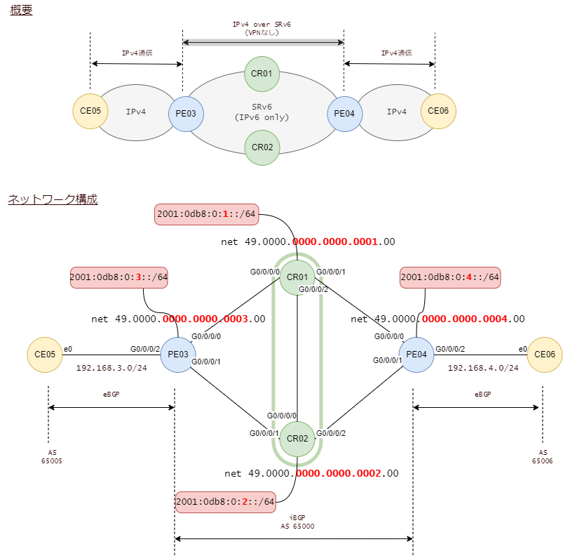

# SRv6 BGP

**VPNを使わずに** エンド・エンドでIPv4通信を通します。トンネルインタフェースも使いません。

<br><br>

## 構成




<br>

## ping

CE05からPE04へのpingをキャプチャ。送信元アドレスと宛先アドレス、NextHeader、に注目。


<br>

## CR01の経路

CR01は自足にIPv4アドレスを振っていませんので、IPv4の経路はiBGPで学習したものだけです。
IPv6でピアリングしていますので、nexthopはPE03とPE04のループバックアドレスです。

```
RP/0/RP0/CPU0:CR01#show route
Sat Jan 21 14:42:45.275 JST

B    192.168.3.0/24 [200/0] via 2001:db8:0:3::1 (nexthop in vrf default), 00:03:58
B    192.168.4.0/24 [200/0] via 2001:db8:0:4::1 (nexthop in vrf default), 00:03:58
```

<br>

## CR01が知っているSID

BGPで学習した経路に対してSIDが付いています。

実際の通信に使う宛先はルーティングテーブルのnexthopではなく、SIDの方です。

```
RP/0/RP0/CPU0:CR01#show bgp ipv4 unicast received-sids
Sat Jan 21 14:45:22.826 JST
BGP router identifier 1.1.1.1, local AS number 65000
BGP generic scan interval 60 secs
Non-stop routing is enabled
BGP table state: Active
Table ID: 0xe0000000   RD version: 9
BGP main routing table version 9
BGP NSR Initial initsync version 3 (Reached)
BGP NSR/ISSU Sync-Group versions 0/0
BGP scan interval 60 secs

Status codes: s suppressed, d damped, h history, * valid, > best
              i - internal, r RIB-failure, S stale, N Nexthop-discard
Origin codes: i - IGP, e - EGP, ? - incomplete
   Network            Next Hop                            Received Sid
*>i192.168.3.0/24     2001:db8:0:3::1                     2001:db8:0:3:43::
*>i192.168.4.0/24     2001:db8:0:4::1                     2001:db8:0:4:43::

Processed 2 prefixes, 2 paths
```

<br>

## PE03が採番したSID

`2001:db8:0:3::43::`に注目。VRFを作っていませんが 'default' というvrfが最初から存在していて、そのvrfに対するEnd.DT4になっています。

```
RP/0/RP0/CPU0:PE03#show segment-routing srv6 sid
Sat Jan 21 14:50:24.765 JST

*** Locator: 'a' ***

SID                         Behavior          Context                           Owner               State  RW
--------------------------  ----------------  --------------------------------  ------------------  -----  --
2001:db8:0:3:1::            End (PSP/USD)     'default':1                       sidmgr              InUse  Y
2001:db8:0:3:40::           End.X (PSP/USD)   [Gi0/0/0/0, Link-Local]           isis-core           InUse  Y
2001:db8:0:3:41::           End.X (PSP/USD)   [Gi0/0/0/1, Link-Local]           isis-core           InUse  Y
2001:db8:0:3:42::           End.DT4           'vrf1'                            bgp-65000           InUse  Y
2001:db8:0:3:43::           End.DT4           'default'                         bgp-65000           InUse  Y
```

<br>

## PE03から見たIPv4経路

PE03がiBGPで学習した経路を詳細に見てみます。

`SRv6 Headend: H.Encaps.Red [base], SID-list {2001:db8:0:4:43::}`

このことから、192.168.4.0/24に対しては、SRv6ヘッドエンドの動きをして、SIDリストは2001:db8:0:4:43::ということがわかります。

```
RP/0/RP0/CPU0:PE03#show route 192.168.4.0/24 detail
Sat Jan 21 14:53:26.455 JST

Routing entry for 192.168.4.0/24
  Known via "bgp 65000", distance 200, metric 0
  Tag 65006, type internal
  Installed Jan 21 13:54:04.759 for 00:59:21
  Routing Descriptor Blocks
    2001:db8:0:4::1, from 2001:db8:0:1::1
      Nexthop in Vrf: "default", Table: "default", IPv6 Unicast, Table Id: 0xe0800000
      Route metric is 0
      Label: None
      Tunnel ID: None
      Binding Label: None
      Extended communities count: 0
      NHID:0x0(Ref:0)
      Path Grouping ID: 65000
      SRv6 Headend: H.Encaps.Red [base], SID-list {2001:db8:0:4:43::}
  Route version is 0x3 (3)
  No local label
  IP Precedence: Not Set
  QoS Group ID: Not Set
  Flow-tag: Not Set
  Fwd-class: Not Set
  Route Priority: RIB_PRIORITY_RECURSIVE (12) SVD Type RIB_SVD_TYPE_LOCAL
  Download Priority 4, Download Version 6
  No advertising protos.
RP/0/RP0/CPU0:PE03#
```

<br>

## CR01の設定

関係するところのみ。


インタフェースに設定するMTUは9000バイトにイーサネットヘッダ14バイトを加えて9014としています。
同じ意味合いでCSR1000vを設定するときにはMTUを9000バイトと設定します。

SRv6に関して特に留意すべきことはありません。
SRv6のロケータを定義して、ISIS設定に加えているだけです。

```
!
hostname CR01
clock timezone JST Asia/Tokyo
username root
 group root-lr
 group cisco-support
 secret 10 $6$gyKeD/jZuHdy2D/.$nrt1ShaKihimEdQr.ASYcpWsFzn3zHg4oNPxgC5CS05ppkFthJA2EklVviaeuhf5DNUVOWWvOuWPqLGPSpEbZ0
!
cdp
!
interface Loopback0
 ipv6 address 2001:db8:0:1::1/128
!
interface MgmtEth0/RP0/CPU0/0
 shutdown
!
interface GigabitEthernet0/0/0/0
 cdp
 mtu 9014
 ipv6 enable
!
interface GigabitEthernet0/0/0/1
 cdp
 mtu 9014
 ipv6 enable
!
interface GigabitEthernet0/0/0/2
 cdp
 mtu 9014
 ipv6 enable
!
router isis core
 is-type level-2-only
 net 49.0000.0000.0000.0001.00
 distribute link-state
 nsf ietf
 address-family ipv6 unicast
  metric-style wide
  router-id Loopback0
  segment-routing srv6
   locator a
   !
  !
 !
 interface Loopback0
  address-family ipv6 unicast
  !
 !
 interface GigabitEthernet0/0/0/0
  point-to-point
  address-family ipv6 unicast
   metric 10
  !
 !
 interface GigabitEthernet0/0/0/1
  point-to-point
  address-family ipv6 unicast
   metric 10
  !
 !
 interface GigabitEthernet0/0/0/2
  point-to-point
  address-family ipv6 unicast
   metric 10
  !
 !
!
router bgp 65000
 bgp router-id 1.1.1.1
 bgp cluster-id 1
 address-family ipv4 unicast
 !
 address-family vpnv4 unicast
 !
 neighbor 2001:db8:0:2::1
  remote-as 65000
  update-source Loopback0
  address-family vpnv4 unicast
  !
 !
 neighbor 2001:db8:0:3::1
  remote-as 65000
  update-source Loopback0
  address-family ipv4 unicast
   route-reflector-client
  !
  address-family vpnv4 unicast
   route-reflector-client
  !
 !
 neighbor 2001:db8:0:4::1
  remote-as 65000
  update-source Loopback0
  address-family ipv4 unicast
   route-reflector-client
  !
  address-family vpnv4 unicast
   route-reflector-client
  !
 !
!
segment-routing
 !
 srv6
  logging locator status
  encapsulation
   source-address 2001:db8:0:1::1
  !
  locators
   locator a
    prefix 2001:db8:0:1::/64
   !
  !
 !
!
end
```

<br>

## PE03の設定

関連するところのみ。

eBGPでCE05と接続しますので、経路フィルタの設定が必須です。IOS-XRはeBGPに対してフィルタを設定しないと有効になりません。

BGPで学習したipv4 unicast経路にロケータを割り当てています。
VRFやトンネルを定義せずとも、これだけの設定でIPv4 over SRv6が動きます。

```
!
hostname PE03
clock timezone JST Asia/Tokyo
username root
 group root-lr
 group cisco-support
 secret 10 $6$HXiCBcfH1uoB....$pdeWBcXfZRYi8IIKFJvRL90dvOug/i91ox9Cc3Aji/nYbsg8jYXkDo9xJwcCunIDkDun14w5O1SAo2md2aeoX/
!
cdp
!
interface Loopback0
 ipv6 address 2001:db8:0:3::1/128
!
interface MgmtEth0/RP0/CPU0/0
 shutdown
!
interface GigabitEthernet0/0/0/0
 cdp
 mtu 9014
 ipv6 enable
!
interface GigabitEthernet0/0/0/1
 cdp
 mtu 9014
 ipv6 enable
!
interface GigabitEthernet0/0/0/2
 ipv4 address 192.168.3.1 255.255.255.0
!
extcommunity-set opaque color_10
  10
end-set
!
route-policy PASS-ALL
  pass
end-policy
!
route-policy SET_COLOR_10
  set extcommunity color color_10
  pass
end-policy
!
router isis core
 net 49.0000.0000.0000.0003.00
 distribute link-state
 nsf ietf
 address-family ipv6 unicast
  metric-style wide
  router-id Loopback0
  segment-routing srv6
   locator a
   !
  !
 !
 interface Loopback0
  address-family ipv6 unicast
  !
 !
 interface GigabitEthernet0/0/0/0
  point-to-point
  address-family ipv6 unicast
   metric 10
  !
 !
 interface GigabitEthernet0/0/0/1
  point-to-point
  address-family ipv6 unicast
   metric 20
  !
 !
!
router bgp 65000
 bgp router-id 1.1.1.3
 address-family ipv4 unicast
  segment-routing srv6
   locator a
   alloc mode per-vrf
  !
 !
 address-family vpnv4 unicast
  vrf all
   segment-routing srv6
    locator a
   !
  !
 !
 neighbor 192.168.3.2
  remote-as 65005
  address-family ipv4 unicast
   route-policy PASS-ALL in
   route-policy PASS-ALL out
  !
 !
 neighbor 2001:db8:0:1::1
  remote-as 65000
  update-source Loopback0
  address-family ipv4 unicast
   encapsulation-type srv6
   next-hop-self
  !
  address-family vpnv4 unicast
   next-hop-self
  !
 !
 neighbor 2001:db8:0:2::1
  remote-as 65000
  update-source Loopback0
  address-family ipv4 unicast
   encapsulation-type srv6
   next-hop-self
  !
  address-family vpnv4 unicast
   next-hop-self
  !
 !
!
segment-routing
 srv6
  logging locator status
  encapsulation
   source-address 2001:db8:0:3::1
  !
  locators
   locator a
    prefix 2001:db8:0:3::/64
   !
  !
 !
!
end
```

SRv6のヘッドエンド動作でカプセル化するソースアドレスは、この設定です。

```
!
segment-routing
 srv6
  encapsulation
   source-address 2001:db8:0:3::1
  !
```

BGPで学習したIPv4経路に対してSIDを付与するのは、この設定です。

```
!
router bgp 65000
 bgp router-id 1.1.1.3
 address-family ipv4 unicast
  segment-routing srv6
   locator a
   alloc mode per-vrf
  !
 !
```
