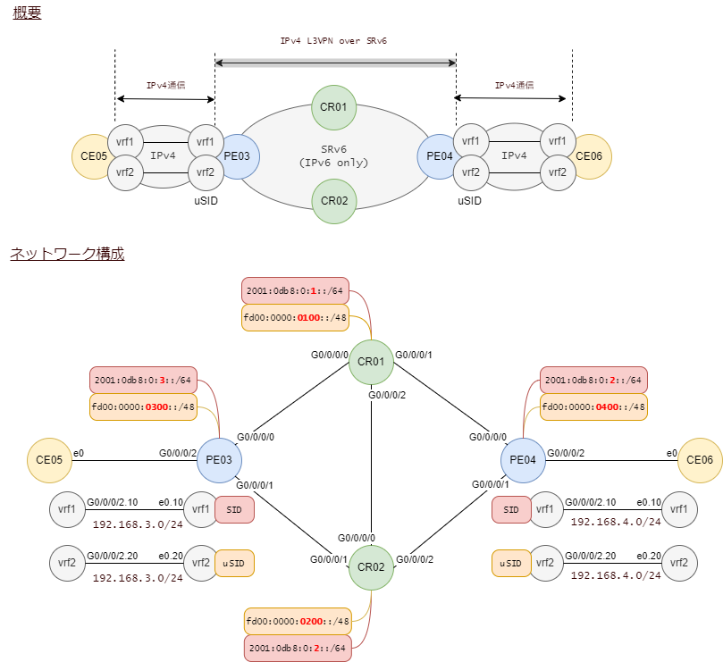
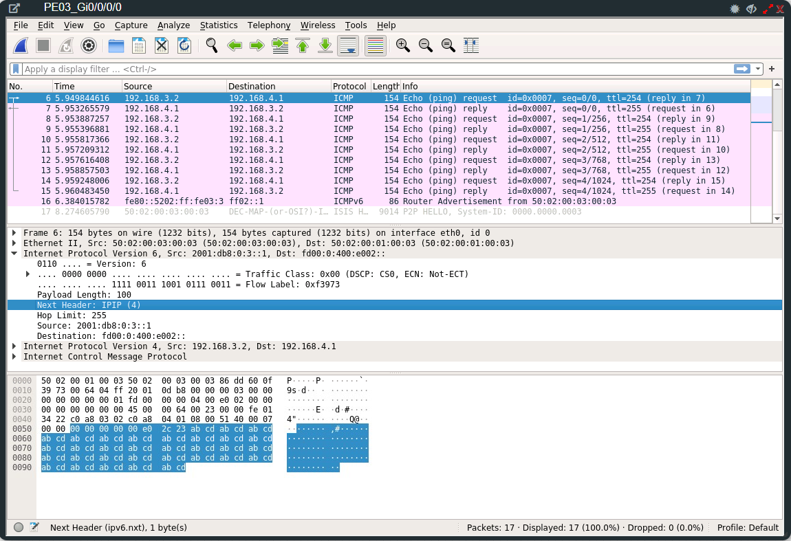

# SRv6 L3VPN uSID

フルレングスのロケータに加えてmicro-SIDのロケータを加えます。

vrfを追加して、vrf1はフルレングスのSIDを、vrf2はuSIDを使います。

<br><br>

## 構成



<br>

## ping

CE05からPE04へのpingをキャプチャ。宛先アドレスに注目。



- Source: 2001:db8:0:3::1 となっています。これはPE3のループバックです。このアドレスを使うように設定しています。
- Destination: fd00:0:400:e002:: となっています。これはPE04のuSIDです。fd00:0は共通部、400はPE04を表しています。e002はファンクション部です。

<br>

## PE04が採番したSID

uSIDのロケータ名は 'ua' です。vrf2に採番されたuSIDはpingの宛先になっていた `fd00:0:400:e002::` です。

```
RP/0/RP0/CPU0:PE04#show segment-routing srv6 sid
Sat Jan 21 17:13:23.674 JST

*** Locator: 'a' ***

SID                         Behavior          Context                           Owner               State  RW
--------------------------  ----------------  --------------------------------  ------------------  -----  --
2001:db8:0:4:1::            End (PSP/USD)     'default':1                       sidmgr              InUse  Y
2001:db8:0:4:40::           End.X (PSP/USD)   [Gi0/0/0/0, Link-Local]           isis-core           InUse  Y
2001:db8:0:4:41::           End.X (PSP/USD)   [Gi0/0/0/1, Link-Local]           isis-core           InUse  Y
2001:db8:0:4:42::           End.DT4           'vrf1'                            bgp-65000           InUse  Y
2001:db8:0:4:43::           End.DT4           'default'                         bgp-65000           InUse  Y

*** Locator: 'ua' ***

fd00:0:400::                uN (PSP/USD)      'default':1024                    sidmgr              InUse  Y
fd00:0:400:e000::           uA (PSP/USD)      [Gi0/0/0/0, Link-Local]:0         isis-core           InUse  Y
fd00:0:400:e001::           uA (PSP/USD)      [Gi0/0/0/1, Link-Local]:0         isis-core           InUse  Y
fd00:0:400:e002::           uDT4              'vrf2'                            bgp-65000           InUse  Y
RP/0/RP0/CPU0:PE04#
```

<br>

## PE03がBGPで受信したSID情報

192.168.4.0/24に対するnexthopは `2001:db8:0:4:::1` で、これはPE4のループバックです。
実際に通信に使われるのはnexthopではなくSIDです。これは `fd00:0:400:e002::` です。

```
RP/0/RP0/CPU0:PE03#show bgp vpnv4 unicast rece
received-sids  recent-prefixes
RP/0/RP0/CPU0:PE03#show bgp vpnv4 unicast received-sids
Sat Jan 21 17:15:40.402 JST
BGP router identifier 1.1.1.3, local AS number 65000
BGP generic scan interval 60 secs
Non-stop routing is enabled
BGP table state: Active
Table ID: 0x0
BGP main routing table version 143
BGP NSR Initial initsync version 1 (Reached)
BGP NSR/ISSU Sync-Group versions 0/0
BGP scan interval 60 secs

Status codes: s suppressed, d damped, h history, * valid, > best
              i - internal, r RIB-failure, S stale, N Nexthop-discard
Origin codes: i - IGP, e - EGP, ? - incomplete
   Network            Next Hop                            Received Sid
Route Distinguisher: 1:1 (default for vrf vrf1)
*> 192.168.3.0/24     192.168.3.2                         NO SRv6 Sid
*>i192.168.4.0/24     2001:db8:0:4::1                     2001:db8:0:4:42::
* i                   2001:db8:0:4::1                     2001:db8:0:4:42::
Route Distinguisher: 1:2 (default for vrf vrf2)
*> 192.168.3.0/24     192.168.3.2                         NO SRv6 Sid
*>i192.168.4.0/24     2001:db8:0:4::1                     fd00:0:400:e002::
* i                   2001:db8:0:4::1                     fd00:0:400:e002::

Processed 4 prefixes, 6 paths
```

<br>

## CR01における経路情報

CR01自身はvrfの情報を知りませんので、通常のIPv6としてパケットを中継をするだけです。
宛先 `fd00:0:400:e002::` のパケットがどこに中継されるのかを見てみます。

ロンゲストマッチのルールに従って `fd00:0:400::/48` に行き着きます。

これはPE04に割り当てられたuSID用のロケータで、ISISによって配信されています。

```
RP/0/RP0/CPU0:CR01#show route ipv6 fd00:0:400:e002::
Sat Jan 21 17:19:53.655 JST

Routing entry for fd00:0:400::/48
  Known via "isis core", distance 115, metric 11, SRv6-locator, type level-2
  Installed Jan 21 17:02:12.033 for 00:17:41
  Routing Descriptor Blocks
    fe80::5202:ff:fe04:3, from 2001:db8:0:4::1, via GigabitEthernet0/0/0/1
      Route metric is 11
  No advertising protos.
```

<br>

## CR01の設定

関係する部分のみ。新たなロケータuaをisisに加えています。

```
!
router isis core
 address-family ipv6 unicast
  segment-routing srv6
   locator a
   !
   locator ua
   !
  !
 !
!

segment-routing
 srv6
  !
  locators
   locator a
    prefix 2001:db8:0:1::/64
   !
   locator ua
    micro-segment behavior unode psp-usd
    prefix fd00:0:100::/48
   !
  !
 !
!
```

念のため、全ての設定。

```
hostname CR01
clock timezone JST Asia/Tokyo
username root
 group root-lr
 group cisco-support
 secret 10 $6$gyKeD/jZuHdy2D/.$nrt1ShaKihimEdQr.ASYcpWsFzn3zHg4oNPxgC5CS05ppkFthJA2EklVviaeuhf5DNUVOWWvOuWPqLGPSpEbZ0
!
cdp
!
interface Loopback0
 ipv6 address 2001:db8:0:1::1/128
!
interface GigabitEthernet0/0/0/0
 cdp
 mtu 9014
 ipv6 enable
!
interface GigabitEthernet0/0/0/1
 cdp
 mtu 9014
 ipv6 enable
!
interface GigabitEthernet0/0/0/2
 cdp
 mtu 9014
 ipv6 enable
!
router isis core
 is-type level-2-only
 net 49.0000.0000.0000.0001.00
 distribute link-state
 nsf ietf
 address-family ipv6 unicast
  metric-style wide
  router-id Loopback0
  segment-routing srv6
   locator a
   !
   locator ua
   !
  !
 !
 interface Loopback0
  address-family ipv6 unicast
  !
 !
 interface GigabitEthernet0/0/0/0
  point-to-point
  address-family ipv6 unicast
   metric 10
  !
 !
 interface GigabitEthernet0/0/0/1
  point-to-point
  address-family ipv6 unicast
   metric 10
  !
 !
 interface GigabitEthernet0/0/0/2
  point-to-point
  address-family ipv6 unicast
   metric 10
  !
 !
!
router bgp 65000
 bgp router-id 1.1.1.1
 bgp cluster-id 1
 address-family ipv4 unicast
 !
 address-family vpnv4 unicast
 !
 neighbor 2001:db8:0:2::1
  remote-as 65000
  update-source Loopback0
  address-family ipv4 unicast
  !
  address-family vpnv4 unicast
  !
 !
 neighbor 2001:db8:0:3::1
  remote-as 65000
  update-source Loopback0
  address-family ipv4 unicast
   route-reflector-client
  !
  address-family vpnv4 unicast
   route-reflector-client
  !
 !
 neighbor 2001:db8:0:4::1
  remote-as 65000
  update-source Loopback0
  address-family ipv4 unicast
   route-reflector-client
  !
  address-family vpnv4 unicast
   route-reflector-client
  !
 !
!
segment-routing
 srv6
  logging locator status
  encapsulation
   source-address 2001:db8:0:1::1
  !
  locators
   locator a
    prefix 2001:db8:0:1::/64
   !
   locator ua
    micro-segment behavior unode psp-usd
    prefix fd00:0:100::/48
   !
  !
 !
!

```

<br>

## PE03の設定

関連するところのみ。

増分は、uSIDのロケータ定義、ISISへの追加、vrf 2に関する定義、CE向けのインタフェース定義、BGPへのvrf2の追加、等です。

```
!
hostname PE03
clock timezone JST Asia/Tokyo
username root
 group root-lr
 group cisco-support
 secret 10 $6$HXiCBcfH1uoB....$pdeWBcXfZRYi8IIKFJvRL90dvOug/i91ox9Cc3Aji/nYbsg8jYXkDo9xJwcCunIDkDun14w5O1SAo2md2aeoX/
!
cdp
pce
 address ipv6 2001:db8:0:2::1
!
vrf vrf1
 rd 1:1
 address-family ipv4 unicast
  import route-target
   1:1
  !
  export route-policy SET_COLOR_10
  export route-target
   1:1
  !
 !
!
vrf vrf2
 rd 1:2
 address-family ipv4 unicast
  import route-target
   1:2
  !
  export route-policy SET_COLOR_10
  export route-target
   1:2
  !
 !
!
interface Loopback0
 ipv6 address 2001:db8:0:3::1/128
!
interface MgmtEth0/RP0/CPU0/0
 shutdown
!
interface GigabitEthernet0/0/0/0
 cdp
 mtu 9014
 ipv6 enable
!
interface GigabitEthernet0/0/0/1
 cdp
 mtu 9014
 ipv6 enable
!
interface GigabitEthernet0/0/0/2
 ipv4 address 192.168.3.1 255.255.255.0
!
interface GigabitEthernet0/0/0/2.10
 vrf vrf1
 ipv4 address 192.168.3.1 255.255.255.0
 encapsulation dot1q 10
!
interface GigabitEthernet0/0/0/2.20
 vrf vrf2
 ipv4 address 192.168.3.1 255.255.255.0
 encapsulation dot1q 20
!
interface GigabitEthernet0/0/0/3
 shutdown
!
extcommunity-set opaque color_10
  10
end-set
!
route-policy PASS-ALL
  pass
end-policy
!
route-policy SET_COLOR_10
  set extcommunity color color_10
  pass
end-policy
!
router isis core
 net 49.0000.0000.0000.0003.00
 distribute link-state
 nsf ietf
 address-family ipv6 unicast
  metric-style wide
  router-id Loopback0
  segment-routing srv6
   locator a
   !
   locator ua
   !
  !
 !
 interface Loopback0
  address-family ipv6 unicast
  !
 !
 interface GigabitEthernet0/0/0/0
  point-to-point
  address-family ipv6 unicast
   metric 10
  !
 !
 interface GigabitEthernet0/0/0/1
  point-to-point
  address-family ipv6 unicast
   metric 20
  !
 !
!
router bgp 65000
 bgp router-id 1.1.1.3
 address-family ipv4 unicast
  segment-routing srv6
   locator a
   alloc mode per-vrf
  !
 !
 address-family vpnv4 unicast
  vrf all
   segment-routing srv6
    locator a
   !
  !
 !
 neighbor 192.168.3.2
  remote-as 65005
  address-family ipv4 unicast
   route-policy PASS-ALL in
   route-policy PASS-ALL out
  !
 !
 neighbor 2001:db8:0:1::1
  remote-as 65000
  update-source Loopback0
  address-family ipv4 unicast
   encapsulation-type srv6
   next-hop-self
  !
  address-family vpnv4 unicast
   next-hop-self
  !
 !
 neighbor 2001:db8:0:2::1
  remote-as 65000
  update-source Loopback0
  address-family ipv4 unicast
   encapsulation-type srv6
   next-hop-self
  !
  address-family vpnv4 unicast
   next-hop-self
  !
 !
 vrf vrf1
  address-family ipv4 unicast
   segment-routing srv6
    locator a
    alloc mode per-vrf
   !
  !
  neighbor 192.168.3.2
   remote-as 65005
   address-family ipv4 unicast
    route-policy PASS-ALL in
    route-policy PASS-ALL out
   !
  !
 !
 vrf vrf2
  address-family ipv4 unicast
   segment-routing srv6
    locator ua
    alloc mode per-vrf
   !
  !
  neighbor 192.168.3.2
   remote-as 65005
   address-family ipv4 unicast
    route-policy PASS-ALL in
    route-policy PASS-ALL out
   !
  !
 !
!
segment-routing
 srv6
  logging locator status
  encapsulation
   source-address 2001:db8:0:3::1
  !
  locators
   locator a
    prefix 2001:db8:0:3::/64
   !
   locator ua
    micro-segment behavior unode psp-usd
    prefix fd00:0:300::/48
   !
  !
 !
!
end
```

vrfに対してどのロケータからSIDを採番するかは、SRv6のヘッドエンド動作でカプセル化するソースアドレスは、この設定です。
vrf allで設定することで、vrf個別に設定する必要がなくなります。

```
router bgp 65000
 !
 address-family vpnv4 unicast
  vrf all
   segment-routing srv6
    locator a
   !
  !
 !
```

今回はvrf個別に設定を加えて、上書きしています。

```
router bgp 65000
 vrf vrf1
  address-family ipv4 unicast
   segment-routing srv6
    locator a
    alloc mode per-vrf
   !
  !
```
