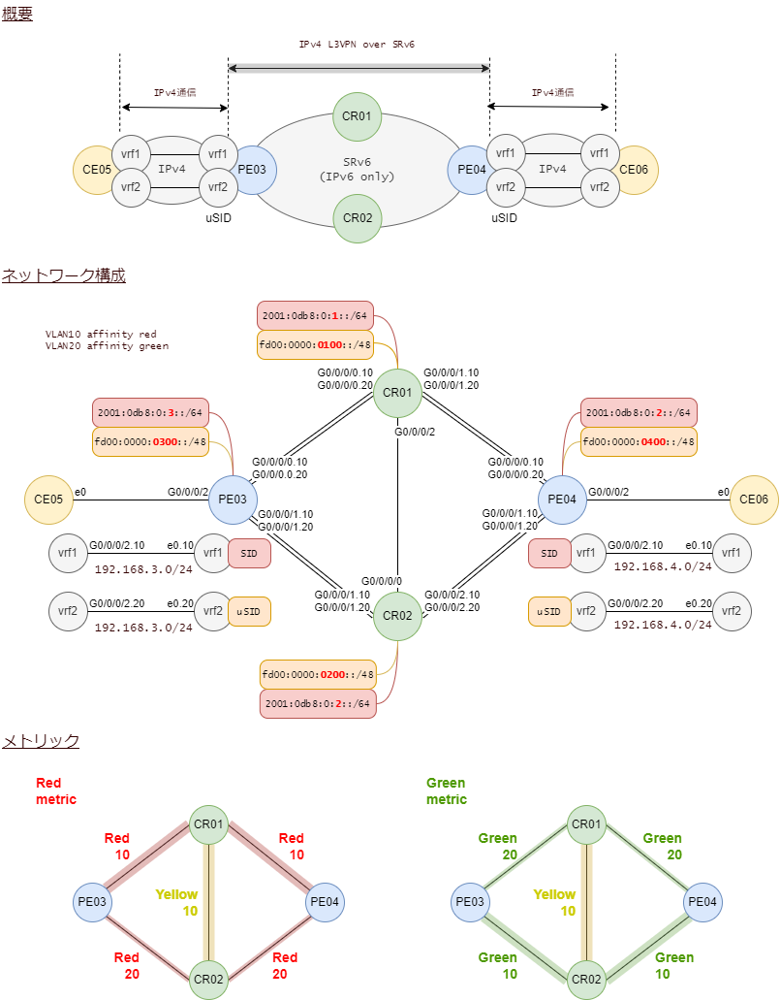
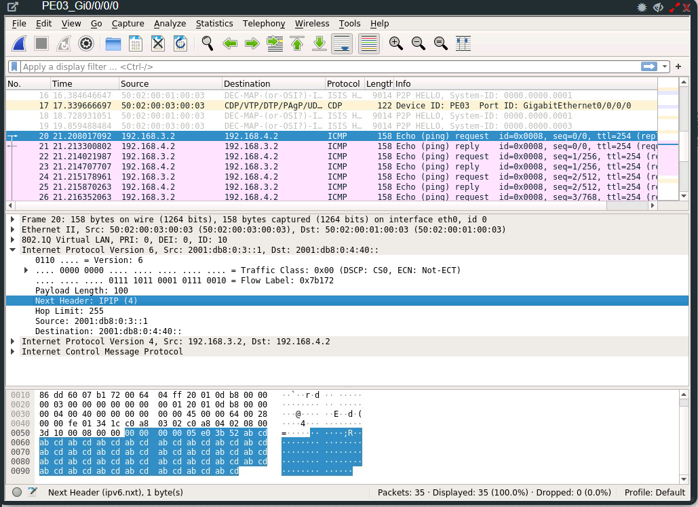
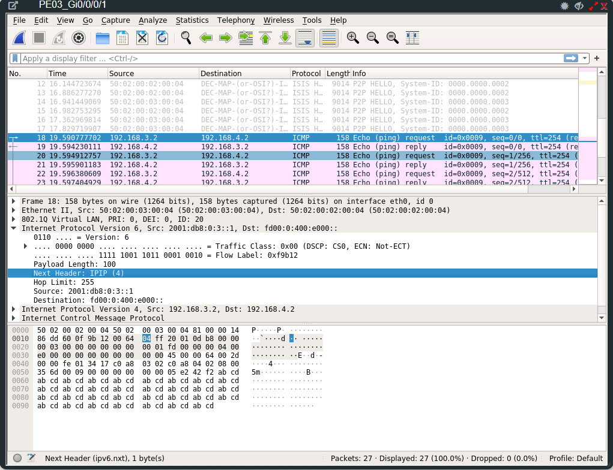

# SRv6 L3VPN uSID FlexAlgo

VLANを使ってCR01-CR02-PE03-PE04の4台でリング型ネットワークを2個追加します。
untagを含めると3リング構成になります。

VLAN10で作成したリングはred、VLAN20はgreenと名付けます。

- リング(VLAN 10) = affinity red
- リング(VLAN 20) = affinity green

メトリックを操作してredは上ルートを、greenは下ルートを通るようにします。

vrf1はred経路、vrf2はgreen経路を通るようにします。

<br><br>

## IOS-XRの制約条件

- ISIS と OSPF でサポートしています

- FlexAlgoのロケータ数は最大8です。

- 全てのロケータのブロック部（先頭40ビット）は同一でなければいけません。

- アルゴリズム番号は 128 ～ 255 です。

<br>

## 構成



<br>

## ロケータの変更

ロケータにアルゴリズム番号を紐づけます。

ロケータaはアルゴリズム128、ロケータuaはアルゴリズム129に変更します。

この設定は全ルータ共通です。

```
RP/0/RP0/CPU0:CR01(config)#segment-routing srv6
RP/0/RP0/CPU0:CR01(config-srv6)#locators
RP/0/RP0/CPU0:CR01(config-srv6-locators)#locator a
RP/0/RP0/CPU0:CR01(config-srv6-locator)#algorithm 128
RP/0/RP0/CPU0:CR01(config-srv6-locator)#exit

RP/0/RP0/CPU0:CR01(config-srv6-locators)#locator ua
RP/0/RP0/CPU0:CR01(config-srv6-locator)#algorithm 129
RP/0/RP0/CPU0:CR01(config-srv6-locator)#root
RP/0/RP0/CPU0:CR01(config)#commit
```

<br>

## ISIS FlexAlgoの設定

アルゴリズム128と129を有効にします。

ISISの各アルゴリズムのmetric-typeをteにします。

この設定は全ルータ共通です。

```
RP/0/RP0/CPU0:CR01(config)#router isis core
RP/0/RP0/CPU0:CR01(config-isis)#flex-algo ?
  <128-255>  Algorithm number
RP/0/RP0/CPU0:CR01(config-isis)#flex-algo 128
RP/0/RP0/CPU0:CR01(config-isis-flex-algo)#priority 128
RP/0/RP0/CPU0:CR01(config-isis-flex-algo)#metric-type ?
  delay  Use delay as metric
  te     Use Traffic Engineering metric
RP/0/RP0/CPU0:CR01(config-isis-flex-algo)#metric-type te
RP/0/RP0/CPU0:CR01(config-isis-flex-algo)#prefix-metric
RP/0/RP0/CPU0:CR01(config-isis-flex-algo)#advertise-definition
RP/0/RP0/CPU0:CR01(config-isis-flex-algo)#exit
RP/0/RP0/CPU0:CR01(config-isis)#flex-algo 129
RP/0/RP0/CPU0:CR01(config-isis-flex-algo)#priority 129
RP/0/RP0/CPU0:CR01(config-isis-flex-algo)#metric-type te
RP/0/RP0/CPU0:CR01(config-isis-flex-algo)#prefix-metric
RP/0/RP0/CPU0:CR01(config-isis-flex-algo)#advertise-definition
RP/0/RP0/CPU0:CR01(config-isis-flex-algo)#exit
RP/0/RP0/CPU0:CR01(config-isis)#commit
```

<br>

## ISIS affinityの設定

名前とビットポジションを対応づけます。

この設定は全ルータ共通です。

```
RP/0/RP0/CPU0:CR01(config-sr-te)#router isis core
RP/0/RP0/CPU0:CR01(config-isis)#affinity-map yellow bit-position 1
RP/0/RP0/CPU0:CR01(config-isis)#affinity-map red bit-position 2
RP/0/RP0/CPU0:CR01(config-isis)#affinity-map green bit-position 3

RP/0/RP0/CPU0:CR01(config-isis)#flex-algo 128
RP/0/RP0/CPU0:CR01(config-isis-flex-algo)#affinity ?
  exclude-any  Exclude objects in flex-algo calculation
  include-all  Include objects in flex-algo calculation
  include-any  Include objects in flex-algo calculation
RP/0/RP0/CPU0:CR01(config-isis-flex-algo)#affinity include-any red yellow
RP/0/RP0/CPU0:CR01(config-isis-flex-algo)#exit
RP/0/RP0/CPU0:CR01(config-isis)#flex-algo 129
RP/0/RP0/CPU0:CR01(config-isis-flex-algo)#affinity include-any green yellow
RP/0/RP0/CPU0:CR01(config-isis-flex-algo)#commit
```

続いて、どのインタフェースがどの名前のaffinityに属するかを設定します。
これはルータのインタフェースによって異なります。

```
RP/0/RP0/CPU0:CR01(config-isis-flex-algo)#router isis core
RP/0/RP0/CPU0:CR01(config-isis)#interface gigabitEthernet 0/0/0/0.10
RP/0/RP0/CPU0:CR01(config-isis-if)#affinity flex-algo ?
  red     Affinity names
  green   Affinity names
  yellow  Affinity names
  WORD    Affinity names
RP/0/RP0/CPU0:CR01(config-isis-if)#affinity flex-algo red
RP/0/RP0/CPU0:CR01(config-isis-if)#exit
RP/0/RP0/CPU0:CR01(config-isis)#interface gigabitEthernet 0/0/0/0.20
RP/0/RP0/CPU0:CR01(config-isis-if)#affinity flex-algo green
RP/0/RP0/CPU0:CR01(config-isis-if)#exit
RP/0/RP0/CPU0:CR01(config-isis)#interface gigabitEthernet 0/0/0/1.10
RP/0/RP0/CPU0:CR01(config-isis-if)#affinity flex-algo red
RP/0/RP0/CPU0:CR01(config-isis-if)#interface gigabitEthernet 0/0/0/1.20
RP/0/RP0/CPU0:CR01(config-isis-if)#affinity flex-algo green
RP/0/RP0/CPU0:CR01(config-isis-if)#interface gigabitEthernet 0/0/0/2
RP/0/RP0/CPU0:CR01(config-isis-if)#affinity flex-algo yellow
RP/0/RP0/CPU0:CR01(config-isis-if)#commit
```

続いて、インタフェースごとにFlexAlgoのメトリックを設定します。

```
RP/0/RP0/CPU0:CR01(config-sr)#router isis core
RP/0/RP0/CPU0:CR01(config-isis)#interface gigabitEthernet 0/0/0/0.10
RP/0/RP0/CPU0:CR01(config-isis-if)#address-family ipv6 unicast
RP/0/RP0/CPU0:CR01(config-isis-if-af)#te-metric flex-algo ?
  <1-16777214>  Flex-algo traffic-engineering metric
RP/0/RP0/CPU0:CR01(config-isis-if-af)#te-metric flex-algo 10
RP/0/RP0/CPU0:CR01(config-isis-if-af)#exit
RP/0/RP0/CPU0:CR01(config-isis-if)#exit
RP/0/RP0/CPU0:CR01(config-isis)#interface gigabitEthernet 0/0/0/0.20
RP/0/RP0/CPU0:CR01(config-isis-if)#address-family ipv6 unicast
RP/0/RP0/CPU0:CR01(config-isis-if-af)#te-metric flex-algo 20
RP/0/RP0/CPU0:CR01(config-isis-if-af)#interface gigabitEthernet 0/0/0/1.10
RP/0/RP0/CPU0:CR01(config-isis-if)#address-family ipv6 unicast
RP/0/RP0/CPU0:CR01(config-isis-if-af)#te-metric flex-algo 10
RP/0/RP0/CPU0:CR01(config-isis-if-af)#interface gigabitEthernet 0/0/0/1.20
RP/0/RP0/CPU0:CR01(config-isis-if)#address-family ipv6 unicast
RP/0/RP0/CPU0:CR01(config-isis-if-af)#te-metric flex-algo 20
RP/0/RP0/CPU0:CR01(config-isis-if-af)#interface gigabitEthernet 0/0/0/2
RP/0/RP0/CPU0:CR01(config-isis-if)#address-family ipv6 unicast
RP/0/RP0/CPU0:CR01(config-isis-if-af)#te-metric flex-algo 10
RP/0/RP0/CPU0:CR01(config-isis-if-af)#commit
```

<br>

## PE03が採番したSID

vrf1にはフルレングスのロケータaから、vrf2にはマイクロSIDのロケータuaから採番しています。

```
RP/0/RP0/CPU0:PE03#sh segment-routing srv6 sid
Sun Jan 22 16:11:48.318 JST

*** Locator: 'a' ***

SID                         Behavior          Context                           Owner               State  RW
--------------------------  ----------------  --------------------------------  ------------------  -----  --
2001:db8:0:3:1::            End (PSP/USD)     'default':1                       sidmgr              InUse  Y
2001:db8:0:3:40::           End.DT4           'vrf1'                            bgp-65000           InUse  Y
2001:db8:0:3:41::           End.DT4           'default'                         bgp-65000           InUse  Y
2001:db8:0:3:42::           End.X (PSP/USD)   [Gi0/0/0/0, Link-Local]           isis-core           InUse  Y
2001:db8:0:3:43::           End.X (PSP/USD)   [Gi0/0/0/0.10, Link-Local]        isis-core           InUse  Y
2001:db8:0:3:44::           End.X (PSP/USD)   [Gi0/0/0/0.20, Link-Local]        isis-core           InUse  Y
2001:db8:0:3:45::           End.X (PSP/USD)   [Gi0/0/0/1, Link-Local]           isis-core           InUse  Y
2001:db8:0:3:46::           End.X (PSP/USD)   [Gi0/0/0/1.10, Link-Local]        isis-core           InUse  Y
2001:db8:0:3:47::           End.X (PSP/USD)   [Gi0/0/0/1.20, Link-Local]        isis-core           InUse  Y

*** Locator: 'ua' ***

fd00:0:300::                uN (PSP/USD)      'default':768                     sidmgr              InUse  Y
fd00:0:300:e000::           uDT4              'vrf2'                            bgp-65000           InUse  Y
fd00:0:300:e001::           uA (PSP/USD)      [Gi0/0/0/0, Link-Local]:129       isis-core           InUse  Y
fd00:0:300:e002::           uA (PSP/USD)      [Gi0/0/0/0.10, Link-Local]:129    isis-core           InUse  Y
fd00:0:300:e003::           uA (PSP/USD)      [Gi0/0/0/0.20, Link-Local]:129    isis-core           InUse  Y
fd00:0:300:e004::           uA (PSP/USD)      [Gi0/0/0/1, Link-Local]:129       isis-core           InUse  Y
fd00:0:300:e005::           uA (PSP/USD)      [Gi0/0/0/1.10, Link-Local]:129    isis-core           InUse  Y
fd00:0:300:e006::           uA (PSP/USD)      [Gi0/0/0/1.20, Link-Local]:129    isis-core           InUse  Y
```

<br>

## PE03がBGPで受信したSID情報

vrf1の192.168.4.0/24には `2001:db8:0:4:40::` のSIDが、vrf2には `fd00:0:400:e000::` のSIDが付いています。

```
RP/0/RP0/CPU0:PE03#show bgp vpnv4 unicast received-sids
Sun Jan 22 16:14:10.126 JST
BGP router identifier 1.1.1.3, local AS number 65000
BGP generic scan interval 60 secs
Non-stop routing is enabled
BGP table state: Active
Table ID: 0x0
BGP main routing table version 183
BGP NSR Initial initsync version 1 (Reached)
BGP NSR/ISSU Sync-Group versions 0/0
BGP scan interval 60 secs

Status codes: s suppressed, d damped, h history, * valid, > best
              i - internal, r RIB-failure, S stale, N Nexthop-discard
Origin codes: i - IGP, e - EGP, ? - incomplete
   Network            Next Hop                            Received Sid
Route Distinguisher: 1:1 (default for vrf vrf1)
*> 192.168.3.0/24     192.168.3.2                         NO SRv6 Sid
*>i192.168.4.0/24     2001:db8:0:4::1                     2001:db8:0:4:40::
* i                   2001:db8:0:4::1                     2001:db8:0:4:40::
Route Distinguisher: 1:2 (default for vrf vrf2)
*> 192.168.3.0/24     192.168.3.2                         NO SRv6 Sid
*>i192.168.4.0/24     2001:db8:0:4::1                     fd00:0:400:e000::
* i                   2001:db8:0:4::1                     fd00:0:400:e000::

Processed 4 prefixes, 6 paths
```

<br>

## PE03から各SIDへの経路

PE03からみて、PE04の先のvrf1にたどり着くにはSID `2001:db8:0:4:40::` が宛先になります。
この宛先にたどり着く経路を調べます。

```
Routing entry for 2001:db8:0:4::/64
  Known via "isis core", distance 115, metric 20, SRv6-locator (algo 128), type level-2
  Installed Jan 22 14:48:07.190 for 01:28:37
  Routing Descriptor Blocks
    fe80::5202:ff:fe01:3, from 2001:db8:0:4::1, via GigabitEthernet0/0/0/0.10
      Route metric is 20
  No advertising protos.
RP/0/RP0/CPU0:PE03#
```

algo 128のISISで学習して、中継先はGig0/0/0/0.10、つまりredのaffinityを持ったインタフェースに転送されることがわかります。
これはリングの上ルートを通る経路です。

<br>

次に、vrf2のSID `fd00:0:400:e000::` にたどり着くための経路を調べます。

```
RP/0/RP0/CPU0:PE03#show route ipv6 fd00:0:400:e000::
Sun Jan 22 16:20:43.951 JST

Routing entry for fd00:0:400::/48
  Known via "isis core", distance 115, metric 20, SRv6-locator (algo 129), type level-2
  Installed Jan 22 14:48:07.190 for 01:32:36
  Routing Descriptor Blocks
    fe80::5202:ff:fe02:4, from 2001:db8:0:4::1, via GigabitEthernet0/0/0/1.20
      Route metric is 20
  No advertising protos.
```

algo 129のISISで学習して、中継先はGig0/0/0/1.20、つまりgreenのaffinityを持ったインタフェースに転送されることがわかります。
これはリングの下ルートを通る経路です。

<br>

## CE05-CE06間のping

vrf1のpingパケットです。これはリングの上ルートを通ります。



ICMP Echo RequestとReplyが同じところでキャプチャできていますので、戻りの通信も非対称になることなく、適切にルーティングされていることがわかります。

<br><br>

vrf2のpingパケットです。これはリングの下ルートを通ります。



<br>

## 設定

[CR01](config_l3vpn_usid_flexalgo/1_CR01.txt)

[CR02](config_l3vpn_usid_flexalgo/2_CR02.txt)

[PE03](config_l3vpn_usid_flexalgo/3_PE03.txt)

[PE04](config_l3vpn_usid_flexalgo/4_PE04.txt)

[CE05](config_l3vpn_usid_flexalgo/6_CE05.txt)

[CE06](config_l3vpn_usid_flexalgo/5_CE06.txt)
