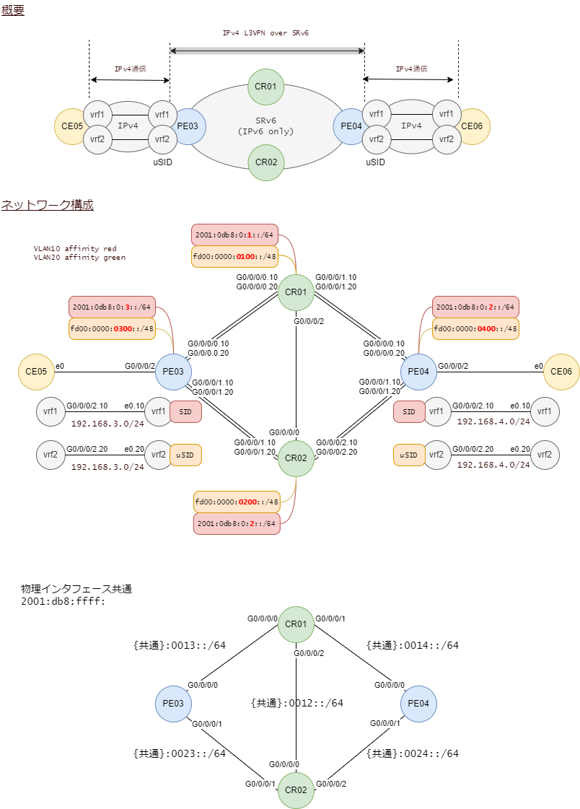

# SRv6 L3VPN uSID FlexAlgo + Performance Measurement

Performance Measurementを有効にします。

  

## IOS-XRの制約条件

PTP(Precision Time Protocol)をサポートするハードウェアでサポートされます。

> **Warn**
>
> XRv9000では動作しませんでした。

一方通行で測定する場合はPTPを使ったクロック同期が必須です。双方向計測、ループバック計測の場合は必須ではありません。

測定できるものは以下の通りです。

- IPエンドポイントの遅延測定と死活監視
- リンク遅延測定
- SRポリシーの活性監視
- SRポリシーのエンドツーエンド遅延測定

 

## 構成

 

##
