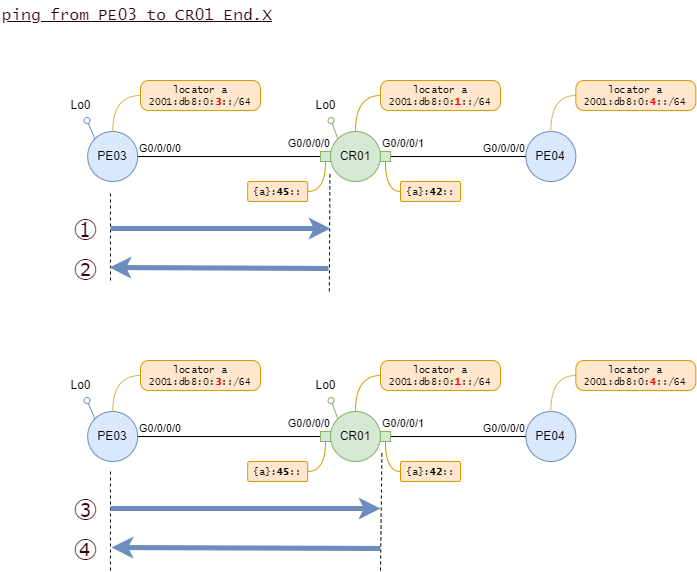
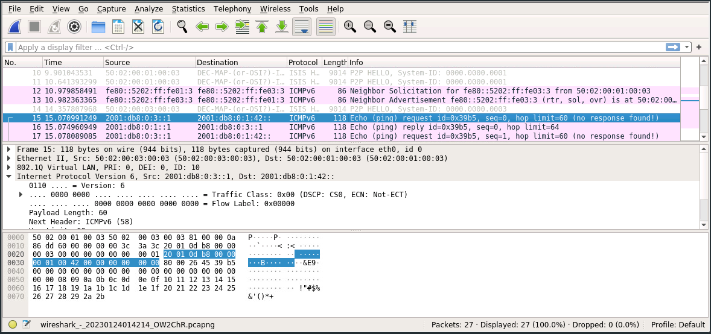
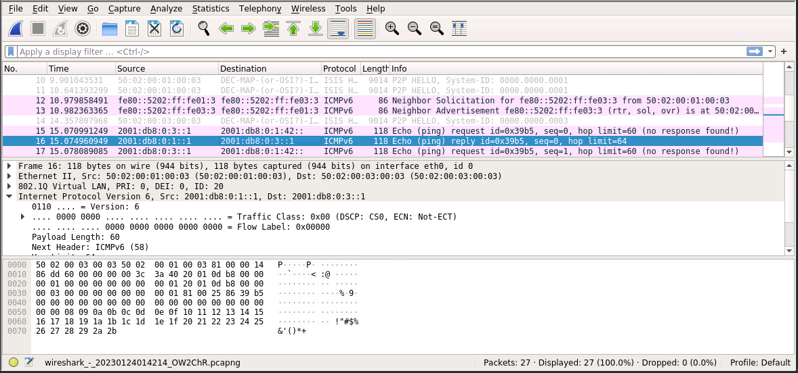
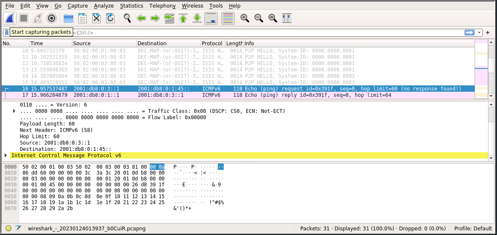
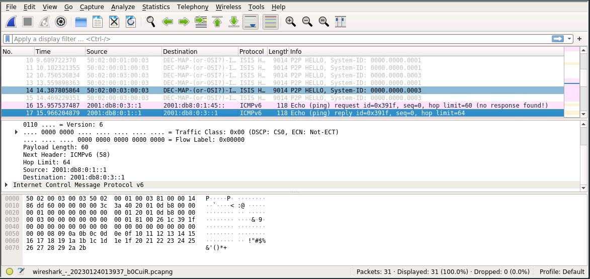
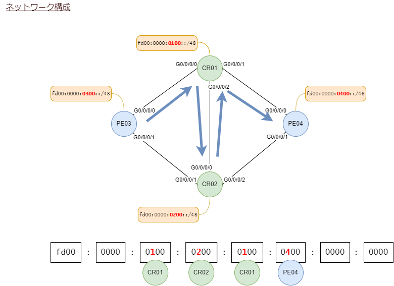
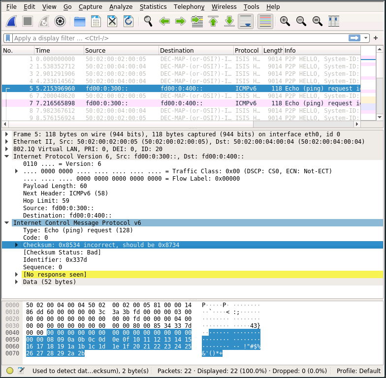

# SRv6 OAM

SRv6 DPM(Data Plane Monitoring)は実装されていない模様です。

<br>

## ping(CE-CE)

CEルータから見たら、途中にSRv6網を経由していることはわかりません。

フルレングスSIDを使う経路。

```
CE05#ping vrf vrf1 192.168.4.2
Type escape sequence to abort.
Sending 5, 100-byte ICMP Echos to 192.168.4.2, timeout is 2 seconds:
!!!!!
Success rate is 100 percent (5/5), round-trip min/avg/max = 1/1/2 ms
```

マイクロSIDを使う経路。

```
CE05#ping vrf vrf2 192.168.4.2
Type escape sequence to abort.
Sending 5, 100-byte ICMP Echos to 192.168.4.2, timeout is 2 seconds:
!!!!!
Success rate is 100 percent (5/5), round-trip min/avg/max = 1/1/3 ms
```

行きのIPv4ヘッダのTTLは255、戻ってきたときのTTLは253になります。SRv6網の入り口と出口でそれぞれTTLを一つ減らしています。


<br>

## traceroute(CE-CE)

エンド・エンドのL3VPN通信でtracerouteをしても、SRv6網は見えません。

```
CE05#traceroute vrf vrf1 192.168.4.2
Type escape sequence to abort.
Tracing the route to 192.168.4.2
VRF info: (vrf in name/id, vrf out name/id)
  1 192.168.3.1 4 msec 1 msec 1 msec
  2 192.168.4.1 [AS 65006] 3 msec 2 msec 1 msec
  3 192.168.4.2 [AS 65006] 2 msec *  2 msec
```

<br>

## SRv6網内のping(node-SIDにping)

IOS-XRは `{locator}:1::` がnode-SID(Endに対するSID)になります。

PE03からCR01、CR02、PE04のnode-SIDにpingを打ち込みます。

```
P/0/RP0/CPU0:PE03#ping ipv6 2001:db8:0:1:1::
Sun Jan 22 17:11:37.537 JST
Type escape sequence to abort.
Sending 5, 100-byte ICMP Echos to 2001:db8:0:1:1::, timeout is 2 seconds:
!!!!!
Success rate is 100 percent (5/5), round-trip min/avg/max = 4/7/10 ms

RP/0/RP0/CPU0:PE03#ping ipv6 2001:db8:0:2:1::
Sun Jan 22 17:11:40.330 JST
Type escape sequence to abort.
Sending 5, 100-byte ICMP Echos to 2001:db8:0:2:1::, timeout is 2 seconds:
!!!!!
Success rate is 100 percent (5/5), round-trip min/avg/max = 2/5/13 ms

RP/0/RP0/CPU0:PE03#ping ipv6 2001:db8:0:3:1::
Sun Jan 22 17:11:43.067 JST
Type escape sequence to abort.
Sending 5, 100-byte ICMP Echos to 2001:db8:0:3:1::, timeout is 2 seconds:
!!!!!
Success rate is 100 percent (5/5), round-trip min/avg/max = 1/1/3 ms
```

<br>

## SRv6網内のping(adj-SIDにping)

CR01のSIDは以下の通りです。

```
RP/0/RP0/CPU0:CR01#show segment-routing srv6 sid
Sun Jan 22 17:14:47.865 JST

*** Locator: 'a' ***

SID                         Behavior          Context                           Owner               State  RW
--------------------------  ----------------  --------------------------------  ------------------  -----  --
2001:db8:0:1:1::            End (PSP/USD)     'default':1                       sidmgr              InUse  Y
2001:db8:0:1:40::           End.DT4           'default'                         bgp-65000           InUse  Y
2001:db8:0:1:41::           End.X (PSP/USD)   [Gi0/0/0/2, Link-Local]           isis-core           InUse  Y
2001:db8:0:1:42::           End.X (PSP/USD)   [Gi0/0/0/1, Link-Local]           isis-core           InUse  Y
2001:db8:0:1:43::           End.X (PSP/USD)   [Gi0/0/0/1.10, Link-Local]        isis-core           InUse  Y
2001:db8:0:1:44::           End.X (PSP/USD)   [Gi0/0/0/1.20, Link-Local]        isis-core           InUse  Y
2001:db8:0:1:45::           End.X (PSP/USD)   [Gi0/0/0/0, Link-Local]           isis-core           InUse  Y
2001:db8:0:1:46::           End.X (PSP/USD)   [Gi0/0/0/0.10, Link-Local]        isis-core           InUse  Y
2001:db8:0:1:47::           End.X (PSP/USD)   [Gi0/0/0/0.20, Link-Local]        isis-core           InUse  Y
```

PE03からCR01のEnd.XのSIDにpingを打ち込みます。全てCR01からの応答です。

```
RP/0/RP0/CPU0:PE03#ping ipv6 2001:db8:0:1:41::
Sun Jan 22 17:16:15.097 JST
Type escape sequence to abort.
Sending 5, 100-byte ICMP Echos to 2001:db8:0:1:41::, timeout is 2 seconds:
!!!!!
Success rate is 100 percent (5/5), round-trip min/avg/max = 2/3/8 ms

RP/0/RP0/CPU0:PE03#ping ipv6 2001:db8:0:1:42::
Sun Jan 22 17:16:19.171 JST
Type escape sequence to abort.
Sending 5, 100-byte ICMP Echos to 2001:db8:0:1:42::, timeout is 2 seconds:
!!!!!
Success rate is 100 percent (5/5), round-trip min/avg/max = 2/3/5 ms

RP/0/RP0/CPU0:PE03#ping ipv6 2001:db8:0:1:43::
Sun Jan 22 17:16:21.821 JST
Type escape sequence to abort.
Sending 5, 100-byte ICMP Echos to 2001:db8:0:1:43::, timeout is 2 seconds:
!!!!!
Success rate is 100 percent (5/5), round-trip min/avg/max = 2/4/7 ms
```



<br>

#### ①

- 送信元アドレス PE03のLoopback0
- 宛先アドレス CR01のEnd.X (Gig0/0/0/0)



<br>

#### ②

- 送信元アドレス CR01のLoopback0
- 宛先アドレス PE03のLoopback0



<br>

#### ③

- 送信元アドレス PE03のLoopback0
- 宛先アドレス CR01のEnd.X (Gig0/0/0/1)



<br>

#### ④

- 送信元アドレス CR01のLoopback0
- 宛先アドレス PE03のLoopback0




<br>

## SRv6網内のping(uNにping)

F3216形式のマイクロSIDを次のように割り当てています。

- CR01のuNはfd00:0000:0100::
- CR02のuNはfd00:0000:0200::
- PE03のuNはfd00:0000:0300::
- PE04のuNはfd00:0000:0400::

PE03から各uNにpingを打ち込みます。全て応答あります。

```
RP/0/RP0/CPU0:PE03#ping ipv6 fd00:0000:0100::
Sun Jan 22 17:46:30.845 JST
Type escape sequence to abort.
Sending 5, 100-byte ICMP Echos to fd00:0:100::, timeout is 2 seconds:
!!!!!
Success rate is 100 percent (5/5), round-trip min/avg/max = 2/4/8 ms

RP/0/RP0/CPU0:PE03#ping ipv6 fd00:0000:0200::
Sun Jan 22 17:46:35.447 JST
Type escape sequence to abort.
Sending 5, 100-byte ICMP Echos to fd00:0:200::, timeout is 2 seconds:
!!!!!
Success rate is 100 percent (5/5), round-trip min/avg/max = 2/4/6 ms

RP/0/RP0/CPU0:PE03#ping ipv6 fd00:0000:0300::
Sun Jan 22 17:46:38.396 JST
Type escape sequence to abort.
Sending 5, 100-byte ICMP Echos to fd00:0:300::, timeout is 2 seconds:
!!!!!
Success rate is 100 percent (5/5), round-trip min/avg/max = 1/2/3 ms

RP/0/RP0/CPU0:PE03#ping ipv6 fd00:0000:0400::
Sun Jan 22 17:46:41.511 JST
Type escape sequence to abort.
Sending 5, 100-byte ICMP Echos to fd00:0:400::, timeout is 2 seconds:
!!!!!
Success rate is 100 percent (5/5), round-trip min/avg/max = 3/4/8 ms
```

<br>

## SRv6網内のping(uSID)

マイクロSIDは一つの宛先IPv6アドレスに複数の経由地を詰め込めます。



PE03から、CR01-CR02-CR01-PE04の経路でたどり着くには、

`fd00:0000:0100:0200:0100:0400::`

を宛先にすればよいことになります。
実際にこの宛先に打ち込むと・・・

```
RP/0/RP0/CPU0:PE03#ping ipv6 fd00:0000:0100:0200:0100:0400::
Sun Jan 22 17:49:45.376 JST
Type escape sequence to abort.
Sending 5, 100-byte ICMP Echos to fd00:0:100:200:100:400::, timeout is 2 seconds:
.....
Success rate is 0 percent (0/5)
```

残念ながら応答なしです。

キャプチャして追いかけてみますと、ちゃんと期待した通りの経路を通って最終目的地のPE04まで届いています。
ですが応答はありません。



理由はこのキャプチャの通り、ICMPv6のチェックサムが再計算されていないためです。
uSIDで指定された途中のノードはIPv6ヘッダの宛先をビットシフトして転送するわけですが、これによってペイロードのICMPv6のチェックサムが合わなくなっているためです。

> **Note**
>
> ちなみにマニュアルに以下のような制限が記載されていますので、もともと期待してはいけないものです。
>
> https://www.cisco.com/c/en/us/td/docs/iosxr/ncs5500/segment-routing/78x/b-segment-routing-cg-ncs5500-78x/using-segment-routing-oam.html#id_128984
>
> The following restriction applies for SRv6 OAM:
>
> Ping to an SRv6 SID is not supported.

<br>

## SIDへのssh

できません。

PE04からPE03のLoopback0にsshすると、ログインできます。

```
RP/0/RP0/CPU0:PE04#ssh 2001:db8:0:3::1
Password:


RP/0/RP0/CPU0:PE03#exit
```

<br>

PE04からPE03のnode-SIDにsshすると・・・

```
RP/0/RP0/CPU0:PE04#ssh 2001:db8:0:3:1::
RP/0/RP0/CPU0:Jan 24 14:30:06.047 JST: ssh_xr[65757]: %SECURITY-SSHD-3-ERR_ERRNO : Failed to connect to 2001:db8:0:3:1:: - Connection failed
Failed to connect to 2001:db8:0:3:1:: - Connection failed

RP/0/RP0/CPU0:PE04#
```

残念。接続できません。TCP22番ポートのSYNに対して無応答です。

node-SIDといえど、ルータ自身がホストとして振る舞うときのアドレスではない、という理解でいいと思います。

<br><br><br><br>

# srv6関連のshowコマンド

SIDは各装置のロケータから動的に採番されますが、
SIDマネージャやISISやBGP等、複数のプロトコルがそれぞれのコンテキストに採番しますので、詳細な情報は各プロトコルのshowコマンドを使います。

<br>

### show segment-routing srv6 manager

SIDマネージャが持つ情報を表示します。

以下の表示では `Max Locators: 16` となっていますので、最大で16個のロケータを設定できます。
`Max SIDs: 64000` の表示から最大のSID数がわかります。

```
RP/0/RP0/CPU0:PE03#show segment-routing srv6 manager
Tue Jan 24 08:59:48.790 JST
Parameters:
  SRv6 Enabled: Yes
  SRv6 Operational Mode:
    Base:
      SID Base Block: 2001:db8::/40
    Micro-segment:
      SID Base Block: fd00::/24
  Encapsulation:
    Source Address:
      Configured: 2001:db8:0:3::1
      Default: 2001:db8:0:3::1
    Hop-Limit: Default
    Traffic-class: Default
Summary:
  Number of Locators: 2 (2 operational)
  Number of SIDs: 15 (0 stale)
  Max SID resources: 64000
  Number of free SID resources: 63985
  OOR:
    Thresholds (resources): Green 3200, Warning 1920
    Status: Resource Available
        History: (0 cleared, 0 warnings, 0 full)
    Block 2001:db8:0:3::/64:
        Number of SIDs free: 65462
        Max SIDs: 65470
        Thresholds: Green 3274, Warning 1965
        Status: Resource Available
            History: (0 cleared, 0 warnings, 0 full)
    Block fd00::/32:
        Number of SIDs free: 7673
        Max SIDs: 7680
        Thresholds: Green 384, Warning 231
        Status: Resource Available
            History: (0 cleared, 0 warnings, 0 full)
    Block fd00:ff::/32:
        Number of SIDs free: 7680
        Max SIDs: 7680
        Thresholds: Green 384, Warning 231
        Status: Resource Available
            History: (0 cleared, 0 warnings, 0 full)
Platform Capabilities:
  SRv6: Yes
  TILFA: Yes
  Microloop-Avoidance: Yes
  Endpoint behaviors:
    End.DX6
    End.DX4
    End.DT6
    End.DT4
    End.DX2
    End (PSP/USD)
    End.X (PSP/USD)
    uN (PSP/USD)
    uA (PSP/USD)
    uDT6
    uDT4
    uDX2
    uDT2U
    uDT2M
    uB6 (Insert.Red)
  Headend behaviors:
    T
    H.Insert.Red
    H.Encaps.Red
    H.Encaps.L2.Red
  Security rules:
    SEC-1
    SEC-2
    SEC-3
  Counters:
    CNT-1
    CNT-3
  Signaled parameters:
    Max-SL          : 3
    Max-End-Pop-SRH : 3
    Max-H-Insert    : 3 sids
    Max-H-Encap     : 3 sids
    Max-End-D       : 4
  Configurable parameters (under srv6):
    Encapsulation:
      Source Address: Yes
      Hop-Limit     : value=Yes, propagate=No
      Traffic-class : value=Yes, propagate=Yes
  Default parameters (under srv6):
    Encapsulation:
      Hop-Limit     : value=0, propagate=No
      Traffic-class : value=0, propagate=No
  Max Locators: 16
  Max SIDs: 64000
  SID Holdtime: 3 mins
RP/0/RP0/CPU0:PE03#
```

<br>

### show segment-routing srv6 sid

その装置自身のSIDを表示します。

IOS-XRではnode-SIDはファンクション部1、オーナーはsidマネージャになるようです。

```
RP/0/RP0/CPU0:PE03#show segment-routing srv6 sid
Tue Jan 24 08:41:23.198 JST

*** Locator: 'a' ***

SID                         Behavior          Context                           Owner               State  RW
--------------------------  ----------------  --------------------------------  ------------------  -----  --
2001:db8:0:3:1::            End (PSP/USD)     'default':1                       sidmgr              InUse  Y
2001:db8:0:3:40::           End.DT4           'vrf1'                            bgp-65000           InUse  Y
2001:db8:0:3:41::           End.DT4           'default'                         bgp-65000           InUse  Y
2001:db8:0:3:42::           End.X (PSP/USD)   [Gi0/0/0/0, Link-Local]           isis-core           InUse  Y
2001:db8:0:3:43::           End.X (PSP/USD)   [Gi0/0/0/0.10, Link-Local]        isis-core           InUse  Y
2001:db8:0:3:44::           End.X (PSP/USD)   [Gi0/0/0/0.20, Link-Local]        isis-core           InUse  Y
2001:db8:0:3:45::           End.X (PSP/USD)   [Gi0/0/0/1, Link-Local]           isis-core           InUse  Y
2001:db8:0:3:46::           End.X (PSP/USD)   [Gi0/0/0/1.10, Link-Local]        isis-core           InUse  Y
2001:db8:0:3:47::           End.X (PSP/USD)   [Gi0/0/0/1.20, Link-Local]        isis-core           InUse  Y

*** Locator: 'ua' ***

fd00:0:300::                uN (PSP/USD)      'default':768                     sidmgr              InUse  Y
fd00:0:300:e000::           uDT4              'vrf2'                            bgp-65000           InUse  Y
fd00:0:300:e001::           uA (PSP/USD)      [Gi0/0/0/0, Link-Local]:129       isis-core           InUse  Y
fd00:0:300:e002::           uA (PSP/USD)      [Gi0/0/0/0.10, Link-Local]:129    isis-core           InUse  Y
fd00:0:300:e003::           uA (PSP/USD)      [Gi0/0/0/0.20, Link-Local]:129    isis-core           InUse  Y
fd00:0:300:e004::           uA (PSP/USD)      [Gi0/0/0/1, Link-Local]:129       isis-core           InUse  Y
fd00:0:300:e005::           uA (PSP/USD)      [Gi0/0/0/1.10, Link-Local]:129    isis-core           InUse  Y
fd00:0:300:e006::           uA (PSP/USD)      [Gi0/0/0/1.20, Link-Local]:129    isis-core           InUse  Y
RP/0/RP0/CPU0:PE03#
```

<br>

### show segment-routing srv6 sid detail

detailを付けると表示項目が増えます。

```
RP/0/RP0/CPU0:PE03#show segment-routing srv6 sid detail
Tue Jan 24 08:42:40.757 JST

*** Locator: 'a' ***

SID                         Behavior          Context                           Owner               State  RW
--------------------------  ----------------  --------------------------------  ------------------  -----  --
2001:db8:0:3:1::            End (PSP/USD)     'default':1                       sidmgr              InUse  Y
  SID Function: 0x1
  SID context: { table-id=0xe0800000 ('default':IPv6/Unicast), opaque-id=1 }
  Locator: 'a'
  Allocation type: Dynamic
  Created: Jan 22 13:25:52.431 (1d19h ago)
2001:db8:0:3:40::           End.DT4           'vrf1'                            bgp-65000           InUse  Y
  SID Function: 0x40
  SID context: { table-id=0xe0000001 ('vrf1':IPv4/Unicast) }
  Locator: 'a'
  Allocation type: Dynamic
  Created: Jan 22 13:25:52.441 (1d19h ago)
2001:db8:0:3:41::           End.DT4           'default'                         bgp-65000           InUse  Y
  SID Function: 0x41
  SID context: { table-id=0xe0000000 ('default':IPv4/Unicast) }
  Locator: 'a'
  Allocation type: Dynamic
  Created: Jan 22 13:25:52.442 (1d19h ago)
2001:db8:0:3:42::           End.X (PSP/USD)   [Gi0/0/0/0, Link-Local]           isis-core           InUse  Y
  SID Function: 0x42
  SID context: { intf=GigabitEthernet0/0/0/0, nh=fe80::5202:ff:fe01:3, opaque-id=0, protected=no }
  Locator: 'a'
  Allocation type: Dynamic
  Created: Jan 22 13:30:40.609 (1d19h ago)
2001:db8:0:3:43::           End.X (PSP/USD)   [Gi0/0/0/0.10, Link-Local]        isis-core           InUse  Y
  SID Function: 0x43
  SID context: { intf=GigabitEthernet0/0/0/0.10, nh=fe80::5202:ff:fe01:3, opaque-id=0, protected=no }
  Locator: 'a'
  Allocation type: Dynamic
  Created: Jan 22 13:30:40.609 (1d19h ago)
2001:db8:0:3:44::           End.X (PSP/USD)   [Gi0/0/0/0.20, Link-Local]        isis-core           InUse  Y
  SID Function: 0x44
  SID context: { intf=GigabitEthernet0/0/0/0.20, nh=fe80::5202:ff:fe01:3, opaque-id=0, protected=no }
  Locator: 'a'
  Allocation type: Dynamic
  Created: Jan 22 13:30:40.609 (1d19h ago)
2001:db8:0:3:45::           End.X (PSP/USD)   [Gi0/0/0/1, Link-Local]           isis-core           InUse  Y
  SID Function: 0x45
  SID context: { intf=GigabitEthernet0/0/0/1, nh=fe80::5202:ff:fe02:4, opaque-id=0, protected=no }
  Locator: 'a'
  Allocation type: Dynamic
  Created: Jan 22 13:30:40.610 (1d19h ago)
2001:db8:0:3:46::           End.X (PSP/USD)   [Gi0/0/0/1.10, Link-Local]        isis-core           InUse  Y
  SID Function: 0x46
  SID context: { intf=GigabitEthernet0/0/0/1.10, nh=fe80::5202:ff:fe02:4, opaque-id=0, protected=no }
  Locator: 'a'
  Allocation type: Dynamic
  Created: Jan 22 13:30:40.610 (1d19h ago)
2001:db8:0:3:47::           End.X (PSP/USD)   [Gi0/0/0/1.20, Link-Local]        isis-core           InUse  Y
  SID Function: 0x47
  SID context: { intf=GigabitEthernet0/0/0/1.20, nh=fe80::5202:ff:fe02:4, opaque-id=0, protected=no }
  Locator: 'a'
  Allocation type: Dynamic
  Created: Jan 22 13:30:40.610 (1d19h ago)

*** Locator: 'ua' ***

fd00:0:300::                uN (PSP/USD)      'default':768                     sidmgr              InUse  Y
  SID Function: 0x300
  SID context: { table-id=0xe0800000 ('default':IPv6/Unicast), opaque-id=768 }
  Locator: 'ua'
  Allocation type: Dynamic
  Created: Jan 22 13:25:52.455 (1d19h ago)
fd00:0:300:e000::           uDT4              'vrf2'                            bgp-65000           InUse  Y
  SID Function: 0xe000
  SID context: { table-id=0xe0000003 ('vrf2':IPv4/Unicast) }
  Locator: 'ua'
  Allocation type: Dynamic
  Created: Jan 22 13:25:52.458 (1d19h ago)
fd00:0:300:e001::           uA (PSP/USD)      [Gi0/0/0/0, Link-Local]:129       isis-core           InUse  Y
  SID Function: 0xe001
  SID context: { intf=GigabitEthernet0/0/0/0, nh=fe80::5202:ff:fe01:3, algo=129, opaque-id=0, protected=no }
  Locator: 'ua'
  Allocation type: Dynamic
  Created: Jan 22 13:30:40.609 (1d19h ago)
fd00:0:300:e002::           uA (PSP/USD)      [Gi0/0/0/0.10, Link-Local]:129    isis-core           InUse  Y
  SID Function: 0xe002
  SID context: { intf=GigabitEthernet0/0/0/0.10, nh=fe80::5202:ff:fe01:3, algo=129, opaque-id=0, protected=no }
  Locator: 'ua'
  Allocation type: Dynamic
  Created: Jan 22 13:30:40.609 (1d19h ago)
fd00:0:300:e003::           uA (PSP/USD)      [Gi0/0/0/0.20, Link-Local]:129    isis-core           InUse  Y
  SID Function: 0xe003
  SID context: { intf=GigabitEthernet0/0/0/0.20, nh=fe80::5202:ff:fe01:3, algo=129, opaque-id=0, protected=no }
  Locator: 'ua'
  Allocation type: Dynamic
  Created: Jan 22 13:30:40.610 (1d19h ago)
fd00:0:300:e004::           uA (PSP/USD)      [Gi0/0/0/1, Link-Local]:129       isis-core           InUse  Y
  SID Function: 0xe004
  SID context: { intf=GigabitEthernet0/0/0/1, nh=fe80::5202:ff:fe02:4, algo=129, opaque-id=0, protected=no }
  Locator: 'ua'
  Allocation type: Dynamic
  Created: Jan 22 13:30:40.610 (1d19h ago)
fd00:0:300:e005::           uA (PSP/USD)      [Gi0/0/0/1.10, Link-Local]:129    isis-core           InUse  Y
  SID Function: 0xe005
  SID context: { intf=GigabitEthernet0/0/0/1.10, nh=fe80::5202:ff:fe02:4, algo=129, opaque-id=0, protected=no }
  Locator: 'ua'
  Allocation type: Dynamic
  Created: Jan 22 13:30:40.610 (1d19h ago)
fd00:0:300:e006::           uA (PSP/USD)      [Gi0/0/0/1.20, Link-Local]:129    isis-core           InUse  Y
  SID Function: 0xe006
  SID context: { intf=GigabitEthernet0/0/0/1.20, nh=fe80::5202:ff:fe02:4, algo=129, opaque-id=0, protected=no }
  Locator: 'ua'
  Allocation type: Dynamic
  Created: Jan 22 13:30:40.610 (1d19h ago)
```

<br>

### show bgp vpnv4 unicast received-sids

iBGPで受信したvpnv4経路のsidを表示します。
BGPテーブルなので、自装置に当該のvrfが定義されているかどうかは関係ありません。
どのPEルータで採取しても同じ結果になります。

```
RP/0/RP0/CPU0:PE03#show bgp vpnv4 unicast received-sids
Tue Jan 24 08:52:46.272 JST
BGP router identifier 1.1.1.3, local AS number 65000
BGP generic scan interval 60 secs
Non-stop routing is enabled
BGP table state: Active
Table ID: 0x0
BGP main routing table version 221
BGP NSR Initial initsync version 1 (Reached)
BGP NSR/ISSU Sync-Group versions 0/0
BGP scan interval 60 secs

Status codes: s suppressed, d damped, h history, * valid, > best
              i - internal, r RIB-failure, S stale, N Nexthop-discard
Origin codes: i - IGP, e - EGP, ? - incomplete
   Network            Next Hop                            Received Sid
Route Distinguisher: 1:1 (default for vrf vrf1)
*> 192.168.3.0/24     192.168.3.2                         NO SRv6 Sid
*>i192.168.4.0/24     2001:db8:0:4::1                     2001:db8:0:4:40::
* i                   2001:db8:0:4::1                     2001:db8:0:4:40::
Route Distinguisher: 1:2 (default for vrf vrf2)
*> 192.168.3.0/24     192.168.3.2                         NO SRv6 Sid
*>i192.168.4.0/24     2001:db8:0:4::1                     fd00:0:400:e000::
* i                   2001:db8:0:4::1                     fd00:0:400:e000::

Processed 4 prefixes, 6 paths
```

<br>

### show bgp vpnv4 unicast local-sids

自装置がvpnv4アドレスに割り当てたsidを表示します。

```
P/0/RP0/CPU0:PE03#show bgp vpnv4 unicast local-sids
Tue Jan 24 08:56:31.808 JST
BGP router identifier 1.1.1.3, local AS number 65000
BGP generic scan interval 60 secs
Non-stop routing is enabled
BGP table state: Active
Table ID: 0x0
BGP main routing table version 221
BGP NSR Initial initsync version 1 (Reached)
BGP NSR/ISSU Sync-Group versions 0/0
BGP scan interval 60 secs

Status codes: s suppressed, d damped, h history, * valid, > best
              i - internal, r RIB-failure, S stale, N Nexthop-discard
Origin codes: i - IGP, e - EGP, ? - incomplete
   Network            Local Sid                                   Alloc mode   Locator
Route Distinguisher: 1:1 (default for vrf vrf1)
*> 192.168.3.0/24     2001:db8:0:3:40::                           per-vrf      a
*>i192.168.4.0/24     NO SRv6 Sid                                 -            -
* i                   NO SRv6 Sid                                 -            -
Route Distinguisher: 1:2 (default for vrf vrf2)
*> 192.168.3.0/24     fd00:0:300:e000::                           per-vrf      ua
*>i192.168.4.0/24     NO SRv6 Sid                                 -            -
* i                   NO SRv6 Sid                                 -            -

Processed 4 prefixes, 6 paths
```

<br>

### show route vrf ＜VRF名＞

vrfに関する経路情報を表示します。

> **Warn**
>
> via で表示されるのはBGPのnexthopでSIDではありません。
> 実際にSRv6通信に使うのはSIDで、これとは別ですので注意が必要です。

```
RP/0/RP0/CPU0:PE03#show route vrf vrf1
Tue Jan 24 09:12:26.530 JST

Codes: C - connected, S - static, R - RIP, B - BGP, (>) - Diversion path
       D - EIGRP, EX - EIGRP external, O - OSPF, IA - OSPF inter area
       N1 - OSPF NSSA external type 1, N2 - OSPF NSSA external type 2
       E1 - OSPF external type 1, E2 - OSPF external type 2, E - EGP
       i - ISIS, L1 - IS-IS level-1, L2 - IS-IS level-2
       ia - IS-IS inter area, su - IS-IS summary null, * - candidate default
       U - per-user static route, o - ODR, L - local, G  - DAGR, l - LISP
       A - access/subscriber, a - Application route
       M - mobile route, r - RPL, t - Traffic Engineering, (!) - FRR Backup path

Gateway of last resort is not set

C    192.168.3.0/24 is directly connected, 2d20h, GigabitEthernet0/0/0/2.10
L    192.168.3.1/32 is directly connected, 2d20h, GigabitEthernet0/0/0/2.10
B    192.168.4.0/24 [200/0] via 2001:db8:0:4::1 (nexthop in vrf default), 19:13:33
```

<br>

### show route vrf ＜vrf名＞ ＜プレフィクス＞ detail

経路ごとに詳細情報を表示すると、SIDリストが出てきます。

```
RP/0/RP0/CPU0:PE03#show route vrf vrf1 192.168.4.0 detail
Tue Jan 24 09:20:47.459 JST

Routing entry for 192.168.4.0/24
  Known via "bgp 65000", distance 200, metric 0
  Tag 65006, type internal
  Installed Jan 23 13:58:53.344 for 19:21:54
  Routing Descriptor Blocks
    2001:db8:0:4::1, from 2001:db8:0:1::1
      Nexthop in Vrf: "default", Table: "default", IPv6 Unicast, Table Id: 0xe0800000
      Route metric is 0
      Label: None
      Tunnel ID: None
      Binding Label: None
      Extended communities count: 0
      Source RD attributes: 0x0000:1:1
      NHID:0x0(Ref:0)
      SRv6 Headend: H.Encaps.Red [base], SID-list {2001:db8:0:4:40::}
  Route version is 0x39 (57)
  No local label
  IP Precedence: Not Set
  QoS Group ID: Not Set
  Flow-tag: Not Set
  Fwd-class: Not Set
  Route Priority: RIB_PRIORITY_RECURSIVE (12) SVD Type RIB_SVD_TYPE_REMOTE
  Download Priority 3, Download Version 153
  No advertising protos.
```

<br>

### show cef ipv6

cefテーブルを表示します。

宛先がSIDになったエントリも含まれます。

```
RP/0/RP0/CPU0:PE03#show cef ipv6
Tue Jan 24 09:23:09.184 JST

::/0
  drop       default handler
2001:db8:0:1::/64
  fe80::5202:ff:fe01:3/128  GigabitEthernet0/0/0/0.10
2001:db8:0:1::1/128
  fe80::5202:ff:fe01:3/128  GigabitEthernet0/0/0/0

  fe80::5202:ff:fe01:3/128  GigabitEthernet0/0/0/0.10

  fe80::5202:ff:fe01:3/128  GigabitEthernet0/0/0/0.20
2001:db8:0:2::/64
  fe80::5202:ff:fe02:4/128  GigabitEthernet0/0/0/1.10
2001:db8:0:3::1/128
  receive    Loopback0
2001:db8:0:3:1::/128
  recursive    ::/128
2001:db8:0:3:40::/128
  recursive    ::ffff:0.0.0.0/128
2001:db8:0:3:41::/128
  recursive    ::ffff:0.0.0.0/128
2001:db8:0:3:42::/128
  fe80::5202:ff:fe01:3/128  GigabitEthernet0/0/0/0
2001:db8:0:3:43::/128
  fe80::5202:ff:fe01:3/128  GigabitEthernet0/0/0/0.10
2001:db8:0:3:44::/128
  fe80::5202:ff:fe01:3/128  GigabitEthernet0/0/0/0.20
2001:db8:0:3:45::/128
  fe80::5202:ff:fe02:4/128  GigabitEthernet0/0/0/1
2001:db8:0:3:46::/128
  fe80::5202:ff:fe02:4/128  GigabitEthernet0/0/0/1.10
2001:db8:0:3:47::/128
  fe80::5202:ff:fe02:4/128  GigabitEthernet0/0/0/1.20
2001:db8:0:4::/64
  fe80::5202:ff:fe01:3/128  GigabitEthernet0/0/0/0.10
2001:db8:0:4::1/128
  fe80::5202:ff:fe01:3/128  GigabitEthernet0/0/0/0

  fe80::5202:ff:fe01:3/128  GigabitEthernet0/0/0/0.10

  fe80::5202:ff:fe01:3/128  GigabitEthernet0/0/0/0.20

  fe80::5202:ff:fe02:4/128  GigabitEthernet0/0/0/1.10

  fe80::5202:ff:fe02:4/128  GigabitEthernet0/0/0/1.20
fd00:0:100::/48
  fe80::5202:ff:fe01:3/128  GigabitEthernet0/0/0/0.20

  fe80::5202:ff:fe02:4/128  GigabitEthernet0/0/0/1.20
fd00:0:200::/48
  fe80::5202:ff:fe02:4/128  GigabitEthernet0/0/0/1.20
fd00:0:300::/48
  recursive    ::/128
fd00:0:300::/64
  recursive    ::/128
fd00:0:300:e000::/64
  recursive    ::ffff:0.0.0.0/128
fd00:0:300:e001::/64
  fe80::5202:ff:fe01:3/128  GigabitEthernet0/0/0/0
fd00:0:300:e001::/80
  fe80::5202:ff:fe01:3/128  GigabitEthernet0/0/0/0
fd00:0:300:e002::/64
  fe80::5202:ff:fe01:3/128  GigabitEthernet0/0/0/0.10
fd00:0:300:e002::/80
  fe80::5202:ff:fe01:3/128  GigabitEthernet0/0/0/0.10
fd00:0:300:e003::/64
  fe80::5202:ff:fe01:3/128  GigabitEthernet0/0/0/0.20
fd00:0:300:e003::/80
  fe80::5202:ff:fe01:3/128  GigabitEthernet0/0/0/0.20
fd00:0:300:e004::/64
  fe80::5202:ff:fe02:4/128  GigabitEthernet0/0/0/1
fd00:0:300:e004::/80
  fe80::5202:ff:fe02:4/128  GigabitEthernet0/0/0/1
fd00:0:300:e005::/64
  fe80::5202:ff:fe02:4/128  GigabitEthernet0/0/0/1.10
fd00:0:300:e005::/80
  fe80::5202:ff:fe02:4/128  GigabitEthernet0/0/0/1.10
fd00:0:300:e006::/64
  fe80::5202:ff:fe02:4/128  GigabitEthernet0/0/0/1.20
fd00:0:300:e006::/80
  fe80::5202:ff:fe02:4/128  GigabitEthernet0/0/0/1.20
fd00:0:400::/48
  fe80::5202:ff:fe02:4/128  GigabitEthernet0/0/0/1.20
fd00:0:e001::/48
  fe80::5202:ff:fe01:3/128  GigabitEthernet0/0/0/0
fd00:0:e001::/64
  fe80::5202:ff:fe01:3/128  GigabitEthernet0/0/0/0
fd00:0:e002::/48
  fe80::5202:ff:fe01:3/128  GigabitEthernet0/0/0/0.10
fd00:0:e002::/64
  fe80::5202:ff:fe01:3/128  GigabitEthernet0/0/0/0.10
fd00:0:e003::/48
  fe80::5202:ff:fe01:3/128  GigabitEthernet0/0/0/0.20
fd00:0:e003::/64
  fe80::5202:ff:fe01:3/128  GigabitEthernet0/0/0/0.20
fd00:0:e004::/48
  fe80::5202:ff:fe02:4/128  GigabitEthernet0/0/0/1
fd00:0:e004::/64
  fe80::5202:ff:fe02:4/128  GigabitEthernet0/0/0/1
fd00:0:e005::/48
  fe80::5202:ff:fe02:4/128  GigabitEthernet0/0/0/1.10
fd00:0:e005::/64
  fe80::5202:ff:fe02:4/128  GigabitEthernet0/0/0/1.10
fd00:0:e006::/48
  fe80::5202:ff:fe02:4/128  GigabitEthernet0/0/0/1.20
fd00:0:e006::/64
  fe80::5202:ff:fe02:4/128  GigabitEthernet0/0/0/1.20
fe80::/10
  receive
ff02::/16
  receive
ff02::2/128
  receive
ff02::1:ff00:0/104
  receive
ff05::/16
  receive
ff12::/16
  receive
```

- ループバックのアドレス

```
2001:db8:0:3::1/128
  receive    Loopback0
```

- End (node-SID)

```
2001:db8:0:3:1::/128
  recursive    ::/128
```

- End.X (adj-SID)

```
2001:db8:0:3:42::/128
  fe80::5202:ff:fe01:3/128  GigabitEthernet0/0/0/0
```
