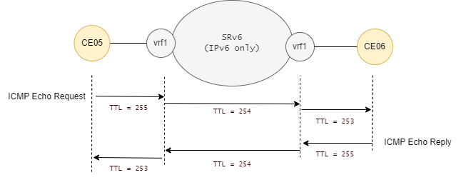

# SRv6 OAM

SRv6 DPM(Data Plane Monitoring)は実装されていない模様です。

<br>

## ping(CE-CE)

CEルータから見たら、途中にSRv6網を経由していることはわかりません。

フルレングスSIDを使う経路。

```
CE05#ping vrf vrf1 192.168.4.2
Type escape sequence to abort.
Sending 5, 100-byte ICMP Echos to 192.168.4.2, timeout is 2 seconds:
!!!!!
Success rate is 100 percent (5/5), round-trip min/avg/max = 1/1/2 ms
```

マイクロSIDを使う経路。

```
CE05#ping vrf vrf2 192.168.4.2
Type escape sequence to abort.
Sending 5, 100-byte ICMP Echos to 192.168.4.2, timeout is 2 seconds:
!!!!!
Success rate is 100 percent (5/5), round-trip min/avg/max = 1/1/3 ms
```

行きのIPv4ヘッダのTTLは255、戻ってきたときのTTLは253になります。SRv6網の入り口と出口でそれぞれTTLを一つ減らしています。




<br>

## traceroute(CE-CE)

エンド・エンドのL3VPN通信でtracerouteをしても、SRv6網は見えません。

```
CE05#traceroute vrf vrf1 192.168.4.2
Type escape sequence to abort.
Tracing the route to 192.168.4.2
VRF info: (vrf in name/id, vrf out name/id)
  1 192.168.3.1 4 msec 1 msec 1 msec
  2 192.168.4.1 [AS 65006] 3 msec 2 msec 1 msec
  3 192.168.4.2 [AS 65006] 2 msec *  2 msec
```

<br>

## SRv6網内のping(node-SIDにping)

IOS-XRは `{locator}:1::` がnode-SID(Endに対するSID)になります。

PE03からCR01、CR02、PE04のnode-SIDにpingを打ち込みます。

```
P/0/RP0/CPU0:PE03#ping ipv6 2001:db8:0:1:1::
Sun Jan 22 17:11:37.537 JST
Type escape sequence to abort.
Sending 5, 100-byte ICMP Echos to 2001:db8:0:1:1::, timeout is 2 seconds:
!!!!!
Success rate is 100 percent (5/5), round-trip min/avg/max = 4/7/10 ms

RP/0/RP0/CPU0:PE03#ping ipv6 2001:db8:0:2:1::
Sun Jan 22 17:11:40.330 JST
Type escape sequence to abort.
Sending 5, 100-byte ICMP Echos to 2001:db8:0:2:1::, timeout is 2 seconds:
!!!!!
Success rate is 100 percent (5/5), round-trip min/avg/max = 2/5/13 ms

RP/0/RP0/CPU0:PE03#ping ipv6 2001:db8:0:3:1::
Sun Jan 22 17:11:43.067 JST
Type escape sequence to abort.
Sending 5, 100-byte ICMP Echos to 2001:db8:0:3:1::, timeout is 2 seconds:
!!!!!
Success rate is 100 percent (5/5), round-trip min/avg/max = 1/1/3 ms
```

<br>

## SRv6網内のping(adj-SIDにping)

CR01のSIDは以下の通りです。

```
RP/0/RP0/CPU0:CR01#show segment-routing srv6 sid
Sun Jan 22 17:14:47.865 JST

*** Locator: 'a' ***

SID                         Behavior          Context                           Owner               State  RW
--------------------------  ----------------  --------------------------------  ------------------  -----  --
2001:db8:0:1:1::            End (PSP/USD)     'default':1                       sidmgr              InUse  Y
2001:db8:0:1:40::           End.DT4           'default'                         bgp-65000           InUse  Y
2001:db8:0:1:41::           End.X (PSP/USD)   [Gi0/0/0/2, Link-Local]           isis-core           InUse  Y
2001:db8:0:1:42::           End.X (PSP/USD)   [Gi0/0/0/1, Link-Local]           isis-core           InUse  Y
2001:db8:0:1:43::           End.X (PSP/USD)   [Gi0/0/0/1.10, Link-Local]        isis-core           InUse  Y
2001:db8:0:1:44::           End.X (PSP/USD)   [Gi0/0/0/1.20, Link-Local]        isis-core           InUse  Y
2001:db8:0:1:45::           End.X (PSP/USD)   [Gi0/0/0/0, Link-Local]           isis-core           InUse  Y
2001:db8:0:1:46::           End.X (PSP/USD)   [Gi0/0/0/0.10, Link-Local]        isis-core           InUse  Y
2001:db8:0:1:47::           End.X (PSP/USD)   [Gi0/0/0/0.20, Link-Local]        isis-core           InUse  Y
```

PE03からCR01のEnd.XのSIDにpingを打ち込みます。全てCR01からの応答です。

```
RP/0/RP0/CPU0:PE03#ping ipv6 2001:db8:0:1:41::
Sun Jan 22 17:16:15.097 JST
Type escape sequence to abort.
Sending 5, 100-byte ICMP Echos to 2001:db8:0:1:41::, timeout is 2 seconds:
!!!!!
Success rate is 100 percent (5/5), round-trip min/avg/max = 2/3/8 ms

RP/0/RP0/CPU0:PE03#ping ipv6 2001:db8:0:1:42::
Sun Jan 22 17:16:19.171 JST
Type escape sequence to abort.
Sending 5, 100-byte ICMP Echos to 2001:db8:0:1:42::, timeout is 2 seconds:
!!!!!
Success rate is 100 percent (5/5), round-trip min/avg/max = 2/3/5 ms

RP/0/RP0/CPU0:PE03#ping ipv6 2001:db8:0:1:43::
Sun Jan 22 17:16:21.821 JST
Type escape sequence to abort.
Sending 5, 100-byte ICMP Echos to 2001:db8:0:1:43::, timeout is 2 seconds:
!!!!!
Success rate is 100 percent (5/5), round-trip min/avg/max = 2/4/7 ms
```

<br>

## SRv6網内のping(uNにping)

F3216形式のマイクロSIDを次のように割り当てています。

- CR01のuNはfd00:0000:0100::
- CR02のuNはfd00:0000:0200::
- PE03のuNはfd00:0000:0300::
- PE04のuNはfd00:0000:0400::

PE03から各uNにpingを打ち込みます。全て応答あります。

```
RP/0/RP0/CPU0:PE03#ping ipv6 fd00:0000:0100::
Sun Jan 22 17:46:30.845 JST
Type escape sequence to abort.
Sending 5, 100-byte ICMP Echos to fd00:0:100::, timeout is 2 seconds:
!!!!!
Success rate is 100 percent (5/5), round-trip min/avg/max = 2/4/8 ms

RP/0/RP0/CPU0:PE03#ping ipv6 fd00:0000:0200::
Sun Jan 22 17:46:35.447 JST
Type escape sequence to abort.
Sending 5, 100-byte ICMP Echos to fd00:0:200::, timeout is 2 seconds:
!!!!!
Success rate is 100 percent (5/5), round-trip min/avg/max = 2/4/6 ms

RP/0/RP0/CPU0:PE03#ping ipv6 fd00:0000:0300::
Sun Jan 22 17:46:38.396 JST
Type escape sequence to abort.
Sending 5, 100-byte ICMP Echos to fd00:0:300::, timeout is 2 seconds:
!!!!!
Success rate is 100 percent (5/5), round-trip min/avg/max = 1/2/3 ms

RP/0/RP0/CPU0:PE03#ping ipv6 fd00:0000:0400::
Sun Jan 22 17:46:41.511 JST
Type escape sequence to abort.
Sending 5, 100-byte ICMP Echos to fd00:0:400::, timeout is 2 seconds:
!!!!!
Success rate is 100 percent (5/5), round-trip min/avg/max = 3/4/8 ms
```

<br>

## SRv6網内のping(uSID)

マイクロSIDは一つの宛先IPv6アドレスに複数の経由地を詰め込めます。


PE03から、CR01-CR02-CR01-PE04の経路でたどり着くには、

`fd00:0000:0100:0200:0100:0400::`

を宛先にすればよいことになります。
実際にこの宛先に打ち込むと・・・

```
RP/0/RP0/CPU0:PE03#ping ipv6 fd00:0000:0100:0200:0100:0400::
Sun Jan 22 17:49:45.376 JST
Type escape sequence to abort.
Sending 5, 100-byte ICMP Echos to fd00:0:100:200:100:400::, timeout is 2 seconds:
.....
Success rate is 0 percent (0/5)
```

残念ながら応答なしです。

キャプチャして追いかけてみますと、ちゃんと期待した通りの経路を通って最終目的地のPE04まで届いています。
ですが応答はありません。

理由は不明ですが、もともとマニュアルにも以下のような制限が記載されていますので、仕方ないのかもしれません。

> https://www.cisco.com/c/en/us/td/docs/iosxr/ncs5500/segment-routing/78x/b-segment-routing-cg-ncs5500-78x/using-segment-routing-oam.html#id_128984
>
> The following restriction applies for SRv6 OAM:
>
> Ping to an SRv6 SID is not supported.
